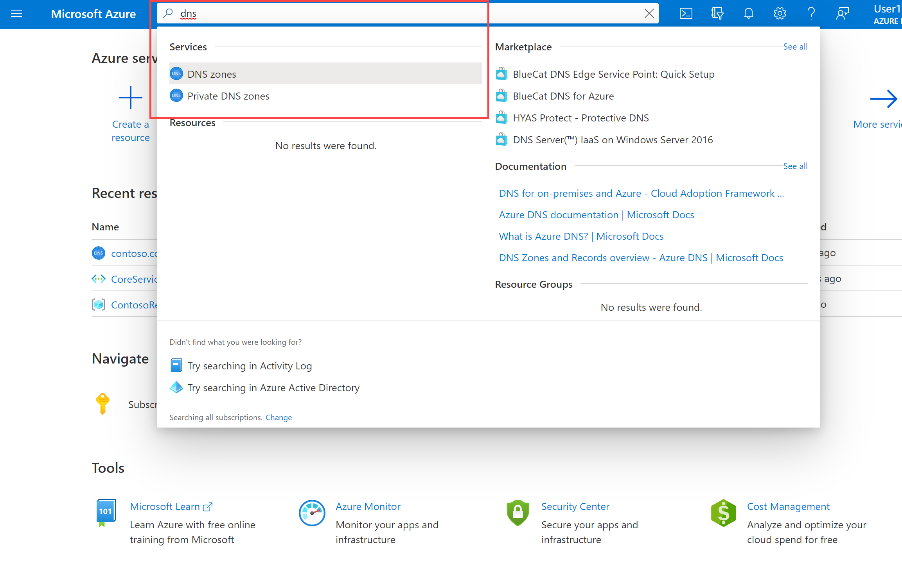
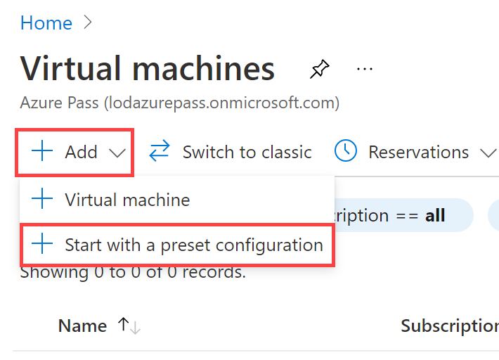

In this unit, you will configure DNS name resolution for Contoso Ltd. You will create a private DNS zone named contoso.com, link the VNets for registration and resolution, and then create two virtual machines and test the configuration.

## Create a private DNS Zone

1. Go to [Azure Portal](https://portal.azure.com/).

2. On the Azure home page, in the search bar, type dns, and then select **Private DNS zones**.  
   ‎

3. In Private DNS zones, select **+ Create**.

4. Use the information in the following table to create the private DNS zone.

| **Tab**         | **Option**                             | **Value**            |
| --------------- | -------------------------------------- | -------------------- |
| Basics          | Resource group                         | ContosoResourceGroup |
|                 | Name                                   | Contoso.com          |
| Tags            | No changes required                    |                      |
| Review + create | Review your settings and select Create |                      |

5. Wait until the deployment is complete, and then select **Go to resource**.

6. Verify that the zone has been created.

## Link subnet for auto registration

1. In Contoso.com, under **Settings**, select **Virtual network links**.

2. On Contoso.com | Virtual network links, select **+ Add**.

3. Use the information in the following table to add the virtual network link.

| **Option**                          | **Value**                               |
| ----------------------------------- | --------------------------------------- |
| Link name                           | CoreServicesVnetLink                    |
| Subscription                        | No changes required                     |
| Virtual Network                     | CoreServicesVnet (ContosoResourceGroup) |
| Enable auto registration            | Selected                                |
| Review your settings and select OK. |                                         |

4. Select **Refresh**.

5. Verify that the CoreServicesVnetLink has been created, and that auto-registration is enabled.

6. Repeat steps 2 - 5 for the ManufacturingVnet, using the information in the following table: 

| **Option**                          | **Value**                                |
| ----------------------------------- | ---------------------------------------- |
| Link name                           | ManufacturingVnetLink                    |
| Subscription                        | No changes required                      |
| Virtual Network                     | ManufacturingVnet (ContosoResourceGroup) |
| Enable auto registration            | Selected                                 |
| Review your settings and select OK. |                                          |

7. Select **Refresh**.

8. Verify that the ManufacturingVnetLink has been created, and that auto-registration is enabled.

9. Repeat steps 2 - 5 for the ResearchVnet, using the information in the following table: 

| **Option**                          | **Value**                           |
| ----------------------------------- | ----------------------------------- |
| Link name                           | ResearchVnetLink                    |
| Subscription                        | No changes required                 |
| Virtual Network                     | ResearchVnet (ContosoResourceGroup) |
| Enable auto registration            | Selected                            |
| Review your settings and select OK. |                                     |

10. Select **Refresh**.

11. Verify that the ResearchVnetLink has been created, and that auto-registration is enabled.

 

## Create Virtual Machines to test the configuration

In this section, you will create two test VMs to test the Private DNS zone configuration.

### Create TestVM1

1. On the Azure home page, select **Virtual Machines**.

2. In Virtual Machines, select **+ Add &gt; + Start with a preset configuration**.

3. In Choose recommended defaults that match your workload, under **Select a workload environment**, select **Dev/Test**.

4. Under **Select a workload type**, select **General purpose (D-Series)**, and then select **Continue to create a VM**.

5. Use the information in the following table to create your first VM.

| **Tab**         | **Option**                                                   | **Value**                             |
| --------------- | ------------------------------------------------------------ | ------------------------------------- |
| Basics          | Resource group                                               | ContosoResourceGroup                  |
|                 | Virtual machine name                                         | TestVM1                               |
|                 | Region                                                       | (US) West US                          |
|                 | Availability options                                         | No infrastructure redundancy required |
|                 | Image                                                        | Windows 10 Pro, Version 20H2 - Gen 1  |
|                 | Azure Spot instance                                          | Not selected                          |
|                 | Size                                                         | Standard_D2_v3 - 2vcpus, 8GiB memory  |
|                 | Username                                                     | TestUser                              |
|                 | Password                                                     | TestPa$$w0rd!                         |
|                 | Public inbound ports                                         | Allow selected ports                  |
|                 | Select inbound ports                                         | RDP (3389)                            |
|                 | I confirm I have an eligible Windows 10 license with multi-tenant hosting rights. | Selected                              |
| Disks           | No changes required                                          |                                       |
| Networking      | Virtual network                                              | CoreServicesVnet                      |
|                 | Subnet                                                       | DatabaseSubnet (10.20.20.0/24)        |
|                 | Public IP                                                    | (new) TestVM1-ip                      |
|                 | NIC network security group                                   | Basic                                 |
|                 | Public inbound ports                                         | Allow selected ports                  |
|                 | Select inbound ports                                         | RDP (3389)                            |
|                 | Load balancing                                               | Not selected                          |
| Management      | No changes required                                          |                                       |
| Advanced        | No changes required                                          |                                       |
| Tags            | No changes required                                          |                                       |
| Review + create | Review your settings and select Create                       |                                       |

6. While the deployment is in progress, you can proceed with creating TestVM2.

### Create TestVM2

1. On the Azure home page, select **Virtual Machines**.

2. In Virtual Machines, select **+ Add &gt; + Start with a preset configuration**.

3. In Choose recommended defaults that match your workload, under **Select a workload environment**, select **Dev/Test**.

4. Under **Select a workload type**, select **General purpose (D-Series)**, and then select **Continue to create a VM**.

5. Use the information in the following table to create your second VM.

| **Tab**         | **Option**                                                   | **Value**                             |
| --------------- | ------------------------------------------------------------ | ------------------------------------- |
| Basics          | Resource group                                               | ContosoResourceGroup                  |
|                 | Virtual machine name                                         | TestVM2                               |
|                 | Region                                                       | (US) West US                          |
|                 | Availability options                                         | No infrastructure redundancy required |
|                 | Image                                                        | Windows 10 Pro, Version 20H2 - Gen 1  |
|                 | Azure Spot instance                                          | Not selected                          |
|                 | Size                                                         | Standard_D2_v3 - 2vcpus, 8GiB memory  |
|                 | Username                                                     | TestUser                              |
|                 | Password                                                     | TestPa$$w0rd!                         |
|                 | Public inbound ports                                         | Allow selected ports                  |
|                 | Select inbound ports                                         | RDP (3389)                            |
|                 | I confirm I have an eligible Windows 10 license with multi-tenant hosting rights. | Selected                              |
| Disks           | No changes required                                          |                                       |
| Networking      | Virtual network                                              | CoreServicesVnet                      |
|                 | Subnet                                                       | DatabaseSubnet (10.20.20.0/24)        |
|                 | Public IP                                                    | (new) TestVM2-ip                      |
|                 | NIC network security group                                   | Basic                                 |
|                 | Public inbound ports                                         | Allow selected ports                  |
|                 | Select inbound ports                                         | RDP (3389)                            |
|                 | Load balancing                                               | Not selected                          |
| Management      | No changes required                                          |                                       |
| Advanced        | No changes required                                          |                                       |
| Tags            | No changes required                                          |                                       |
| Review + create | Review your settings and select **Create**                   |                                       |

6. When the deployment is complete, go to the Azure portal home page, and then select **Virtual Machines**.

7. Verify that both virtual machines have been created.

 

## Verify records are present in the DNS zone

1. On the Azure Portal home page, select **Private DNS zones**.

2. In Private DNS zones, select **contoso.com**.

3. Verify that host (A) records are listed for both VMs, as shown:

 

4. Make a note of the names and IP addresses of the VMs.

 

### Connect to the Test VMs using RDP

1. On the Azure Portal home page, select **Virtual Machines**.

2. Select **TestVM1**.

3. In TestVM1, select **Connect &gt; RDP**.

4. In TestVM1 | Connect, select **Download RDP file**.

5. Save the RDP file to your desktop.

6. On the Azure Portal home page, select **Virtual Machines**.

7. Select **TestVM2**.

8. In TestVM2, select **Connect &gt; RDP**.

9. In TestVM2 | Connect, select **Download RDP file**.

10. Save the RDP file to your desktop.

11. Connect to TestVM1 using the RDP file, and the username and password you specified when you created the VM.

12. Connect to TestVM2 using the RDP file, and the username and password you specified when you created the VM.

13. On both VMs, in **Choose privacy settings for your device**, select **Accept**.

14. On both VMs, in **Networks**, select **Yes**.

15. On TestVM1, open a command prompt and enter the command ipconfig /all.

16. Verify that the IP address is the same as the one you noted in the DNS zone.

17. Enter the command ping TestVM2.contoso.com.

18. Verify that you receive four replies from TestVM2.

 

Congratulations! You have created a private DNS Zone, added a name resolution and auto-registration link, and tested name resolution in your configuration. 