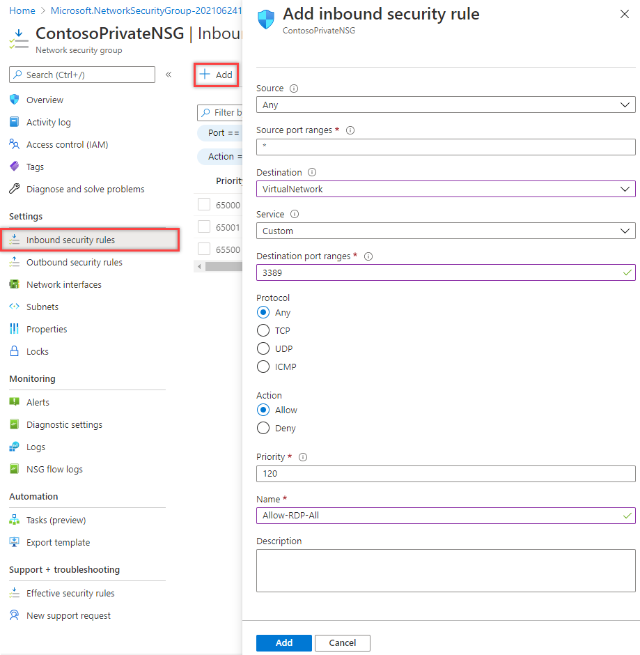
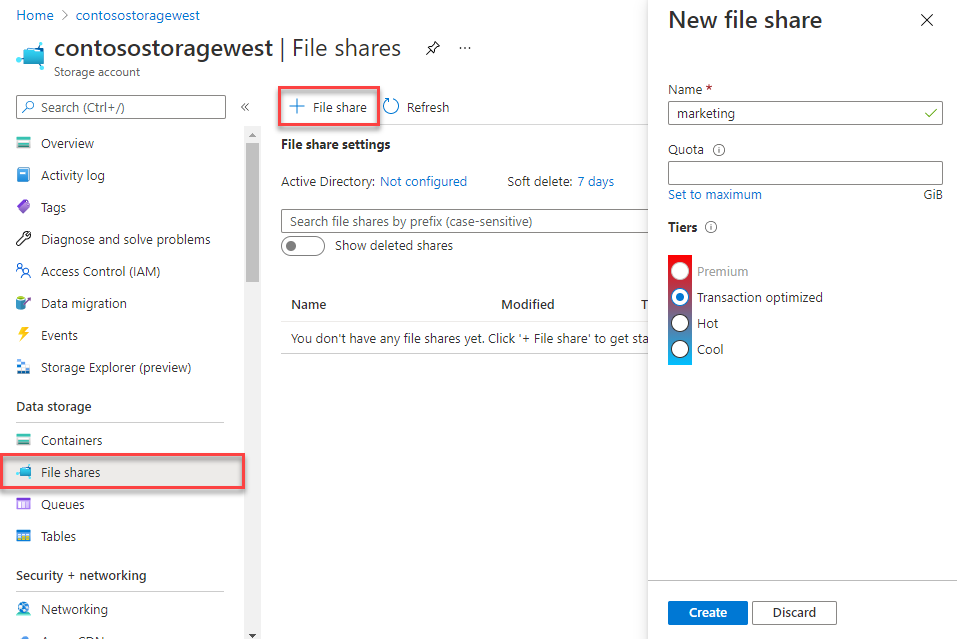

# Exercise - Restrict network access to PaaS resources with virtual network service endpoints using the Azure portal

 

Virtual network service endpoints enable you to limit network access to some Azure service resources to a virtual network subnet. You can also remove internet access to the resources. Service endpoints provide direct connection from your virtual network to supported Azure services, allowing you to use your virtual network's private address space to access the Azure services. Traffic destined to Azure resources through service endpoints always stays on the Microsoft Azure backbone network. In this exercise, you learn how to:

- Create a virtual network with one subnet

- Add a subnet and enable a service endpoint

- Create an Azure resource and allow network access to it from only a subnet

- Deploy a virtual machine (VM) to each subnet

- Confirm access to a resource from a subnet

- Confirm access is denied to a resource from a subnet and the internet

## Create a virtual network

1. On the Azure Portal home page, select **+ Create a resource**.

2. Search for virtual network and then select **Virtual network** from the results.

3. Select **+** **Create**.

4. Enter, or select, the following information
   

   | **Setting**    | **Value**                                     |
   | -------------- | --------------------------------------------- |
   | Subscription   | Select your subscription                      |
   | Resource group | Select the provided resource group from Learn |
   | Name           | CoreServicesVNet                              |
   | Location       | Select **West US**                            |

5. Select the **IP Addresses** tab and enter the following values (select **default** to change the subnet name):
   

   | **Setting**          | **Value**   |
   | -------------------- | ----------- |
   | Address space        | 10.0.0.0/16 |
   | Subnet Name          | Public      |
   | Subnet Address range | 10.0.0.0/24 |

6. Select the **Security** tab and enter the following values:
   

   | **Setting**     | **Value** |
   | --------------- | --------- |
   | BastionHost     | Disabled  |
   | DDoS protection | Disabled  |
   | Firewall        | Disabled  |

7. Click **Review + Create**. Once the resource is validated select **Create**. 

## Enable a service endpoint

Service endpoints are enabled per service, per subnet. Create a subnet and enable a service endpoint for the subnet.

1. In the **Search resources, services, and docs** box at the top of the portal, enter CoreServicesVNet. When CoreServicesVNet appears in the search results, select it.

2. Add a subnet to the virtual network. Under **Settings**, select **Subnets**, and then select **+ Subnet**, as shown in the following picture: 
   

3. Under **Add subnet**, select or enter the following information:

   | **Setting**                 | **Value**                    |
   | --------------------------- | ---------------------------- |
   | Name                        | Private                      |
   | Address range               | 10.0.1.0/24                  |
   | Service endpoints: Services | Select **Microsoft.Storage** |

4. Select **Save**.

You should now have two subnets configured:


 

## Restrict network access for a subnet

By default, all VMs in a subnet can communicate with all resources. You can limit communication to and from all resources in a subnet by creating a network security group and associating it to the subnet.

1. In the **Search resources, services, and docs** box at the top of the portal, enter **security group**. When **Network Security groups** appears in the search results, select it.

2. In Network security groups, select **+ Create**. 

3. Enter or select, the following information: 
   

   | **Setting**    | **Value**                                                    |
   | -------------- | ------------------------------------------------------------ |
   | Subscription   | Select your subscription                                     |
   | Resource group | Select **Use existing** and select the provided resource group from Learn |
   | Name           | ContosoPrivateNSG                                            |
   | Location       | Select **West US**                                           |

4. select **Review + create**, then click **Create**:

5. After the ContosoPrivateNSG network security group is created, select **Go to resource**.
   

6. Under **Settings**, select **Outbound security rules**.

7. Select **+ Add**.

8. Create a rule that allows outbound communication to the Azure Storage service. Enter, or select, the following information:
   

   | **Setting**             | **Value**                 |
   | ----------------------- | ------------------------- |
   | Source                  | Select **VirtualNetwork** |
   | Source port ranges      | *                         |
   | Destination             | Select **Service Tag**    |
   | Destination service tag | Select **Storage**        |
   | Service                 | Custom                    |
   | Destination port ranges | *                         |
   | Protocol                | Any                       |
   | Action                  | Allow                     |
   | Priority                | 100                       |
   | Name                    | Allow-Storage-All         |

9. Select **Add**:

Create another outbound security rule that denies communication to the internet. This rule overrides a default rule in all network security groups that allows outbound internet communication. 

1. Select **+Add** under **Outbound security rules**.

2. Enter, or select, the following information:
   

   | **Setting**             | **Value**                 |
   | ----------------------- | ------------------------- |
   | Source                  | Select **VirtualNetwork** |
   | Source port ranges      | *                         |
   | Destination             | Select **Service Tag**    |
   | Destination service tag | Select **Internet**       |
   | Service                 | Custom                    |
   | Destination port ranges | *                         |
   | Protocol                | Any                       |
   | Action                  | Deny                      |
   | Priority                | 110                       |
   | Name                    | Deny-Internet-All         |

3. Select **Add**.

## Allow access for RDP connections

Create an inbound security rule that allows Remote Desktop Protocol (RDP) traffic to the subnet from anywhere. The rule overrides a default security rule that denies all inbound traffic from the internet. Remote desktop connections are allowed to the subnet so that connectivity can be tested in a later step.

1. On ContosoPrivateNSG | Outbound security rules, under **Settings**, select **Inbound security rules**.

2. Select **+ Add**.

3. In Add inbound security rule, enter the following values::
   

   | **Setting**             | **Value**                 |
   | ----------------------- | ------------------------- |
   | Source                  | Any                       |
   | Source port ranges      | *                         |
   | Destination             | Select **VirtualNetwork** |
   | Service                 | Custom                    |
   | Destination port ranges | 3389                      |
   | Protocol                | Any                       |
   | Action                  | Allow                     |
   | Priority                | 120                       |
   | Name                    | Allow-RDP-All             |

4. And then select **Add**.

   > [!Warning]
   >
   >  RDP port 3389 is exposed to the Internet. This is only recommended for testing. For production environments, we recommend using a VPN or private connection.

5. Under **Settings**, select **Subnets**.

6. Select **+ Associate.**

7. Under **Associate subnet**, select **Virtual network** and then select **CoreServicesVNet** under **Choose a virtual network**.

8. Under **Choose subnet**, select **Private**, and then select **OK**.

## Restrict network access to a resource

The steps necessary to restrict network access to resources created through Azure services enabled for service endpoints varies across services. See the documentation for individual services for specific steps for each service. The remainder of this exercise includes steps to restrict network access for an Azure Storage account, as an example.

1. In the Azure portal, select Storage accounts.

2. Select +Create.

3. Enter, or select, the following information and accept the remaining defaults:
   

   | **Setting**    | **Value**                                                    |
   | -------------- | ------------------------------------------------------------ |
   | Subscription   | Select your subscription                                     |
   | Resource group | Select Use existing and select the resource group provided by Learn. |
   | Name           | Enter a contosostoragewest..                                 |
   | Performance    | Standard StorageV2 (general purpose v2)                      |
   | Location       | Select West US                                               |
   | Replication    | Locally-redundant storage (LRS)                              |

4. select **Review + create**, then click **Create**.

## Create a file share in the storage account

1. After the storage account is created, enter the name of the storage account in the **Search resources, services, and docs** box, at the top of the portal. When the name of your storage account appears in the search results, select it.
2. Select **File shares**, as shown in the following picture: 
   
3. Select **+ File share**.
4. Enter marketing under **Name**, and then select **Create**.

## Restrict network access to a subnet

By default, storage accounts accept network connections from clients in any network, including the internet. Deny network access from the internet, and all other subnets in all virtual networks, except for the Private subnet in the CoreServicesVNet virtual network.

1. Under **Security + networking** for the storage account, select **Networking**.

2. Select **Selected networks**.

3. Select **+Add existing virtual network**.

4. Under **Add networks**, select the following values:
   

   | **Setting**      | **Value**                    |
   | ---------------- | ---------------------------- |
   | Subscription     | Select your subscription.    |
   | Virtual networks | Select CoreServicesVNet**.** |
   | Subnets          | Select **Private**.          |

5. Select **Add**.

6. Select **Save**.

7. Under **Security and Networking** for the storage account, select **Access keys**.

8. Select **Show Keys**. Note the **Key** value, as you'll have to manually enter it in a later step when mapping the file share to a drive letter in a VM.

## Create virtual machines

To test network access to a storage account, deploy a VM to each subnet.

1. In the Azure protal Home screen, select Virtual machinesSelect **+ Create**, then **+Virtual machine**.

2. On the Basics tab, enter, or select, the following information: 
   

   | **Setting**           | **Value**                                                    |
   | --------------------- | ------------------------------------------------------------ |
   | Project Details       |                                                              |
   | Subscription          | Select your subscription.                                    |
   | Resource group        | Select **Use existing** and select the resource group provided by Learn |
   | Instance Details      |                                                              |
   | Virtual machine name  | ContosoWestPublic                                            |
   | Region                | (US) West US                                                 |
   | Availability Options  | No infrastructure redundancy required                        |
   | Image                 | Select **Windows Server 2019 Datacenter**.                   |
   | Size                  | Standard_D2s                                                 |
   | Administrator Account |                                                              |
   | Authentication type   | SSH public key                                               |
   | Username              | Enter a user name of your choosing.                          |
   | Password              | Enter a password of your choosing.                           |
   | Confirm Password      | Re-enter the password.                                       |
   | Inbound port rules    |                                                              |
   | Public inbound ports  | Allow selected ports                                         |
   | Select inbound ports  | RDP (3389)                                                   |

3. Then select the **Networking** tab. Enter, or select, the following information:
   

   | **Setting**                | **Value**                  |
   | -------------------------- | -------------------------- |
   | Virtual network            | CoreServicesVNet           |
   | Subnet                     | Public (10.0.0.0/24)       |
   | Public IP                  | (new) ContosoWestPublic-ip |
   | NIC network security group | Basic                      |
   | Public inbound ports       | Allow selected ports       |
   | Select inbound ports       | RDP (3389)                 |

4. Click **Review + create**.

5. Select **Create** to start the virtual machine deployment. The VM takes a few minutes to deploy, but you can continue to the next step while the VM is creating.

6. Create another virtual machine Complete steps 2-5 again, but name the virtual machine ContosoWestPrivate and and select the **Private** subnet.

The VM takes a few minutes to deploy. Do not continue to the next step until it finishes creating and its settings open in the portal.

 

## Confirm access to storage account

1. Once the ContosoWestPrivate VM finishes creating, open the blade for the VM by selecting Go to resource. Select the Connect button, then select RDP.
   
2. After selecting the Connect button and RDP, select the Download RDP File button. A Remote Desktop Protocol (.rdp) file is created and downloaded to your computer.
3. Open the downloaded rdp file. If prompted, select Connect. Enter the user name and password you specified when creating the VM. You may need to select More choices, then Use a different account, to specify the credentials you entered when you created the VM.
4. Select **OK**.
5. You may receive a certificate warning during the sign-in process. If you receive the warning, select Yes or Continue to proceed with the connection.
6. On the ContosoWestPrivate VM, map the Azure file share to drive Z using PowerShell. Before running the commands that follow, replace <storage-account-key> and <storage-account-name> with values you supplied and retrieved in the Create a storage account task.

```Azure CLI
$acctKey = ConvertTo-SecureString -String "<storage-account-key>" -AsPlainText -Force

$credential = New-Object System.Management.Automation.PSCredential -ArgumentList "Azure\<storage-account-name>", $acctKey

New-PSDrive -Name Z -PSProvider FileSystem -Root "\\<storage-account-name>.file.core.windows.net\my-file-share" -Credential $credential
```


The Azure file share successfully mapped to the Z drive.

7. Confirm that the VM has no outbound connectivity to the internet from a command prompt:

 ping bing.com

You receive no replies because the network security group associated to the Private subnet does not allow outbound access to the internet.

8. Close the remote desktop session to the ContosoWestPrivate VM.

## Confirm access is denied to storage account

1. Enter ContosoWestPublic In the **Search resources, services, and docs** box at the top of the portal.

2. When **ContosoWestPublic** appears in the search results, select it.

3. Complete steps 1-6 in the Confirm access to storage account task for the ContosoWestPublic VM.  
   ‎  
   ‎After a short wait, you receive a New-PSDrive : Access is denied error. Access is denied because the ContosoWestPublic VM is deployed in the Public subnet. The Public subnet does not have a service endpoint enabled for Azure Storage. The storage account only allows network access from the Private subnet, not the Public subnet.

4. Close the remote desktop session to the ContosoWestPublic VM.

5. From your computer, browse to the Azure portal.

6. Enter the name of the storage account you created in the **Search resources, services, and docs** box. When the name of your storage account appears in the search results, select it.

7. Select **File shares** then select my-file-share.

8. You receive the error shown in the following screenshot:

    

 Access is denied, because your computer is not in the Private subnet of the CoreServicesVNet virtual network.

> [!WARNING]
>
>  Prior to continuing you should remove all resources used for this lab. To do this in the Azure Portal click Resource groups. Select any resources groups you have created. On the resource group blade click Delete Resource group, enter the Resource Group Name and click Delete. Repeat the process for any additional Resource Groups you may have created. Failure to do this may cause issues with other labs.

Results: You have now completed this lab.