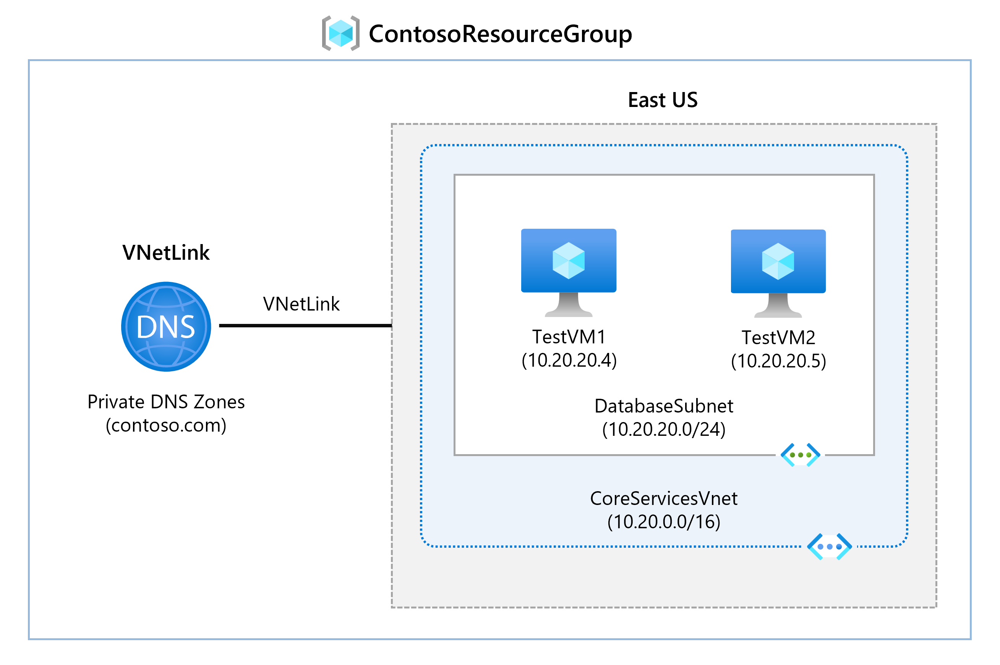
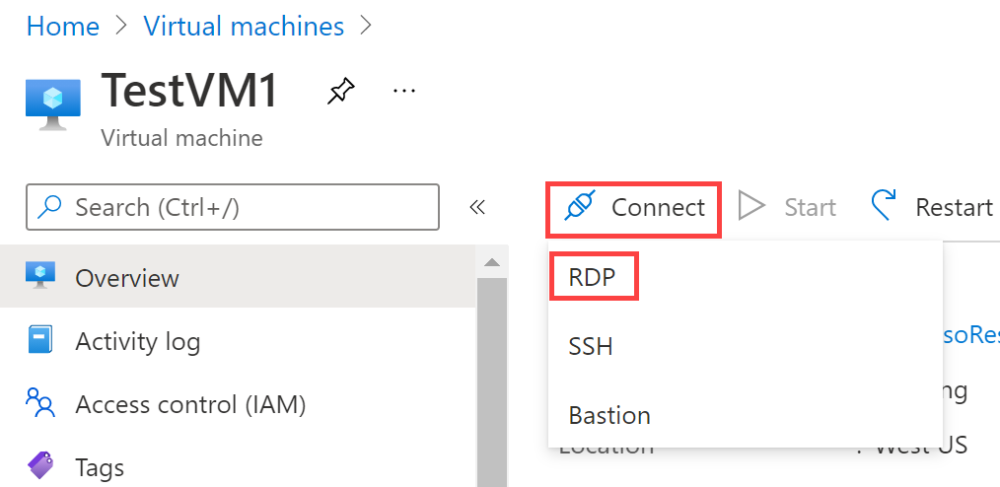

---
Exercise:
    title: 'M01 - Unit 6 Configure DNS settings in Azure'
    module: 'Module 01 - Introduction to Azure Virtual Networks'
---

# M01 - Unit 6 Configure DNS settings in Azure

## Exercise scenario

In this unit, you will configure DNS name resolution for Contoso Ltd. You will create a private DNS zone named contoso.com, link the VNets for registration and resolution, and then create two virtual machines and test the configuration.



In this exercise, you will:

+ Task 1: Create a private DNS Zone
+ Task 2: Link subnet for auto registration
+ Task 3: Create Virtual Machines to test the configuration
+ Task 4: Verify records are present in the DNS zone

   >**Note**: An **[interactive lab simulation](https://mslabs.cloudguides.com/guides/AZ-700%20Lab%20Simulation%20-%20Configure%20DNS%20settings%20in%20Azure)** is available that allows you to click through this lab at your own pace. You may find slight differences between the interactive simulation and the hosted lab, but the core concepts and ideas being demonstrated are the same.

### Estimated time: 25 minutes

## Task 1: Create a private DNS Zone

1. Go to [Azure Portal](https://portal.azure.com/).

1. On the Azure home page, in the search bar, enter dns, and then select **Private DNS zones**.  
   

1. In Private DNS zones, select **+ Create**.

1. Use the information in the following table to create the private DNS zone.

    | **Tab**         | **Option**                             | **Value**            |
    | --------------- | -------------------------------------- | -------------------- |
    | Basics          | Resource group                         | ContosoResourceGroup |
    |                 | Name                                   | Contoso.com          |
    | Tags            | No changes required                    |                      |
    | Review + create | Review your settings and select Create |                      |

1. Wait until the deployment is complete, and then select **Go to resource**.

1. Verify that the zone has been created.

## Task 2: Link subnet for auto registration

1. In Contoso.com, under **DNS Management**, select **Virtual network links**.

1. On Contoso.com \| Virtual network links, select **+ Add**.

    

1. Use the information in the following table to add the virtual network link.

    | **Option**                          | **Value**                               |
    | ----------------------------------- | --------------------------------------- |
    | Link name                           | CoreServicesVnetLink                    |
    | Subscription                        | No changes required                     |
    | Virtual Network                     | CoreServicesVnet (ContosoResourceGroup) |
    | Enable auto registration            | Selected                                |
    | Review your settings and select OK. |                                         |

1. Select **Refresh**.

1. Verify that the CoreServicesVnetLink has been created, and that auto-registration is enabled.

1. Repeat steps 2 - 5 for the ManufacturingVnet, using the information in the following table:

    | **Option**                          | **Value**                                |
    | ----------------------------------- | ---------------------------------------- |
    | Link name                           | ManufacturingVnetLink                    |
    | Subscription                        | No changes required                      |
    | Virtual Network                     | ManufacturingVnet (ContosoResourceGroup) |
    | Enable auto registration            | Selected                                 |
    | Review your settings and select OK. |                                          |

1. Select **Refresh**.

1. Verify that the ManufacturingVnetLink has been created, and that auto-registration is enabled.

1. Repeat steps 2 - 5 for the ResearchVnet, using the information in the following table:

    | **Option**                          | **Value**                           |
    | ----------------------------------- | ----------------------------------- |
    | Link name                           | ResearchVnetLink                    |
    | Subscription                        | No changes required                 |
    | Virtual Network                     | ResearchVnet (ContosoResourceGroup) |
    | Enable auto registration            | Selected                            |
    | Review your settings and select OK. |                                     |

1. Select **Refresh**.

1. Verify that the ResearchVnetLink has been created, and that auto-registration is enabled.

## Task 3: Create Virtual Machines to test the configuration

In this section, you will create two test VMs to test the Private DNS zone configuration.

1. In the Azure portal, select the Cloud Shell icon (top right). If necessary, configure the shell.  
    + Select **PowerShell**.
    + Select **No Storage Account required** and your **Subscription**, then select **Apply**.
    + Wait for the terminal to create and a prompt to be displayed. 

1. On the toolbar of the Cloud Shell pane, select the **Manage Files** icon, in the drop-down menu, select **Upload** and upload the following files **azuredeploy.json** and **azuredeploy.parameters.json** into the Cloud Shell home directory one by one from the source folder **F:\Allfiles\Exercises\M01**.

1. Deploy the following ARM templates to create the VMs needed for this exercise:

   >**Note**: You will be prompted to provide an Admin password.

   ```powershell
   $RGName = "ContosoResourceGroup"
   
   New-AzResourceGroupDeployment -ResourceGroupName $RGName -TemplateFile azuredeploy.json -TemplateParameterFile azuredeploy.parameters.json
   ```
  
1. When the deployment is complete, go to the Azure portal home page, and then select **Virtual Machines**.

1. Verify that both virtual machines have been created.

## Task 4: Verify records are present in the DNS zone

1. On the Azure Portal home page, select **Private DNS zones**.

1. On Private DNS zones, select **contoso.com**.

1. Verify that host (A) records are listed for both VMs, as shown:

    

1. Make a note of the names and IP addresses of the VMs.

### Connect to the Test VMs using RDP

1. On the Azure Portal home page, select **Virtual Machines**.

1. Select **TestVM1**.

1. On TestVM1, select **Connect &gt; RDP** and download the RDP file.

    

1. Save the RDP file to your desktop.

1. Follow the same steps for **TestVM2**

1. Connect to TestVM1 using the RDP file, and the username **TestUser** and the password you provided during deployment.

1. Connect to TestVM2 using the RDP file, and the username **TestUser** and the password you provided during deployment.

1. On both VMs, in **Choose privacy settings for your device**, select **Accept**.

1. On both VMs, if prompted, in **Networks**, select **Yes**.

1. On TestVM1, open a command prompt and enter the command `ipconfig /all`.

1. Verify that the IP address is the same as the one you noted in the DNS zone.

1. Enter the command ping TestVM2.contoso.com.

1. Verify that the FQDN resolves to the IP address that you noted in the Private DNS zone. The ping itself will timeout because of the Windows Firewall that is enabled on the VMs.

1. Alternatively, you can enter the command nslookup TestVM2.contoso.com and verify that you receive a successful name resolution record for VM2

## Extend your learning with Copilot

Copilot can assist you in learning how to use the Azure scripting tools. Copilot can also assist in areas not covered in the lab or where you need more information. Open an Edge browser and choose Copilot (top right) or navigate to *copilot.microsoft.com*. Take a few minutes to try these prompts.
+ What is the difference between Azure DNS and Azure Private DNS? Provide examples of when to use Azure private DNS.
+ What is the purpose of auto registration when creating an Azure DNS zone?

## Learn more with self-paced training

+ [Introduction to Azure DNS](https://learn.microsoft.com/training/modules/intro-to-azure-dns/). This module explains what Azure DNS does, how it works, and when you should choose to use Azure DNS as a solution to meet your organization’s needs.
+ [Host your domain on Azure DNS](https://learn.microsoft.com/training/modules/host-domain-azure-dns/). In this module, you create a DNS zone and DNS records to map the domain to an IP address. You also test to ensure the domain name resolves to your web server.

## Key takeaways

Congratulations on completing the lab. Here are the main takeaways for this lab. 

+ Azure DNS is a cloud service that allows you to host and manage domain name system (DNS) domains, also known as DNS zones. 
+ Azure DNS public zones host domain name zone data for records that you intend to be resolved by any host on the internet.
+ Azure Private DNS zones allow you to configure a private DNS zone namespace for private Azure resources.
+ A DNS zone is a collection of DNS records. DNS records provide information about the domain.
