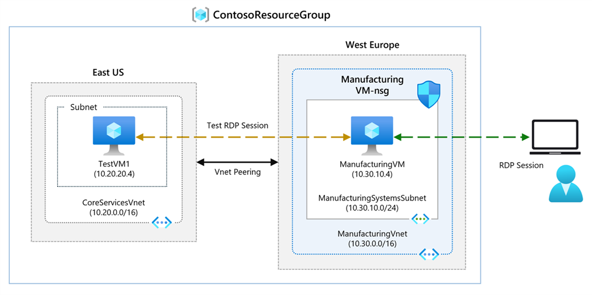

---
Exercise:
    title: 'M01 - Unit 8 Connect two Azure Virtual Networks using global virtual network peering'
    module: 'Module 01 - Introduction to Azure Virtual Networks'
---

# M01 - Unit 8 Connect two Azure Virtual Networks using global virtual network peering

## Exercise scenario

In this unit, you will configure connectivity between the CoreServicesVnet and the ManufacturingVnet by adding peerings to allow traffic flow.



In this unit, you will:

+ Task 1: Create a Virtual Machine to test the configuration
+ Task 2: Connect to the Test VMs using RDP
+ Task 3: Test the connection between the VMs
+ Task 4: Create VNet peerings between CoreServicesVnet and ManufacturingVnet
+ Task 5: Test the connection between the VMs

   >**Note**: An **[interactive lab simulation](https://mslabs.cloudguides.com/guides/AZ-700%20Lab%20Simulation%20-%20Connect%20two%20Azure%20virtual%20networks%20using%20global%20virtual%20network%20peering)** is available that allows you to click through this lab at your own pace. You may find slight differences between the interactive simulation and the hosted lab, but the core concepts and ideas being demonstrated are the same.

### Estimated time: 20 minutes

## Task 1: Create a Virtual Machine to test the configuration

In this section, you will create a test VM on the  VNet to test if you can access resources inside another Azure virtual network from your Vnet.

### Create ManufacturingVM

1. In the Azure portal, select the Cloud Shell icon (top right). If necessary, configure the shell.  
    + Select **PowerShell**.
    + Select **No Storage Account required** and your **Subscription**, then select **Apply**.
    + Wait for the terminal to create and a prompt to be displayed. 

1. On the toolbar of the Cloud Shell pane, select the **Manage files** icon, in the drop-down menu, select **Upload** and upload the following files **ManufacturingVMazuredeploy.json** and **ManufacturingVMazuredeploy.parameters.json** into the Cloud Shell home directory from the source folder **F:\Allfiles\Exercises\M01**.

1. Deploy the following ARM templates to create the VMs needed for this exercise:

   >**Note**: You will be prompted to provide an Admin password.

   ```powershell
   $RGName = "ContosoResourceGroup"
   
   New-AzResourceGroupDeployment -ResourceGroupName $RGName -TemplateFile ManufacturingVMazuredeploy.json -TemplateParameterFile ManufacturingVMazuredeploy.parameters.json
   ```
  
1. When the deployment is complete, go to the Azure portal home page, and then select **Virtual Machines**.

1. Verify that the virtual machine has been created.

## Task 2: Connect to the Test VMs using RDP

1. On the Azure Portal home page, select **Virtual Machines**.

1. Select **ManufacturingVM**.

1. On ManufacturingVM, select **Connect &gt; RDP**.

1. On ManufacturingVM \| Connect, select **Download RDP file**.

1. Save the RDP file to your desktop.

1. Connect to ManufacturingVM using the RDP file, and the username **TestUser** and the password you provided during deployment.

1. On the Azure Portal home page, select **Virtual Machines**.

1. Select **TestVM1**.

1. On TestVM1, select **Connect &gt; RDP**.

1. On TestVM1 \| Connect, select **Download RDP file**.

1. Save the RDP file to your desktop.

1. Connect to TestVM1 using the RDP file, and the username **TestUser** and the password you provided during deployment.

1. On both VMs, in **Choose privacy settings for your device**, select **Accept**.

1. On both VMs, in **Networks**, select **Yes**.

1. On TestVM1, open a PowerShell prompt, and run the following command: ipconfig

1. Note the IPv4 address.

## Task 3: Test the connection between the VMs

1. On the ManufacturingVM, open a PowerShell prompt.

1. Use the following command to verify that there is no connection to TestVM1 on CoreServicesVnet. Be sure to use the IPv4 address for TestVM1.

   ```powershell
    Test-NetConnection 10.20.20.4 -port 3389
    ```

1. The test connection should fail, and you will see a result similar to the following:
   

## Task 4: Create VNet peerings between CoreServicesVnet and ManufacturingVnet

1. On the Azure home page, select **Virtual Networks**, and then select **CoreServicesVnet**.

1. In CoreServicesVnet, under **Settings**, select **Peerings**.
   

1. On CoreServicesVnet \| Peerings, select **+ Add**.

1. Use this information to create the peering. When finished, select **Add**. 

   **Remote virtual network summary**

   | **Option**                                    | **Value**                             |
   | ------------------------------------ | --------------------------------------------- | 
   | Peering link name    | `ManufacturingVnet-to-CoreServicesVnet` |
   | Virtual network | ManufacturingVnet |

    **Remote virtual network peering settings**
   
   | **Option**                                    | **Value**                             |
   | ------------------------------------ | --------------------------------------------- | 
   | Allow 'ManufacturingVnet' to access 'CoreServicesVnet' | Enabled |
   |'ManufacturingVnet' to receive forwarded traffic from 'CoreServicesVnet' | Enabled |
 
    **Local virtual network summary**

    | **Option**                                    | **Value**                             |
    | ------------------------------------ | --------------------------------------------- | 
    | Peering link name | `CoreServicesVnet-to-ManufacturingVnet` |
 
    **Remote virtual network peering settings**
   
    | **Option**                                    | **Value**                             |
    | ------------------------------------ | --------------------------------------------- | 
    | Allow 'CoreServicesVnet' to access 'ManufacturingVnet' | Enabled
    | Allow 'CoreServicesVnet' to receive forwarded traffic from 'ManufacturingVnet' | Enabled |
 
1. In CoreServicesVnet \| Peerings, verify that the **CoreServicesVnet-to-ManufacturingVnet** peering is **Connected**.

1. Under Virtual networks, select **ManufacturingVnet**, and verify the **ManufacturingVnet-to-CoreServicesVnet** peering is **Connected**.

## Task 5: Test the connection between the VMs

1. On the ManufacturingVM, open a PowerShell prompt.

1. Use the following command to verify that there is now a connection to TestVM1 on CoreServicesVnet.

   ```powershell
    Test-NetConnection 10.20.20.4 -port 3389
    ```

1. The test connection should succeed, and you will see a result similar to the following:
   


## Clean up resources

   >**Note**: Remember to remove any newly created Azure resources that you no longer use. Removing unused resources ensures you will not see unexpected charges.

1. On the Azure portal, open the **PowerShell** session within the **Cloud Shell** pane. (Create Cloud Shell storage if needed, using default settings.)

1. Delete all resource groups you created throughout the labs of this module by running the following command:

   ```powershell
   Remove-AzResourceGroup -Name 'ContosoResourceGroup' -Force -AsJob
   ```
   >**Note**: The command executes asynchronously (as determined by the -AsJob parameter), so while you will be able to run another PowerShell command immediately afterwards within the same PowerShell session, it will take a few minutes before the resource groups are actually removed.
   
## Extend your learning with Copilot

Copilot can assist you in learning how to use the Azure scripting tools. Copilot can also assist in areas not covered in the lab or where you need more information. Open an Edge browser and choose Copilot (top right) or navigate to *copilot.microsoft.com*. Take a few minutes to try these prompts.
+ What the most common errors when configuring Azure virtual network peering?
+ In Azure, if I peer Vnet1 with Vnet2 and then I peer Vnet2 with Vnet3, is Vnet1 peered with Vnet3?
+ Can firewalls and gateways affect Azure virtual network peering?


## Learn more with self-paced training

+ [Introduction to Azure Virtual Networks](https://learn.microsoft.com/training/modules/introduction-to-azure-virtual-networks/). In this module, you learn how to design and implement Azure networking services. You learn about virtual networks, public and private IPs, DNS, virtual network peering, routing, and Azure Virtual NAT.
+ [Distribute your services across Azure virtual networks and integrate them by using virtual network peering](https://learn.microsoft.com/training/modules/integrate-vnets-with-vnet-peering/). In this module, you will learn how to configure virtual network peering.

## Key takeaways

Congratulations on completing the lab. Here are the main takeaways for this lab. 

+ Virtual network peering enables you to seamlessly connect two Azure virtual networks. The virtual networks appear as one for connectivity purposes.
+ Azure supports connecting virtual networks within the same Azure region and across Azure regions (global).
+ The traffic between virtual machines in peered virtual networks is routed directly through the Microsoft backbone infrastructure, not through a gateway or over the public Internet.
+ You can resize the address space of Azure virtual networks that are peered without incurring any downtime on the currently peered address space.
