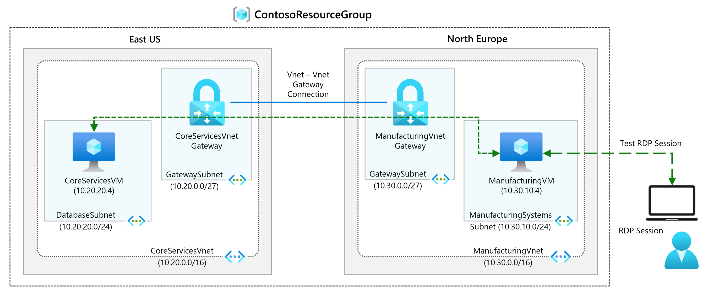
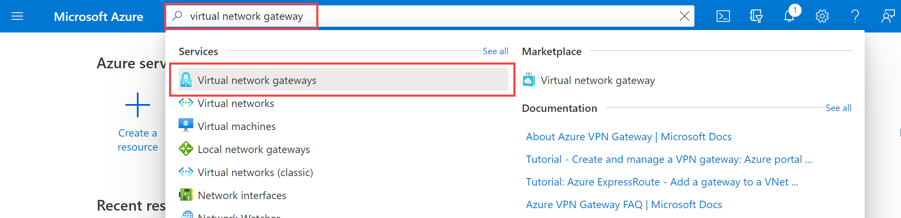

---
Exercise:
    title: 'M02 - Unit 3 Create and configure a virtual network gateway'
    module: 'Module 02 - Design and implement hybrid networking'
---


# M02-Unit 3 Create and configure a virtual network gateway

## Exercise scenario

In this exercise you will configure a virtual network gateway to connect the Contoso Core Services VNet and Manufacturing VNet.



In this exercise, you will:

+ Task 1: Create CoreServicesVnet and ManufacturingVnet
+ Task 2: Create CoreServicesVM
+ Task 3: Create ManufacturingVM
+ Task 4: Connect to the VMs using RDP
+ Task 5: Test the connection between the VMs
+ Task 6: Create CoreServicesVnet Gateway
+ Task 7: Create ManufacturingVnet Gateway
+ Task 8: Connect CoreServicesVnet to ManufacturingVnet
+ Task 9: Connect ManufacturingVnet to CoreServicesVnet
+ Task 10: Verify that the connections connect
+ Task 11: Test the connection between the VMs

>**Note**: An **[interactive lab simulation](https://mslabs.cloudguides.com/guides/AZ-700%20Lab%20Simulation%20-%20Create%20and%20configure%20a%20virtual%20network%20gateway)** is available that allows you to click through this lab at your own pace. You may find slight differences between the interactive simulation and the hosted lab, but the core concepts and ideas being demonstrated are the same.

### Estimated time: 70 minutes (including ~45 minutes deployment waiting time)

## Task 1: Create CoreServicesVnet and ManufacturingVnet

1. In the Azure portal, select the Cloud Shell icon (top right). If necessary, configure the shell.  
    + Select **PowerShell**.
    + Select **No Storage Account required** and your **Subscription**, then select **Apply**.
    + Wait for the terminal to create and a prompt to be displayed. 

1. On the toolbar of the Cloud Shell pane, select the **Manage files** icon, in the drop-down menu, select **Upload** and upload the following files **azuredeploy.json** and **azuredeploy.parameters.json** into the Cloud Shell home directory one by one from the source folder **F:\Allfiles\Exercises\M02**

1. Deploy the following ARM templates to create the virtual network and subnets needed for this exercise:

   ```powershell
   $RGName = "ContosoResourceGroup"
   #create resource group if it doesnt exist
   New-AzResourceGroup -Name $RGName -Location "eastus"
   New-AzResourceGroupDeployment -ResourceGroupName $RGName -TemplateFile azuredeploy.json -TemplateParameterFile azuredeploy.parameters.json
   ```
   
## Task 2: Create CoreServicesVM

1. On the Azure portal, open the **PowerShell** session within the **Cloud Shell** pane.

1. On the toolbar of the Cloud Shell pane, select the **Manage files** icon, in the drop-down menu, select **Upload** and upload the following files **CoreServicesVMazuredeploy.json** and **CoreServicesVMazuredeploy.parameters.json** into the Cloud Shell home directory one by one from the source folder **F:\Allfiles\Exercises\M02**.

1. Deploy the following ARM templates to create the VMs needed for this exercise:

   >**Note**: You will be prompted to provide an Admin password.

   ```powershell
   $RGName = "ContosoResourceGroup"
   
   New-AzResourceGroupDeployment -ResourceGroupName $RGName -TemplateFile CoreServicesVMazuredeploy.json -TemplateParameterFile CoreServicesVMazuredeploy.parameters.json
   ```
  
1. When the deployment is complete, go to the Azure portal home page, and then select **Virtual Machines**.

1. Verify that the virtual machine has been created.

## Task 3: Create ManufacturingVM

1. On the Azure portal, open the **PowerShell** session within the **Cloud Shell** pane.

1. On the toolbar of the Cloud Shell pane, select the **Manage files** icon, in the drop-down menu, select **Upload** and upload the following files **ManufacturingVMazuredeploy.json** and **ManufacturingVMazuredeploy.parameters.json** into the Cloud Shell home directory one by one from the source folder **F:\Allfiles\Exercises\M02**.

1. Deploy the following ARM templates to create the VMs needed for this exercise:

   >**Note**: You will be prompted to provide an Admin password.

   ```powershell
   $RGName = "ContosoResourceGroup"
   
   New-AzResourceGroupDeployment -ResourceGroupName $RGName -TemplateFile ManufacturingVMazuredeploy.json -TemplateParameterFile ManufacturingVMazuredeploy.parameters.json
   ```
  
1. When the deployment is complete, go to the Azure portal home page, and then select **Virtual Machines**.

1. Verify that the virtual machine has been created.

## Task 4: Connect to the VMs using RDP

1. On the Azure Portal home page, select **Virtual Machines**.

1. Select **ManufacturingVM**.

1. On **ManufacturingVM**, select **Connect** and then **RDP**.

1. Select **Download RDP file**.

1. Save the RDP file to your desktop.

1. Connect to **ManufacturingVM** using the RDP file, and the username **TestUser** and the password you provided during deployment. After connecting, minimize the RDP session.

1. On the Azure Portal home page, select **Virtual Machines**.

1. Select **CoreServicesVM**.

1. On **CoreServicesVM**, select **Connect** and then **RDP**.

1. Select **Download RDP file**.

1. Save the RDP file to your desktop.

1. Connect to **CoreServicesVM** using the RDP file, and the username **TestUser** and the password you provided during deployment.

1. On both VMs, in **Choose privacy settings for your device**, select **Accept**.

1. On both VMs, in **Networks**, select **Yes**.

1. On **CoreServicesVM**, open PowerShell, and run the following command: ipconfig

1. Note the IPv4 address.

## Task 5: Test the connection between the VMs

1. On the **ManufacturingVM**, open PowerShell.

1. Use the following command to verify that there is no connection to CoreServicesVM on CoreServicesVnet. Be sure to use the IPv4 address for CoreServicesVM.

   ```Powershell
   Test-NetConnection 10.20.20.4 -port 3389
   ```

1. The test connection should fail, and you will see a result similar to the following:

   

## Task 6: Create CoreServicesVnet Gateway

1. In **Search resources, services, and docs (G+/)**, enter **Virtual network gateway**, and then select **Virtual network gateways** from the results.
   

1. In Virtual network gateways, select **+ Create**.

1. Use the information in the following table to create the virtual network gateway:

   | **Tab**         | **Section**       | **Option**                                  | **Value**                    |
   | --------------- | ----------------- | ------------------------------------------- | ---------------------------- |
   | Basics          | Project Details   | Subscription                                | No changes required          |
   |                 |                   | ResourceGroup                               | ContosoResourceGroup         |
   |                 | Instance Details  | Name                                        | CoreServicesVnetGateway      |
   |                 |                   | Region                                      | East US                      |
   |                 |                   | Gateway type                                | VPN                          |
   |                 |                   | SKU                                         | VpnGw1                       |
   |                 |                   | Generation                                  | Generation1                  |
   |                 |                   | Virtual network                             | CoreServicesVnet             |
   |                 |                   | Subnet                                      | GatewaySubnet (10.20.0.0/27) |
   |                 |                   | Public IP address type                      | Standard                     |
   |                 | Public IP address | Public IP address                           | Create new                   |
   |                 |                   | Public IP address name                      | CoreServicesVnetGateway-ip   |
   |                 |                   | Enable active-active mode                   | Disabled                     |
   |                 |                   | Configure BGP                               | Disabled                     |
   | Review + create |                   | Review your settings and select **Create**. |                              |

   >**Note**: It can take up to 15 - 30 minutes to create a virtual network gateway. You don't need to wait for the deployment to complete. Proceed to creating the next gateway. 

## Task 7: Create ManufacturingVnet Gateway

### Create the GatewaySubnet

   >**Note**: The template created the GatewaySubnet for the CoreServicesVnet. Here you create the subnet manually. 

1. Search for and select the **ManufacturingVnet**.

1. In the **Settings** blade, select **Subnets**, and then **+ Subnet**. 

    | Parameter | Value |
    | --------------- | ----------------- | 
    | Subnet purpose | **Virtual Network Gateway** |
    | Size | **/27 (32 addresses)** |

1. Select **Add**. 

### Create the virtual network gateway

1. In **Search resources, services, and docs (G+/)**, enter **Virtual network gateway**, and then select **Virtual network gateways** from the results.

1. In Virtual network gateways, select **+ Create**.

1. Use this information and the **Settings** tab to create the virtual network gateway. 

   | **Tab**         | **Section**       | **Option**                                  | **Value**                    |
   | --------------- | ----------------- | ------------------------------------------- | ---------------------------- |
   | Basics          | Project Details   | Subscription                                | No changes required          |
   |                 |                   | ResourceGroup                               | ContosoResourceGroup         |
   |                 | Instance Details  | Name                                        | ManufacturingVnetGateway     |
   |                 |                   | Region                                      | North Europe                 |
   |                 |                   | Gateway type                                | VPN                          |
   |                 |                   | SKU                                         | VpnGw1                       |
   |                 |                   | Generation                                  | Generation1                  |
   |                 |                   | Virtual network                             | ManufacturingVnet            |
   |                 |                   | Subnet                                      | GatewaySubnet |
   |                 |                   | Public IP Address Type                      | Standard                     |
   |                 | Public IP address | Public IP address                           | Create new                   |
   |                 |                   | Public IP address name                      | ManufacturingVnetGateway-ip  |
   |                 |                   | Enable active-active mode                   | Disabled                     |
   |                 |                   | Configure BGP                               | Disabled                     |
   | Review + create |                   | Review your settings and select **Create**. |                              |

   >**Note**: It can take up to 15 -30 minutes to create a virtual network gateway.

## Task 8: Connect CoreServicesVnet to ManufacturingVnet

1. In **Search resources, services, and docs (G+/)**, enter **Virtual network gateway**, and then select **Virtual network gateways** from the results.

1. In Virtual network gateways, select **CoreServicesVnetGateway**.

1. In CoreServicesGateway, select **Connections**, and then select **+ Add**.

   >**Note**: You will not be able to complete this configuration until the virtual network gateways are fully deployed.

1. Use this information and the **Settings** tab to create the virtual network gateway. 


   | **Option**                     | **Value**                         |
   | ------------------------------ | --------------------------------- |
   | Name                           | CoreServicesGW-to-ManufacturingGW |
   | Connection type                | VNet-to-VNet                      |
   | Region                         | East US                           |
   | First virtual network gateway  | CoreServicesVnetGateway           |
   | Second virtual network gateway | ManufacturingVnetGateway          |
   | Shared key (PSK)               | abc123                            |
   | Use Azure Private IP Address   | Not selected                      |
   | Enable BGP                     | Not selected                      |
   | IKE Protocol                   | IKEv2                             |
   | Subscription                   | No changes required               |
   | Resource group                 | No changes required               |


1. To create the connection, select **Review + Create** and then **Create**.

## Task 9: Connect ManufacturingVnet to CoreServicesVnet

1. In **Search resources, services, and docs (G+/)**, enter **Virtual network gateway**, and then select **Virtual network gateways** from the results.

1. In Virtual network gateways, select **ManufacturingVnetGateway**.

1. In CoreServicesGateway, select **Connections**, and then select **+ Add**.

1. Use the information in the following table to create the connection:

   | **Option**                     | **Value**                         |
   | ------------------------------ | --------------------------------- |
   | Name                           | ManufacturingGW-to-CoreServicesGW |
   | Connection type                | VNet-to-VNet                      |
   | Location                       | North Europe                      |
   | First virtual network gateway  | ManufacturingVnetGateway          |
   | Second virtual network gateway | CoreServicesVnetGateway           |
   | Shared key (PSK)               | abc123                            |
   | Use Azure Private IP Address   | Not selected                      |
   | Enable BGP                     | Not selected                      |
   | IKE Protocol                   | IKEv2                             |
   | Subscription                   | No changes required               |
   | Resource group                 | No changes required               |


1. To create the connection, select **Review + Create** and then **Create**.

## Task 10: Verify that the connections connect

1. In **Search resources, services, and docs (G+/)**, enter **vpn**, and then select **connections** from the results.

1. Wait until the status of both connections is **Connected**. You may need to refresh your screen.

   

## Task 11: Test the connection between the VMs

1. On the **ManufacturingVM**, open PowerShell.

1. Use the following command to verify that there is now a connection to CoreServicesVM on CoreServicesVnet. Be sure to use the IPv4 address for CoreServicesVM.

   ```Powershell
   Test-NetConnection 10.20.20.4 -port 3389
   ```

1. The test connection should succeed, and you will see a result similar to the following:

   

1. Close the Remote Desktop connection windows.

## Extend your learning with Copilot

Copilot can assist you in learning how to use the Azure scripting tools. Copilot can also assist in areas not covered in the lab or where you need more information. Open an Edge browser and choose Copilot (top right) or navigate to *copilot.microsoft.com*. Take a few minutes to try these prompts.
+ What are the main types of Azure VPN gateways and why would you use each type?
+ What factors should I consider when selecting the Azure VPN gateway sku? Give examples.
+ Are there costs associated with Azure VPN gateways?


## Learn more with self-paced training

+ [Connect your on-premises network to Azure with VPN Gateway](https://learn.microsoft.com/training/modules/connect-on-premises-network-with-vpn-gateway/). In this module, you will how to use CLI to provision VPN gateways.
+ [Troubleshoot VPN gateways in Microsoft Azure](https://learn.microsoft.com/training/modules/troubleshoot-vpn-gateways/). In this module, you learn how to monitor and troubleshoot site-to-site and point-to-site VPNs.

## Key takeaways

Congratulations on completing the lab. Here are the main takeaways for this lab. 

+ Azure VPN Gateway is a service that provides secure connectivity between your on-premises networks and Azure virtual networks.
+ Site-to-Site (S2S) connections connect your on-premises network to an Azure virtual network using IPsec/IKE VPN tunnels. Ideal for hybrid cloud scenarios.
+ Point-to-Site (P2S) connections connnect individual clients to an Azure virtual network from remote locations. VPN protocols inlcude OpenVPN, IKEv2, or SSTP. Useful for remote workers.
+ VNet-to-VNet connections connect two or more Azure virtual networks using IPsec/IKE VPN tunnels. Suitable for multi-region or multi-VNet deployments.
+ Different VPN Gateway SKUs offer varying levels of performance, throughput, and features. 

