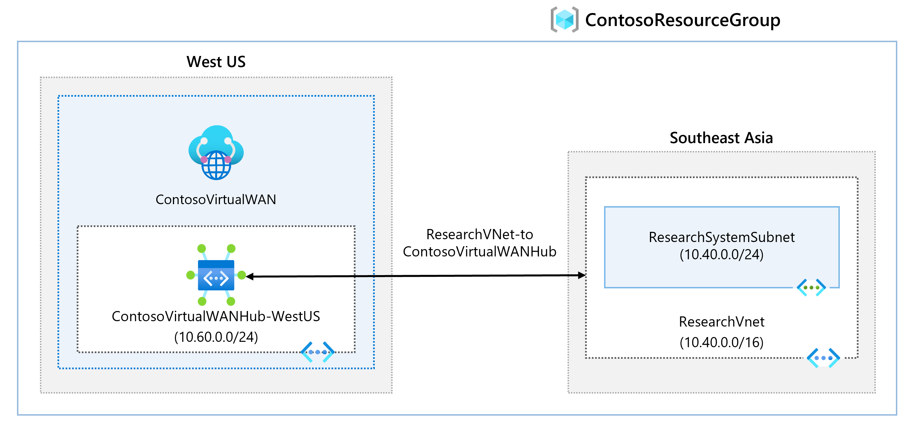
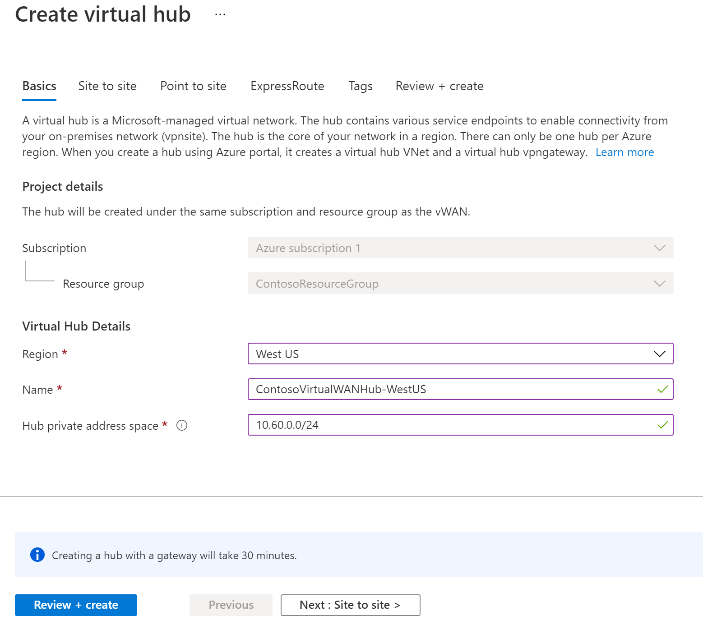

---
Exercise:
    title: 'M02 - Unit 7 Create a Virtual WAN by using Azure Portal'
    module: 'Module 02 - Design and implement hybrid networking'
---

# M02-Unit 7 Create a Virtual WAN by using Azure Portal

## Exercise scenario

In this exercise, you will create a Virtual WAN for Contoso.



In this exercise, you will:

+ Task 1: Create a Virtual WAN
+ Task 2: Create a hub by using Azure Portal
+ Task 3: Connect a VNet to the Virtual Hub


   >**Note**: An **[interactive lab simulation](https://mslabs.cloudguides.com/guides/AZ-700%20Lab%20Simulation%20-%20Create%20a%20virtual%20WAN%20using%20the%20Azure%20portal)** is available that allows you to click through this lab at your own pace. You may find slight differences between the interactive simulation and the hosted lab, but the core concepts and ideas being demonstrated are the same.

### Estimated time: 65 minutes (including ~45 minutes deployment waiting time)

## Task 1: Create a Virtual WAN

1. From a browser, navigate to the Azure portal and sign in with your Azure account.

1. In the portal, enter Virtual WAN into the search box and select **Virtual WANs** from the results list.

   

1. On the Virtual WAN page, select + **Create**.

1. On the Create WAN page, on the **Basics** tab, fill in the following fields:

   + **Subscription:** Use the existing subscription

   + **Resource group:** ContosoResourceGroup

   + **Resource group location:** Choose a resource location from the dropdown. A WAN is a global resource and does not live in a particular region. However, you must select a region to manage and locate the WAN resource that you create.

   + **Name:** ContosoVirtualWAN

   + **Type:** Standard

1. When you have finished filling out the fields, select **Review +Create**.

1. Once validation passes, select **Create** to create the Virtual WAN.

## Task 2: Create a hub by using Azure Portal

A hub contains gateways for site-to-site, ExpressRoute, or point-to-site functionality. It takes 30 minutes to create the site-to-site VPN gateway in the virtual hub. You must create a Virtual WAN before you can create a hub.

1. Locate the Virtual WAN that you created.
   
1. On the Virtual WAN page, under **Connectivity**, select **Hubs**.

1. On the Hubs page, select **+New Hub** to open the Create virtual hub page.
   

1. On the Create virtual hub page **Basics** tab, complete the following fields:
   + **Region:** West US
   + **Name:** ContosoVirtualWANHub-WestUS
   + **Hub private address space:** 10.60.0.0/24
   + **Virtual hub capacity:** 2 Routing infrastructure units
   + **Hub routing preference:** leave the default

1. Select **Next: Site-to-site**.

1. On the **Site-to-site** tab, complete the following fields:
   + **Do you want to create a Site to site (VPN gateway)?:** Yes
   + The **AS Number** field cannot be edited.
   + **Gateway scale units:** 1 scale unit = 500 Mbps x 2
   + **Routing preference:** leave the default

1. Select **Review + Create** to validate.

1. Select **Create** to create the hub.

1. After 30 minutes, **Refresh** to view the hub on the Hubs page.

## Task 3: Connect a VNet to the Virtual Hub

1. Locate the Virtual WAN that you created.

1. In ContosoVirtualWAN, under **Connectivity**, select **Virtual network connections**.

   

1. On ContosoVirtualWAN | Virtual network connections, select **+ Add connection**.

1. In Add connection, use the following information to create the connection.

   + **Connection name:** ContosoVirtualWAN-to-ResearchVNet

   + **Hubs:** ContosoVirtualWANHub-WestUS

   + **Subscription:** no changes

   + **Resource Group:** ContosoResourceGroup

   + **Virtual network:** ResearchVNet

   + **Propagate to none:** Yes

   + **Associate Route Table:** Default

1. Select **Create**.

## Clean up resources

   >**Note**: Remember to remove any newly created Azure resources that you no longer use. Removing unused resources ensures you will not see unexpected charges.

1. On the Azure portal, open the **PowerShell** session within the **Cloud Shell** pane.

1. Delete all resource groups you created throughout the labs of this module by running the following command:

   ```powershell
   Remove-AzResourceGroup -Name 'ContosoResourceGroup' -Force -AsJob
   ```

   >**Note**: The command executes asynchronously (as determined by the -AsJob parameter), so while you will be able to run another PowerShell command immediately afterwards within the same PowerShell session, it will take a few minutes before the resource groups are actually removed.

## Extend your learning with Copilot

Copilot can assist you in learning how to use the Azure scripting tools. Copilot can also assist in areas not covered in the lab or where you need more information. Open an Edge browser and choose Copilot (top right) or navigate to *copilot.microsoft.com*. Take a few minutes to try these prompts.
+ What type of network architecture does Azure VWAN use?
+ What are the differences between Azure VWAN basic and standard? Provide examples.
+ Can an Azure VWAN be created with scripting tools?

## Learn more with self-paced training

+ [Introduction to Azure Virtual WAN](https://learn.microsoft.com/training/modules/introduction-azure-virtual-wan/). In this module, you learn about Azure Virtual WAN functionality and features. 
+ [Design and implement hybrid networking](https://learn.microsoft.com/training/modules/design-implement-hybrid-networking/). In this module, you learn how to design and implement Azure Virtual WAN.

## Key takeaways

Congratulations on completing the lab. Here are the main takeaways for this lab. 

+ Azure Virtual WAN is a networking service that brings many networking, security, and routing functionalities together to provide a single operational interface
+ The Virtual WAN architecture is a hub and spoke architecture with scale and performance built in for branches, users, ExpressRoute circuits, and virtual networks.
+ There are three main usage cases for virtual WAN: Site to site, Point to site, and ExpressRoute. 
+ There are two types of virtual WANs: Basic (Site-to-site VPN only) and Standard.


