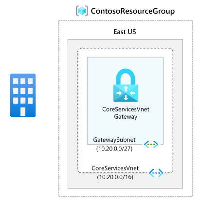

---
Exercise:
    title: 'M03 - Unit 4 Configure an ExpressRoute Gateway'
    module: 'Module 03 - Design and implement Azure ExpressRoute'
---
# M03-Unit 4 Configure an ExpressRoute Gateway

## Exercise scenario

To connect your Azure virtual network and your on-premises network via ExpressRoute, you must create a virtual network gateway first. A virtual network gateway serves two purposes: to exchange IP routes between the networks and to route network traffic.

   >**Note**: An **[interactive lab simulation](https://mslabs.cloudguides.com/guides/AZ-700%20Lab%20Simulation%20-%20Configure%20an%20ExpressRoute%20gateway)** is available that allows you to click through this lab at your own pace. You may find slight differences between the interactive simulation and the hosted lab, but the core concepts and ideas being demonstrated are the same.

### Estimated time: 60 minutes (includes ~45 minutes deployment waiting time)

**Gateway types**

When you create a virtual network gateway, you need to specify several settings. One of the required settings, '-GatewayType', specifies whether the gateway is used for ExpressRoute, or VPN traffic. The two gateway types are:

- **VPN** - To send encrypted traffic across the public Internet, you use the gateway type 'VPN'. This is also referred to as a VPN gateway. Site-to-Site, Point-to-Site, and VNet-to-VNet connections all use a VPN gateway.
- **ExpressRoute** - To send network traffic on a private connection, you use the gateway type 'ExpressRoute'. This is also referred to as an ExpressRoute gateway and is the type of gateway used when configuring ExpressRoute.

Each virtual network can have only one virtual network gateway per gateway type. For example, you can have one virtual network gateway that uses -GatewayType VPN, and one that uses -GatewayType ExpressRoute.

In this exercise, you will:

- Task 1: Create the VNet and gateway subnet
- Task 2: Create the virtual network gateway

## Task 1: Create the VNet and gateway subnet

1. On any Azure Portal page, in **Search resources, services and docs**, enter virtual network, and then select **Virtual networks** from the results.

1. On the Virtual networks page, select **+Create**.

1. On the Create virtual networks pane, on the **Basics** tab, use the information in the following table to create the VNet:

   | **Setting**          | **Value**                        |
   | -------------------- | -------------------------------- |
   | Virtual Network Name | CoreServicesVNet                 |
   | Resource Group       | ContosoResourceGroup             |
   | Location             | East US                          |

1. Select **Next : IP addresses**.

1. On the **IP Addresses** tab, in **IPv4 address space**, enter 10.20.0.0/16, and then select **+ Add subnet**.

1. In the Add subnet pane, use the information in the following table to create the subnet:

   | **Setting**                  | **Value**               |
   | ---------------------------- | ----------------------- |
   | Subnet purpose               | Virtual Network Gateway |
   | Gateway Subnet address space | 10.20.0.0/27            |

Note that the subnet name will be automatically populated.

1. And then select **Add**.

1. On the Create virtual network page, select **Review + Create**.

   

1. Confirm that the VNet passes the validation and then select **Create**.

   >**Note**: If you are using a dual stack virtual network and plan to use IPv6-based private peering over ExpressRoute, select Add IP6 address space and input IPv6 address range values.

## Task 2: Create the virtual network gateway

1. On any Azure Portal page, in **Search resources, services and docs (G+/)**, enter virtual network gateway, and then select **Virtual network gateways** from the results.

1. On the Virtual network gateways page, select **+Create**.

1. On the **Create virtual network gateway** page, use the information in the following table to create the gateway:

   | **Setting**               | **Value**                  |
   | ------------------------- | -------------------------- |
   | **Project details**       |                            |
   | Resource Group            | ContosoResourceGroup       |
   | **Instance details**      |                            |
   | Name                      | CoreServicesVnetGateway    |
   | Region                    | East US                    |
   | Gateway type              | ExpressRoute               |
   | SKU                       | Standard                   |
   | Virtual network           | CoreServicesVNet           |
   | **Public IP address**     |                            |
   | Public IP address         | Create new                 |
   | Public IP address name    | CoreServicesVnetGateway-IP |
   | Assignment                | Not configurable           |

1. Select **Review + Create**.

1. Confirm that the Gateway configuration passes validation and then select **Create**.

1. When the deployment is complete, select **Go to Resource**.

   >**Note**: It can take up to 45 minutes to deploy a Gateway.

## Extend your learning with Copilot

Copilot can assist you in learning how to use the Azure scripting tools. Copilot can also assist in areas not covered in the lab or where you need more information. Open an Edge browser and choose Copilot (top right) or navigate to *copilot.microsoft.com*. Take a few minutes to try these prompts.
+ How is Azure ExpressRoute different from Virtual WAN? Could you use the technolgies together? Provide examples.
+ What should I consider when choosing between an ExpressRoute provider model and ExpressRoute Direct?
+ Create a table that summarizes the Azure ExpressRoute SKU and their features.

## Learn more with self-paced training

+ [Introduction to Azure ExpressRoute](https://learn.microsoft.com/training/modules/intro-to-azure-expressroute/). In this module, you learn what Azure ExpressRoute is and the functionality it provides.
+ [Design and implement ExpressRoute](https://learn.microsoft.com/training/modules/design-implement-azure-expressroute/). In this module, you learn how to design and implement Azure ExpressRoute, ExpressRoute Global Reach, ExpressRoute FastPath.

## Key takeaways

Congratulations on completing the lab. Here are the main takeaways for this lab. 
+ Azure ExpressRoute allows an organization to connect their on-premises networks directly into the Microsoft Azure and Microsoft 365 clouds. Azure ExpressRoute uses a dedicated high-bandwidth connection provided by a Microsoft partner.
+ Microsoft guarantees a minimum of 99.95% availability for ExpressRoute dedicated connections. The connection is private and travels over a dedicated line, third parties can't intercept the traffic.
+ You can create a connection between your on-premises network and the Microsoft cloud in four different ways, CloudExchange Co-location, Point-to-point Ethernet Connection, Any-to-any (IPVPN) Connection, and ExpressRoute Direct.
+ ExpressRoute features is determined by the SKU: Local, Standard, and Premuium. 
