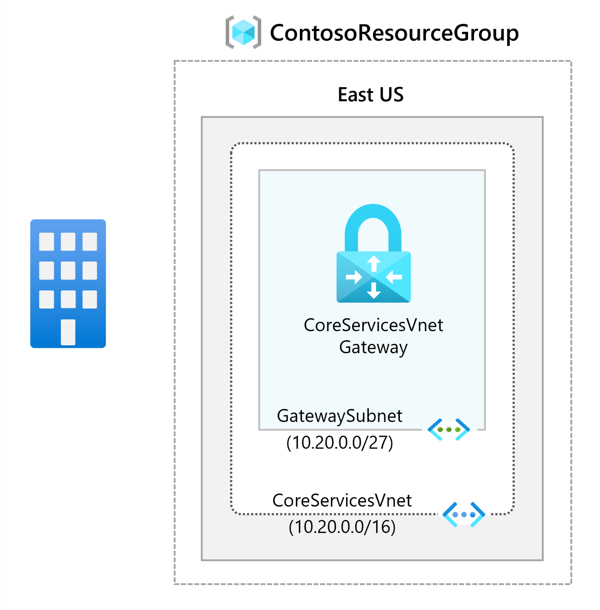
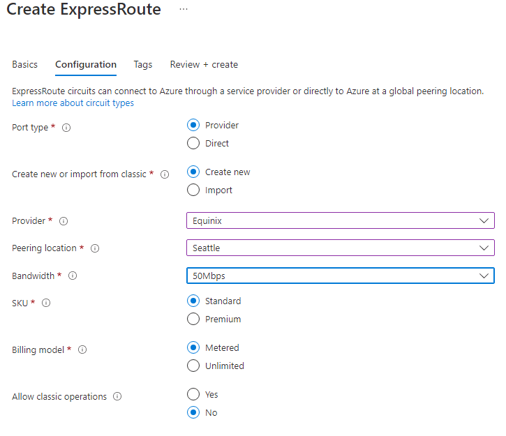

---
Exercise:
    title: 'M03 - Unit 5 Provision an ExpressRoute circuit'
    module: 'Module 03 - Design and implement Azure ExpressRoute'
---
# M03-Unit 5 Provision an ExpressRoute circuit

## Exercise scenario

In this exercise, you will create an ExpressRoute circuit using the Azure portal and the Azure Resource Manager deployment model.

   >**Note**: An **[interactive lab simulation](https://mslabs.cloudguides.com/guides/AZ-700%20Lab%20Simulation%20-%20Provision%20an%20ExpressRoute%20circuit)** is available that allows you to click through this lab at your own pace. You may find slight differences between the interactive simulation and the hosted lab, but the core concepts and ideas being demonstrated are the same.

### Estimated time: 15 minutes



In this exercise, you will:

+ Task 1: Create and provision an ExpressRoute circuit
+ Task 2: Retrieve your Service key
+ Task 3: Deprovisioning an ExpressRoute circuit


## Task 1: Create and provision an ExpressRoute circuit

1. From a browser, navigate to the [Azure portal](https://portal.azure.com/) and sign in with your Azure account.

   >**Important**:  Your ExpressRoute circuit is billed from the moment a service key is issued. Ensure that you perform this operation when the connectivity provider is ready to provision the circuit.

1. On the Azure portal menu, select **+ Create a resource**. Select **Networking**, and then select **ExpressRoute**, as shown in the following image. If ExpressRoute does not appear in the list, use **Search the marketplace** to search for it:

   

1. On the **Create ExpressRoute** page, provide the **Resource Group** as ExpressRouteResourceGroup. Then select **Standard Resiliency** for **Resiliency**

1. For ***Circuit Details**, make sure that you specify the correct Region (**East US 2**), Circuit Name (**TestERCircuit**), Peering location (**Seattle**), Provider (**Equinix**), Bandwidth (**50Mbps**), SKU tier (**Standard**) and data metering billing model (**Metered**).

1. Select **Review + Create**.

1. Confirm that the ExpressRoute configuration passes validation and then select **Create**.



+ Port type determines if you are connecting to a service provider or directly into Microsoft's global network at a peering location.
+ Create new or import from classic determines if a new circuit is being created or if you are migrating a classic circuit to Azure Resource Manager.
+ Provider is the internet service provider who you will be requesting your service from.
+ Peering Location is the physical location where you are peering with Microsoft.

> [!Important]
>
> The Peering Location indicates the [physical location](https://docs.microsoft.com/en-us/azure/expressroute/expressroute-locations) where you are peering with Microsoft. This is not linked to "Location" property, which refers to the geography where the Azure Network Resource Provider is located. While they are not related, it is a good practice to choose a Network Resource Provider geographically close to the Peering Location of the circuit.

+ **SKU** determines whether an ExpressRoute local, ExpressRoute standard, or an ExpressRoute premium add-on is enabled. You can specify **Local** to get the local SKU, **Standard** to get the standard SKU or **Premium** for the premium add-on. You can change the SKU to enable the premium add-on.

   >**Important**:  You cannot change the SKU from Standard/Premium to Local.

+ **Billing model** determines the billing type. You can specify **Metered** for a metered data plan and **Unlimited** for an unlimited data plan. You can change the billing type from **Metered** to **Unlimited**.

> [!Important]
>
> You cannot change the type from Unlimited to Metered.

+ **Allow classic operation** will allow classic virtual networks to be link to the circuit.

## Task 2: Retrieve your Service key

1. You can view all the circuits that you created by selecting **All services &gt; Networking &gt; ExpressRoute circuits**.

   

1. All ExpressRoute circuits created in the subscription will appear here.

   

1. The circuit page displays the properties of the circuit. The service key appears in the service key field. Your service provider will need the Service Key to complete the provisioning process. The service key is specific to your circuit. **You must send the service key to your connectivity provider for provisioning.**

   

1. On this page, **Provider status** gives you the current state of provisioning on the service-provider side. **Circuit status** provides you the state on the Microsoft side.

1. When you create a new ExpressRoute circuit, the circuit is in the following state:

   + Provider status: Not provisioned
   + Circuit status: Enabled

   + The circuit changes to the following state when the connectivity provider is currently enabling it for you:
     + Provider status: Provisioning
     + Circuit status: Enabled
   + To use the ExpressRoute circuit, it must be in the following state:
     + Provider status: Provisioned
     + Circuit status: Enabled
   + You should periodically check the provisioning status and the state of the circuit status.


Congratulations! You have created an ExpressRoute circuit and located the Service key, which you would need to complete the provisioning of the circuit.

## Task 3: Deprovisioning an ExpressRoute circuit

If the ExpressRoute circuit service provider provisioning state is **Provisioning** or **Provisioned,** you must work with your service provider to deprovision the circuit on their side. Microsoft can continue to reserve resources and bill you until the service provider completes deprovisioning the circuit and notifies us.

   >**Note**: You must unlink all virtual networks from the ExpressRoute circuit before deprovisioning. If this operation fails, check whether any virtual networks are linked to the circuit. If the service provider has deprovisioned the circuit (the service provider provisioning state is set to Not provisioned), you can delete the circuit. This stops billing for the circuit.

## Clean up resources

You can delete your ExpressRoute circuit by selecting the **Delete** icon. Ensure the provider status is Not provisioned before proceeding.


   >**Note**: Remember to remove any newly created Azure resources that you no longer use. Removing unused resources ensures you will not see unexpected charges.

1. On the Azure portal, open the **PowerShell** session within the **Cloud Shell** pane.

1. Delete all resource groups you created throughout the labs of this module by running the following command:

   ```powershell
   Remove-AzResourceGroup -Name 'ContosoResourceGroup' -Force -AsJob
   Remove-AzResourceGroup -Name 'ExpressRouteResourceGroup' -Force -AsJob
   ```

   >**Note**: The command executes asynchronously (as determined by the -AsJob parameter), so while you will be able to run another PowerShell command immediately afterwards within the same PowerShell session, it will take a few minutes before the resource groups are actually removed.

## Extend your learning with Copilot

Copilot can assist you in learning how to use the Azure scripting tools. Copilot can also assist in areas not covered in the lab or where you need more information. Open an Edge browser and choose Copilot (top right) or navigate to *copilot.microsoft.com*. Take a few minutes to try these prompts.
+ What service providers are available for Azure ExpressRoute?
+ What are the most common configuration issues with Azure ExpressRoute? What should I do if I have that issue?

## Learn more with self-paced training

+ [Introduction to Azure ExpressRoute](https://learn.microsoft.com/training/modules/intro-to-azure-expressroute/). In this module, you learn what Azure ExpressRoute is and the functionality it provides.
+ [Design and implement ExpressRoute](https://learn.microsoft.com/training/modules/design-implement-azure-expressroute/). In this module, you learn how to design and implement Azure ExpressRoute, ExpressRoute Global Reach, ExpressRoute FastPath.

## Key takeaways

Congratulations on completing the lab. Here are the main takeaways for this lab. 
+ Azure ExpressRoute allows an organization to connect their on-premises networks directly into the Microsoft Azure and Microsoft 365 clouds. Azure ExpressRoute uses a dedicated high-bandwidth connection provided by a Microsoft partner.
+ Microsoft guarantees a minimum of 99.95% availability for ExpressRoute dedicated connections. The connection is private and travels over a dedicated line, third parties can't intercept the traffic.
+ You can create a connection between your on-premises network and the Microsoft cloud in four different ways, CloudExchange Co-location, Point-to-point Ethernet Connection, Any-to-any (IPVPN) Connection, and ExpressRoute Direct.
+ ExpressRoute features is determined by the SKU: Local, Standard, and Premuium. 
