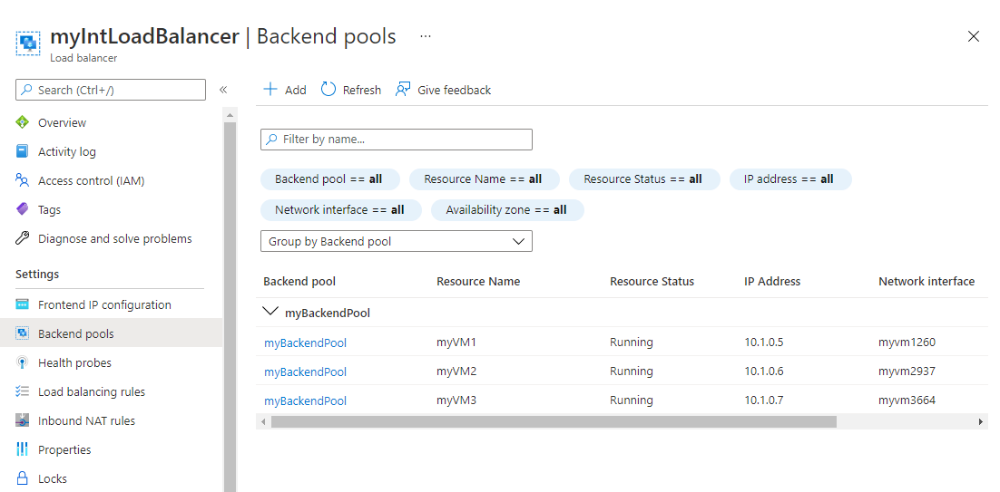
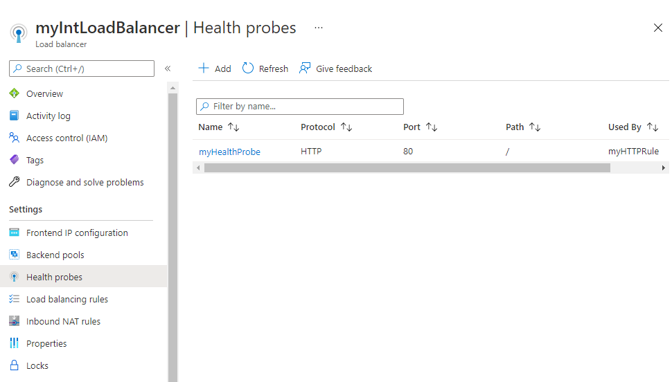

---
Exercise:
    title: 'M04 - Unit 4 Create and configure an Azure load balancer'
    module: 'Module 04 - Load balancing non-HTTP(S) traffic in Azure'
---


# M04-Unit 4 Create and configure an Azure load balancer

In this exercise, you will create an internal load balancer for the fictional Contoso Ltd organization. 

**Note:** An **[interactive lab simulation](https://mslabs.cloudguides.com/guides/AZ-700%20Lab%20Simulation%20-%20Create%20and%20configure%20an%20Azure%20load%20balancer)** is available that allows you to click through this lab at your own pace. You may find slight differences between the interactive simulation and the hosted lab, but the core concepts and ideas being demonstrated are the same.

#### Estimated time: 60 minutes (includes ~45 minutes deployment waiting time)

The steps to create an internal load balancer, are very similar to those you have already learned about in this module, to create a public load balancer. The key difference is that with a public load balancer the front end is accessed via a public IP address, and you test connectivity from a host which is located outside your virtual network; whereas, with an internal load balancer, the front end is a private IP address inside your virtual network, and you test connectivity from a host inside the same network.

The diagram below illustrates the environment you will be deploying in this exercise.


 
In this exercise, you will:

+ Task 1: Create the virtual network
+ Task 2: Create backend servers
+ Task 3: Create the load balancer
+ Task 4: Create load balancer resources
+ Task 5: Test the load balancer

## Task 1: Create the virtual network

In this section, you will create a virtual network and a subnet.
   
1. Log in to the Azure portal.

2. On the Azure portal home page, navigate to the Global Search bar and search **Virtual Networks** and select virtual networks under services.  

3. Select **Create** on the Virtual networks page.  

4. On the **Basics** tab, use the information in the table below to create the virtual network.

   | **Setting**    | **Value**                                  |
   | -------------- | ------------------------------------------ |
   | Subscription   | Select your subscription                   |
   | Resource group | Select **Create  new**  Name: **IntLB-RG** |
   | Name           | **IntLB-VNet**                             |
   | Region         | **(US) East US**                           |


5. Select **Next : IP Addresses**.

6. On the **IP Addresses** tab, in the **IPv4 address space** box, remove the default and enter **10.1.0.0/16**.

7. On the **IP Addresses** tab, select **+ Add subnet**.

8. In the **Add subnet** pane, provide a subnet name of **myBackendSubnet**, and a subnet address range of **10.1.0.0/24**.

9. Select **Add**.

10. Select **Add subnet**, provide a subnet name of **myFrontEndSubnet**, and a subnet address range of **10.1.2.0/24**. Select **Add**

11. Select **Next : Security**.

12. Under **BastionHost** select **Enable**, then enter the information from the table below.

    | **Setting**                       | **Value**                                     |
    | --------------------------------- | --------------------------------------------- |
    | Bastion name                      | **myBastionHost**                             |
    | AzureBastionSubnet address  space | **10.1.1.0/24**                               |
    | Public IP address                 | Select **Create  new**  Name: **myBastionIP** |


13. Select **Review + create**.

14. Select **Create**.

## Task 2: Create backend servers

In this section, you will create three VMs, that will be in the same availability set, for the backend pool of the load balancer, add the VMs to the backend pool, and then install IIS on the three VMs to test the load balancer.

1. On the Azure portal, open the **PowerShell** session within the **Cloud Shell** pane.

2. On the toolbar of the Cloud Shell pane, select the **Upload/Download files** icon, in the drop-down menu, select **Upload** and upload the following files azuredeploy.json, azuredeploy.parameters.vm1.json, azuredeploy.parameters.vm2.json and azuredeploy.parameters.vm3.json into the Cloud Shell home directory one by one.

3. Deploy the following ARM templates to create the VMs needed for this exercise:

>**Note**: You will be prompted to provide an Admin password.

   ```powershell
   $RGName = "IntLB-RG"
   
   New-AzResourceGroupDeployment -ResourceGroupName $RGName -TemplateFile azuredeploy.json -TemplateParameterFile azuredeploy.parameters.vm1.json
   New-AzResourceGroupDeployment -ResourceGroupName $RGName -TemplateFile azuredeploy.json -TemplateParameterFile azuredeploy.parameters.vm2.json
   New-AzResourceGroupDeployment -ResourceGroupName $RGName -TemplateFile azuredeploy.json -TemplateParameterFile azuredeploy.parameters.vm3.json
   ```

It may take 5-10 min to create these three VMs. You do not have to wait until this job completes, you can continue with the next task already.

## Task 3: Create the load balancer

In this section, you will create an internal Standard SKU load balancer. The reason we are creating a Standard SKU load balancer here in the exercise, instead of a Basic SKU load balance, is for later exercises that require a Standard SKU version of the load balancer.

1. On the Azure portal home page, select **Create a resource**.

1. On the search box at the top of the page, enter **Load Balancer**, then press **Enter** (**Note:** do not select one from the list).

1. On the results page, locate and select **Load Balancer** (the one that says 'Microsoft' and 'Azure Service' under the name).

1. Select **Create**.

1. On the **Basics** tab, use the information in the table below to create the load balancer.

   | **Setting**           | **Value**                |
   | --------------------- | ------------------------ |
   | Subscription          | Select your subscription |
   | Resource group        | **IntLB-RG**             |
   | Name                  | **myIntLoadBalancer**    |
   | Region                | **(US) East US**         |
   | Type                  | **Internal**             |
   | SKU                   | **Standard**             |


1. Select **Next: Frontend IP configurations**.
1. Select Add a frontend IP
1. On the **Add frontend IP address** blade, enter the information from the table below and select **Add**.
 
   | **Setting**     | **Value**                |
   | --------------- | ------------------------ |
   | Name            | **LoadBalancerFrontEnd** |
   | Virtual network | **IntLB-VNet**           |
   | Subnet          | **myFrontEndSubnet**     |
   | Assignment      | **Dynamic**              |


1. Select **Review + create**.

1. Select **Create**.

## Task 4: Create load balancer resources

In this section, you will configure load balancer settings for a backend address pool, then create a health probe and a load balancer rule.

### Create a backend pool and add VMs to the backend pool

The backend address pool contains the IP addresses of the virtual NICs connected to the load balancer.

1. On the Azure portal home page, select **All resources**, then select on **myIntLoadBalancer** from the resources list.

1. Under **Settings**, select **Backend pools**, and then select **Add**.

1. On the **Add backend pool** page, enter the information from the table below.

   | **Setting**     | **Value**            |
   | --------------- | -------------------- |
   | Name            | **myBackendPool**    |
   | Virtual network | **IntLB-VNet**       |


1. Under **Virtual machines**, select **Add**.

1. Select the checkboxes for all 3 VMs (**myVM1**, **myVM2**, and **myVM3**), then select **Add**.

1. Select **Add**.
   
   

### Create a health probe

The load balancer monitors the status of your app with a health probe. The health probe adds or removes VMs from the load balancer based on their response to health checks. Here you will create a health probe to monitor the health of the VMs.

1. Under **Settings**, select **Health probes**, then select **Add**.

1. On the **Add health probe** page, enter the information from the table below.

   | **Setting**         | **Value**         |
   | ------------------- | ----------------- |
   | Name                | **myHealthProbe** |
   | Protocol            | **HTTP**          |
   | Port                | **80**            |
   | Path                | **/**             |
   | Interval            | **15**            |
   | Unhealthy threshold | **2**             |


1. Select **Add**.
   

 

### Create a load balancer rule

A load balancer rule is used to define how traffic is distributed to the VMs. You define the frontend IP configuration for the incoming traffic and the backend IP pool to receive the traffic. The source and destination port are defined in the rule. Here you will create a load balancer rule.

1. From the **Backend pools** page of your load balancer, under **Settings**, select **Load balancing rules**, then select **Add**.

1. On the **Add load balancing rule** page, enter the information from the table below.

   | **Setting**            | **Value**                |
   | ---------------------- | ------------------------ |
   | Name                   | **myHTTPRule**           |
   | IP Version             | **IPv4**                 |
   | Frontend IP address    | **LoadBalancerFrontEnd** |
   | Protocol               | **TCP**                  |
   | Port                   | **80**                   |
   | Backend port           | **80**                   |
   | Backend pool           | **myBackendPool**        |
   | Health probe           | **myHealthProbe**        |
   | Session persistence    | **None**                 |
   | Idle timeout (minutes) | **15**                   |
   | Floating IP            | **Disabled**             |


1. Select **Add**.
   

 


 

 

## Task 5: Test the load balancer

In this section, you will create a test VM, and then test the load balancer.

### Create test VM

1. On the Azure portal home page, select **Create a resource**, then **virtual**, then select **Virtual machine** (if this resource type is not listed on the page, use the search box at the top of the page to search for it and select it).

1. On the **Create a virtual machine** page, on the **Basics** tab, use the information in the table below to create the first VM.

   | **Setting**          | **Value**                                    |
   | -------------------- | -------------------------------------------- |
   | Subscription         | Select your subscription                     |
   | Resource group       | **IntLB-RG**                                 |
   | Virtual machine name | **myTestVM**                                 |
   | Region               | **(US) East US**                             |
   | Availability options | **No infrastructure redundancy required**    |
   | Image                | **Windows Server 2019 Datacenter - Gen 2**   |
   | Size                 | **Standard_DS2_v3 - 2 vcpu, 8 GiB memory**   |
   | Username             | **TestUser**                                 |
   | Password             | **Provide a secure password**                |
   | Confirm password     | **Provide a secure password**                |


1. Select **Next : Disks**, then select **Next : Networking**. 

1. On the **Networking** tab, use the information in the table below to configure networking settings.

   | **Setting**                                                  | **Value**                     |
   | ------------------------------------------------------------ | ----------------------------- |
   | Virtual network                                              | **IntLB-VNet**                |
   | Subnet                                                       | **myBackendSubnet**           |
   | Public IP                                                    | Change to **None**            |
   | NIC network security group                                   | **Advanced**                  |
   | Configure network security group                             | Select the existing **myNSG** |
   | Load balancing options                                       | **None**                      |


1. Select **Review + create**.

1. Select **Create**.

1. Wait for this last VM to be deployed before moving forward with the next task.

### Connect to the test VM to test the load balancer

1. On the Azure portal home page, select **All resources**, then select on **myIntLoadBalancer** from the resources list.

1. On the **Overview** page, make a note of the **Private IP address**, or copy it to the clipboard. Note: you may need to select **See more** in order to see the **Private IP address** field.

1. Select **Home**, then on the Azure portal home page, select **All resources**, then select on the **myTestVM** virtual machine that you just created.

1. On the **Overview** page, select **Connect**, then **Bastion**.

1. Select **Use Bastion**.

1. In the **Username** box, enter **TestUser** and in the **Password** box, enter the password you created, then select **Connect**. If popup blocker is preventing the new window, allow popup blocker and **Connect** again.

1. The **myTestVM** window will open in another browser tab.

1. If a **Networks** pane appears, select **Yes**.

1. Select the **Internet Explorer** icon in the task bar to open the web browser.

1. Select **OK** on the **Set up Internet Explorer 11** dialog box.

1. Enter (or paste) the **Private IP address** (e.g. 10.1.0.4) from the previous step into the address bar of the browser and press Enter.

1. The default web home page of the IIS Web server is displayed in the browser window. One of the three virtual machines in the backend pool will respond.
    

1. If you select the refresh button in the browser a few times, you will see that the response comes randomly from the different VMs in the backend pool of the internal load balancer.
    

## Clean up resources

   >**Note**: Remember to remove any newly created Azure resources that you no longer use. Removing unused resources ensures you will not see unexpected charges.

1. On the Azure portal, open the **PowerShell** session within the **Cloud Shell** pane.

1. Delete all resource groups you created throughout the labs of this module by running the following command:

   ```powershell
   Remove-AzResourceGroup -Name 'IntLB-RG' -Force -AsJob
   ```

    >**Note**: The command executes asynchronously (as determined by the -AsJob parameter), so while you will be able to run another PowerShell command immediately afterwards within the same PowerShell session, it will take a few minutes before the resource groups are actually removed.
