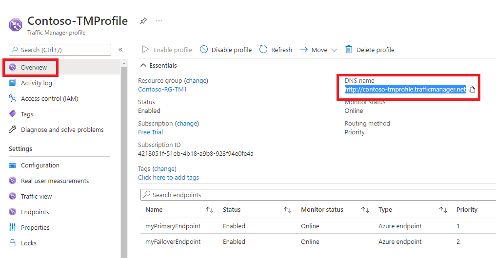

---
Exercise:
    title: 'M04 - Unit 6 Create a Traffic Manager profile using the Azure portal'
    module: 'Module 04 - Load balancing non-HTTP(S) traffic in Azure'
---

# M04-Unit 6 Create a Traffic Manager profile using the Azure portal

In this exercise, you will create a Traffic Manager profile to deliver high availability for the fictional Contoso Ltd organization's web application. 

**Note:** An **[interactive lab simulation](https://mslabs.cloudguides.com/guides/AZ-700%20Lab%20Simulation%20-%20Create%20a%20Traffic%20Manager%20profile%20using%20the%20Azure%20portal)** is available that allows you to click through this lab at your own pace. You may find slight differences between the interactive simulation and the hosted lab, but the core concepts and ideas being demonstrated are the same.

#### Estimated time: 35 minutes

You will create two instances of a web application deployed in two different regions (East US and West Europe). The East US region will act as a primary endpoint for Traffic Manager, and the West Europe region will act as a failover endpoint.

You will then create a Traffic Manager profile based on endpoint priority. This profile will direct user traffic to the primary site running the web application. Traffic Manager will continuously monitor the web application, and if the primary site in East US is unavailable, it will provide automatic failover to the backup site in West Europe.

The diagram below approximately illustrates the environment you will be deploying in this exercise.

​	

 In this exercise, you will:

+ Task 1: Create the web apps
+ Task 2: Create a Traffic Manager profile
+ Task 3: Add Traffic Manager endpoints
+ Task 4: Test the Traffic Manager profile
+ Task 5: Clean up resources


## Task 1: Create the web apps

In this section, you will create two instances of a web application deployed in the two different Azure regions.

1. On the Azure portal home page, select **Create a resource**, then select **Web App** (if this resource type is not listed on the page, use the search box at the top of the page to search for it and select it).

1. On the **Create Web App** page, on the **Basics** tab, use the information in the table below to create the first web application.

   | **Setting**      | **Value**                                                    |
   | ---------------- | ------------------------------------------------------------ |
   | Subscription     | Select your subscription                                     |
   | Resource group   | Select **Create  new**  Name: **Contoso-RG-TM1**             |
   | Name             | **ContosoWebAppEastUSxx** (where xx are your initials to make the name unique) |
   | Publish          | **Code**                                                     |
   | Runtime stack    | **ASP.NET V4.8**                                             |
   | Operating system | **Windows**                                                  |
   | Region           | **East US**                                                  |
   | Windows Plan     | Select **Create  new**  Name: **ContosoAppServicePlanEastUS** |
   | Pricing Plan     | **Standard S1 100 total ACU, 1.75-GB  memory**               |


1. Select **Monitoring** tab.

1. On the **Monitoring** tab, select the **No** option for **Enable Application Insights**.

1. Select **Review + create**.

   

1. Select **Create**. When the Web App successfully deploys, it creates a default web site.

1. Repeat steps 1-6 above to create a second web app. Use the same settings as before except for the information in the table below. 

   | **Setting**    | **Value**                                                    |
   | -------------- | ------------------------------------------------------------ |
   | Resource group | Select **Create  new**  Name: **Contoso-RG-TM2**             |
   | Name           | **ContosoWebAppWestEuropexx** (where xx are your initials to make the name unique)  |
   | Region         | **West Europe**                                              |
   | Windows Plan   | Select **Create  new**  Name: **ContosoAppServicePlanWestEurope** |


1. On the Azure home page, select **All services**, in the left navigation menu, select **Web**, and then select **App Services**.

1. You should see the two new web apps listed.

   

 

## Task 2: Create a Traffic Manager profile

Now you will create a Traffic Manager profile that directs user traffic based on endpoint priority.

1. On the Azure portal home page, select **Create a resource**.

1. In the search box at the top of the page, enter **Traffic Manager profile**, and then select it from the pop-up list.

   

1. Select **Create**.

1. On the **Create Traffic Manager profile** page, use the information in the table below to create the Traffic Manager profile.

   | **Setting**             | **Value**                |
   | ----------------------- | ------------------------ |
   | Name                    | **Contoso-TMProfilexx** (where xx are your initials to make the name unique) |
   | Routing method          | **Priority**             |
   | Subscription            | Select your subscription |
   | Resource group          | **Contoso-RG-TM1**       |
   | Resource group location | **East US**              |


1. Select **Create**.

 

## Task 3: Add Traffic Manager endpoints

In this section, you will add the website in the East US as the primary endpoint to route all the user traffic. You will then add the website in West Europe as a failover endpoint. If the primary endpoint becomes unavailable, then traffic will automatically be routed to the failover endpoint.

1. On the Azure portal home page, select **All resources**, then select on **Contoso-TMProfile** in the resources list.

1. Under **Settings**, select **Endpoints**, and then select **Add**.

   

1. On the **Add endpoint** page, enter the information from the table below.

   | **Setting**          | **Value**                         |
   | -------------------- | --------------------------------- |
   | Type                 | **Azure endpoint**                |
   | Name                 | **myPrimaryEndpoint**             |
   | Target resource type | **App Service**                   |
   | Target resource      | **ContosoWebAppEastUS (East US)** |
   | Priority             | **1**                             |


1. Select **Add**.

1. Repeat steps 2-4 above to create the failover endpoint. Use the same settings as before except for the information in the table below. 

   | **Setting**     | **Value**                                 |
   | --------------- | ----------------------------------------- |
   | Name            | **myFailoverEndpoint**                    |
   | Target resource | **ContosoWebAppWestEurope (West Europe)** |
   | Priority        | **2**                                     |


1. Setting a priority of 2 means that traffic will route to this failover endpoint if the configured primary endpoint becomes unhealthy.

1. Under **Settings**, select **Configuration**, and then update the Endpoint monitor settings **Protocol** to HTTPS and **Port** to 443 and select **Save**.

1. The two new endpoints are displayed in the Traffic Manager profile. Notice that after a few minutes the **Monitoring status** should change to **Online**.

   

 

## Task 4: Test the Traffic Manager profile

In this section, you will check the DNS name of your Traffic Manager profile, and then you will configure the primary endpoint so that it is unavailable. You will then verify that the web app is still available, to test that the Traffic Manager profile is successfully sending traffic to the failover endpoint.

1. On the **Contoso-TMProfile** page, select **Overview**.

1. On the **Overview** screen, copy the **DNS name** entry to the clipboard (or take note of it somewhere).

   

1. Open a web browser tab, and paste (or enter) the **DNS name** entry (contoso-tmprofile.trafficmanager.net) into the address bar, and press Enter.

1. The web app's default web site should be displayed. If you get **404 Web Site not found** message, **Disable profile** from **Contoso-TMProfilexx** Traffic Manager profile overview page and **Enable profile**. Then refresh the webpage.

   

1. Currently all traffic is being sent to the primary endpoint as you set its **Priority** to **1**.

1. To test the failover endpoint is working properly, you need to disable the primary site.

1. On the **Contoso-TMProfile** page, on the overview screen, select **myPrimaryEndpoint**.

1. On the **myPrimaryEndpoint** page, under **Status**, select **Disabled**, and then select **Save**.

   

1. Close the **myPrimaryEndpoint** page (select the **X** in the top right corner of the page).

1. On the **Contoso-TMProfile** page, the **Monitor status** for **myPrimaryEndpoint** should now be **Disabled**.

1. Open a new web browser session, and paste (or enter) the **DNS name** entry (contoso-tmprofile.trafficmanager.net) into the address bar, and press Enter.

1. Verify that the web app is still responding. As the primary endpoint was not available, the traffic was instead routed to the failover endpoint to allow the web site to still function.

 
 ## Task 5: Clean up resources

   >**Note**: Remember to remove any newly created Azure resources that you no longer use. Removing unused resources ensures you will not see unexpected charges.

1. On the Azure portal, open the **PowerShell** session within the **Cloud Shell** pane.

1. Delete all resource groups you created throughout the labs of this module by running the following command:

   ```powershell

   Remove-AzResourceGroup -Name 'Contoso-RG-TM1' -Force -AsJob
   Remove-AzResourceGroup -Name 'Contoso-RG-TM2' -Force -AsJob

   ```

    >**Note**: The command executes asynchronously (as determined by the -AsJob parameter), so while you will be able to run another PowerShell command immediately afterwards within the same PowerShell session, it will take a few minutes before the resource groups are actually removed.
 

