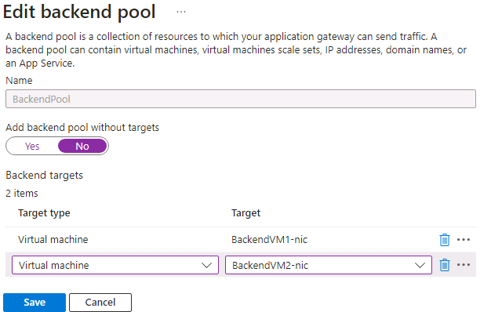

---
Exercise:
    title: 'M05 - Unit 4 Deploy Azure Application Gateway'
    module: 'Module 05 - Load balancing HTTP(S) traffic in Azure'
---

# M05-Unit 4 Deploy Azure Application Gateway
 

In this exercise, you use the Azure portal to create an application gateway. Then you test it to make sure it works correctly.

>**Note**: An **[interactive lab simulation](https://mslabs.cloudguides.com/guides/AZ-700%20Lab%20Simulation%20-%20Deploy%20Azure%20Application%20Gateway)** is available that allows you to click through this lab at your own pace. You may find slight differences between the interactive simulation and the hosted lab, but the core concepts and ideas being demonstrated are the same.

#### Estimated time: 25 minutes

The application gateway directs application web traffic to specific resources in a backend pool. You assign listeners to ports, create rules, and add resources to a backend pool. For the sake of simplicity, this article uses a simple setup with a public front-end IP, a basic listener to host a single site on the application gateway, a basic request routing rule, and two virtual machines in the backend pool.

For Azure to communicate between the resources that you create, it needs a virtual network. You can either create a new virtual network or use an existing one. In this example, you'll create a new virtual network while you create the application gateway. Application Gateway instances are created in separate subnets. You create two subnets in this example: one for the application gateway, and another for the backend servers.

In this exercise, you will:

+ Task 1: Create an application gateway
+ Task 2: Create virtual machines
+ Task 3: Add backend servers to backend pool
+ Task 4: Test the application gateway


## Task 1: Create an application gateway

1. Sign in to the [Azure portal](https://portal.azure.com/) with your Azure account.

1. On any Azure Portal page, in **Search resources, services and docs (G+/)**, enter application gateway, and then select **Application gateways** from the results.
        

1. On the Application gateways page, select **+ Create**.

1. On the Create application gateway **Basics** tab, enter, or select the following information:

   | **Setting**         | **Value**                                    |
   | ------------------- | -------------------------------------------- |
   | Subscription        | Select your subscription.                    |
   | Resource group      | Select Create new ContosoResourceGroup       |
   | Application Gateway | ContosoAppGateway                            |
   | Region              | Select **East US**                           |
   | Virtual Network     | Select **Create new**                        |

1. In Create virtual network, enter, or select the following information:

   | **Setting**       | **Value**                          |
   | ----------------- | ---------------------------------- |
   | Name              | ContosoVNet                        |
   | **ADDRESS SPACE** |                                    |
   | Address range     | 10.0.0.0/16                        |
   | **SUBNETS**       |                                    |
   | Subnet name       | Change **default** to **AGSubnet** |
   | Address range     | 10.0.0.0/24                        |
   | Subnet name       | BackendSubnet                      |
   | Address range     | 10.0.1.0/24                        |


>**Note**: If the UI does not have the option to add additional subnets, complete the steps and add the backend subnet after creating the gateway. 

1. Select **OK** to return to the Create application gateway Basics tab.

1. Accept the default values for the other settings and then select **Next: Frontends**.

1. On the **Frontends** tab, verify **Frontend IP address type** is set to **Public**.

1. Select **Add new** for the **Public IP address** and enter AGPublicIPAddress for the public IP address name, and then select **OK**.

1. Select **Next: Backends**.

1. On the **Backends** tab, select **Add a backend pool**.

1. On the **Add a backend pool** window that opens, enter the following values to create an empty backend pool:

    | **Setting**                      | **Value**   |
    | -------------------------------- | ----------- |
    | Name                             | BackendPool |
    | Add backend pool without targets | Yes         |

1. On the **Add a backend pool** window, select **Add** to save the backend pool configuration and return to the **Backends** tab.

1. On the **Backends** tab, select **Next: Configuration**.

1. On the **Configuration** tab, you'll connect the frontend and backend pool you created using a routing rule.

1. On the **Routing rules** column, select **Add a routing rule**.

1. On the **Rule name** box, enter **RoutingRule**.

1. On the **Listener** tab, enter or select the following information:

    | **Setting**   | **Value**         |
    | ------------- | ----------------- |
    | Listener name | Listener          |
    | Priority      | **100**           |
    | Frontend IP   | Select **Public** |

1. Accept the default values for the other settings on the **Listener** tab.

    

1. Select the **Backend targets** tab to configure the rest of the routing rule.

1. On the **Backend targets** tab, enter or select the following information:

    | **Setting**      | **Value**      |
    | -------------    | -------------- |
    | Target type      | Backend pool   |
    | Backend Settings | **Add new** |

1. In **Add a Backend Setting**, enter or select the following information:

    | **Setting**          | **Value**   |
    | ------------------   | ----------- |
    | Backend setting name | HTTPSetting |
    | Backend port         | 80          |

1. Accept the default values for the other settings in the **Add a Backend Setting** window, then select **Add** to return to **Add a routing rule**.

1. Select **Add** to save the routing rule and return to the **Configuration** tab.

1. Select **Next: Tags** and then **Next: Review + create**.

1. Review the settings on the **Review + create** tab

1. Select **Create** to create the virtual network, the public IP address, and the application gateway. 

It may take several minutes for Azure to create the application gateway. Wait until the deployment finishes successfully before moving on to the next section.

## Task 2: Create virtual machines

1. On the Azure portal, open the **PowerShell** session within the **Cloud Shell** pane.

1. On the toolbar of the Cloud Shell pane, select the **Upload/Download files** icon, in the drop-down menu, select **Upload** and upload the following files **backend.json** and **backend.parameters.json** into the Cloud Shell home directory one by one from the source folder **F:\Allfiles\Exercises\M05**.

1. Deploy the following ARM templates to create the VMs needed for this exercise:

>**Note**: You will be prompted to provide an Admin password.

   ```powershell
   $RGName = "ContosoResourceGroup"
   
   New-AzResourceGroupDeployment -ResourceGroupName $RGName -TemplateFile backend.json -TemplateParameterFile backend.parameters.json
   ```
  
1. When the deployment is complete, go to the Azure portal home page, and then select **Virtual Machines**.

1. Verify that both virtual machines have been created.

## Task 3: Add backend servers to backend pool

1. On the Azure portal menu, select **All resources** or search for and select All resources. Then select **ContosoAppGateway**.

1. Under **Settings**, select **Backend pools**.

1. Select **BackendPool**.

1. On the Edit backend pool page, under **Backend targets**, in **Target type**, select **Virtual machine**.

1. Under **Target**, select **BackendVM1.** 

1. On **Target type**, select **Virtual machine**.

1. Under **Target**, select **BackendVM2.** 

   

1. Select **Save**.

Wait for the deployment to complete before proceeding to the next step.

## Task 4: Test the application gateway

Although IIS isn't required to create the application gateway, you installed it in this exercise to verify if Azure successfully created the application gateway.

### Use IIS to test the application gateway:

1. Find the public IP address for the application gateway on its **Overview** page. 

   

1. Copy the public IP address, and then paste it into the address bar of your browser to browse that IP address.

1. Check the response. A valid response verifies that the application gateway was successfully created and can successfully connect with the backend.

   

1. Refresh the browser multiple times and you should see connections to both BackendVM1 and BackendVM2.

Congratulations! You have configured and tested an Azure Application Gateway.
