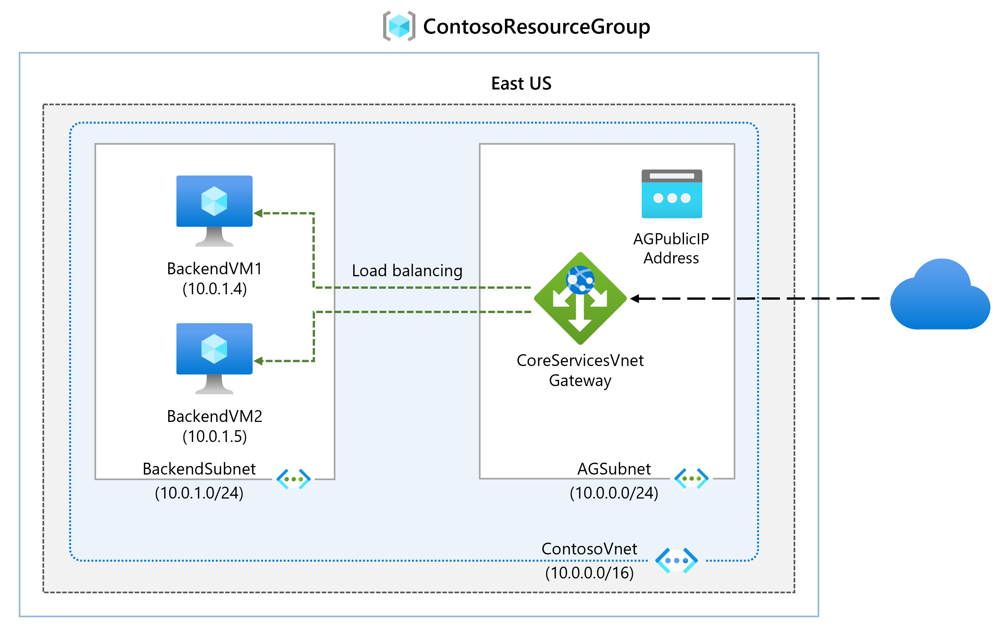
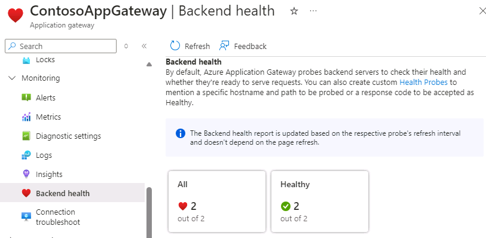

---
Exercise:
    title: 'M05 - Unit 4 Deploy Azure Application Gateway'
    module: 'Module 05 - Load balancing HTTP(S) traffic in Azure'
---

# M05-Unit 4 Deploy Azure Application Gateway

## Exercise scenario

In this exercise, you use the Azure portal to create an application gateway. Then you test it to make sure it works correctly.




   >**Note**: An **[interactive lab simulation](https://mslabs.cloudguides.com/guides/AZ-700%20Lab%20Simulation%20-%20Deploy%20Azure%20Application%20Gateway)** is available that allows you to click through this lab at your own pace. You may find slight differences between the interactive simulation and the hosted lab, but the core concepts and ideas being demonstrated are the same.

### Estimated time: 25 minutes

The application gateway directs application web traffic to specific resources in a backend pool. You assign listeners to ports, create rules, and add resources to a backend pool. For the sake of simplicity, this article uses a simple setup with a public front-end IP, a basic listener to host a single site on the application gateway, a basic request routing rule, and two virtual machines in the backend pool.

For Azure to communicate between the resources that you create, it needs a virtual network. You can either create a new virtual network or use an existing one. In this example, you'll create a new virtual network while you create the application gateway. Application Gateway instances are created in separate subnets. You create two subnets in this example: one for the application gateway, and another for the backend servers.

In this exercise, you will:

+ Task 1: Create an application gateway
+ Task 2: Create virtual machines
+ Task 3: Add backend servers to backend pool
+ Task 4: Test the application gateway

## Task 1: Create an application gateway

1. Sign in to the [Azure portal](https://portal.azure.com/) with your Azure account.

1. On any Azure Portal page, in **Search resources, services and docs (G+/)**, enter application gateway, and then select **Application gateways** from the results.
    

1. On the Application gateways page, select **+ Create**.

1. On the Create application gateway **Basics** tab, enter, or select the following information:

   | **Setting**         | **Value**                                    |
   | ------------------- | -------------------------------------------- |
   | Subscription        | Select your subscription.                    |
   | Resource group      | Select Create new ContosoResourceGroup       |
   | Application Gateway | ContosoAppGateway                            |
   | Region              | Select **East US**                           |
   | Virtual Network     | Select **Create new**                        |

1. In Create virtual network, enter, or select the following information:

   | **Setting**       | **Value**                          |
   | ----------------- | ---------------------------------- |
   | Name              | ContosoVNet                        |
   | **ADDRESS SPACE** |                                    |
   | Address range     | 10.0.0.0/16                        |
   | **SUBNETS**       |                                    |
   | Subnet name       | Change **default** to **AGSubnet** |
   | Address range     | 10.0.0.0/24                        |


1. Select **OK** to return to the Create application gateway Basics tab.

1. Accept the default values for the other settings and then select **Next: Frontends**.

1. On the **Frontends** tab, verify **Frontend IP address type** is set to **Public**.

1. Select **Add new** for the **Public IP address** and enter AGPublicIPAddress for the public IP address name, and then select **OK**.

1. Select **Next: Backends**.

1. On the **Backends** tab, select **Add a backend pool**.

1. On the **Add a backend pool** window that opens, enter the following values to create an empty backend pool:

    | **Setting**                      | **Value**   |
    | -------------------------------- | ----------- |
    | Name                             | BackendPool |
    | Add backend pool without targets | Yes         |

1. On the **Add a backend pool** window, select **Add** to save the backend pool configuration and return to the **Backends** tab.

1. On the **Backends** tab, select **Next: Configuration**.

1. On the **Configuration** tab, you'll connect the frontend and backend pool you created using a routing rule.

1. On the **Routing rules** column, select **Add a routing rule**.

1. On the **Rule name** box, enter **RoutingRule**.

1. For **Priority** enter **100**. 

1. On the **Listener** tab, enter or select the following information:

    | **Setting**   | **Value**         |
    | ------------- | ----------------- |
    | Listener name | Listener          |
    | Frontend IP   | Select **Public IPv4** |

1. Accept the default values for the other settings on the **Listener** tab.

    

1. Select the **Backend targets** tab to configure the rest of the routing rule.

1. On the **Backend targets** tab, enter or select the following information:

    | **Setting**      | **Value**      |
    | -------------    | -------------- |
    | Target type      | Backend pool   |
    | Backend Settings | **Add new** |

1. In **Add a Backend Setting**, enter or select the following information:

    | **Setting**          | **Value**   |
    | ------------------   | ----------- |
    | Backend setting name | HTTPSetting |
    | Backend port         | 80          |

1. Accept the default values for the other settings in the **Add a Backend Setting** window, then select **Add** to return to **Add a routing rule**.

1. Select **Add** to save the routing rule and return to the **Configuration** tab.

1. Select **Next: Tags** and then **Next: Review + create**.

1. Review the settings on the **Review + create** tab

1. Select **Create** to create the virtual network, the public IP address, and the application gateway.

1. It may take several minutes for Azure to create the application gateway. Wait until the deployment finishes successfully.

### Add a subnet for a backend servers

1. Search for and select the **ContosoVNet**. Verify the **AGSubnet** was created. 

1. To create the **BackendSubnet**, select **Settings** and then **Subnets**. Be sure to **Add** the subnet when finished.
   
   | **Setting**       | **Value**                          |
   | ----------------- | ---------------------------------- |
   | Subnet name       | BackendSubnet                      |
   | Address range     | 10.0.1.0/24                        |

## Task 2: Create virtual machines

1. In the Azure portal, select the Cloud Shell icon (top right). If necessary, configure the shell.  
    + Select **PowerShell**.
    + Select **No Storage Account required** and your **Subscription**, then select **Apply**.
    + Wait for the terminal to create and a prompt to be displayed.
      
1. On the toolbar of the Cloud Shell pane, select **Manage files** and then **Upload**. Upload the following files: **backend.json**, **backend.parameters.json**, and **install-iis.ps1**.The files are available for download from the repository, **\Allfiles\Exercises\M05** folder.

1. Deploy the following ARM templates to create the VMs needed for this exercise:

   >**Note**: You will be prompted to provide an Admin password. 

   ```powershell
   $RGName = "ContosoResourceGroup"
   
   New-AzResourceGroupDeployment -ResourceGroupName $RGName -TemplateFile backend.json -TemplateParameterFile backend.parameters.json
   ```
   >**Note**: Take time to review the **backend.json** file. There are two virtual machines being deployed. This will take a few minutes. 

1. The command should complete successfully and list **BackendVM1** and **BackendVM2**.

### Install IIS on each virtual machine

1. Each backend server needs IIS installed.

1. Continue at the PowerShell prompt and use the provided script to install IIS on **BackendVM1**.

   ```powershell
   Invoke-AzVMRunCommand -ResourceGroupName 'ContosoResourceGroup' -Name 'BackendVM1' -CommandId 'RunPowerShellScript' -ScriptPath 'install-iis.ps1'
   ```

   >**Note**: While you wait review the PowerShell script. Notice that the IIS home page is being customized to provide the virtual machine name.

1. Run the command again, this time for **BackendVM2**.

   ```powershell
   Invoke-AzVMRunCommand -ResourceGroupName 'ContosoResourceGroup' -Name 'BackendVM2' -CommandId 'RunPowerShellScript' -ScriptPath 'install-iis.ps1'
   ```
   >**Note**: Each command will take a couple of minutes to complete.

## Task 3: Add backend servers to backend pool

1. On the Azure portal menu, select **All resources** or search for and select All resources. Then select **ContosoAppGateway**.

1. Under **Settings**, select **Backend pools**.

1. Select **BackendPool**.

1. On the Edit backend pool page, under **Backend targets**, in **Target type**, select **Virtual machine**.

1. Under **Target**, select **BackendVM1-nic.**

1. On **Target type**, select **Virtual machine**.

1. Under **Target**, select **BackendVM2-nic.**

   

1. Select **Save** and wait for the targets to be added. 

1. Check to ensure the backend servers are healthy. Select **Monitoring** and then **Backend Health**. Both targets should be healthy. 

   

## Task 4: Test the application gateway

Although IIS isn't required to create the application gateway, you installed it in this exercise to verify if Azure successfully created the application gateway.

### Use IIS to test the application gateway

1. Find the public IP address for the application gateway on its **Overview** page.

   

1. Copy the public IP address, and then paste it into the address bar of your browser to browse that IP address.

1. Check the response. A valid response verifies that the application gateway was successfully created and can successfully connect with the backend.

   

1. Refresh the browser multiple times and you should see connections to both BackendVM1 and BackendVM2.

## Clean up resources

   >**Note**: Remember to remove any newly created Azure resources that you no longer use. Removing unused resources ensures you will not see unexpected charges.

1. On the Azure portal, open the **PowerShell** session within the **Cloud Shell** pane.

1. Delete all resource groups you created throughout the labs of this module by running the following command:

   ```powershell
   Remove-AzResourceGroup -Name 'IntLB-RG' -Force -AsJob
   ```

>**Note**: The command executes asynchronously (as determined by the -AsJob parameter), so while you will be able to run another PowerShell command immediately afterwards within the same PowerShell session, it will take a few minutes before the resource groups are actually removed.

## Extend your learning with Copilot

Copilot can assist you in learning how to use the Azure scripting tools. Copilot can also assist in areas not covered in the lab or where you need more information. Open an Edge browser and choose Copilot (top right) or navigate to *copilot.microsoft.com*. Take a few minutes to try these prompts.
+ How does the Azure Application Gateway route requests?
+ What security features does Azure Application Gateway include?
+ Compare the Azure Application Gateway with the Azure Load Balancer. Give examples of when to use each product.


## Learn more with self-paced training

+ [Introduction to Azure Application Gateway](https://learn.microsoft.com/training/modules/intro-to-azure-application-gateway/). This module explains what Azure Application Gateway does, how it works, and when you should choose to use Application Gateway as a solution to meet your organization's needs.
+ [Load balance your web service traffic with Application Gateway](https://learn.microsoft.com/training/modules/load-balancing-https-traffic-azure/). In this module, you learn how to create and configure and Application Gateway with URL path-based routing.
+ [Load balance HTTP(S) traffic in Azure](https://learn.microsoft.com/training/modules/load-balancing-https-traffic-azure/). In this module, you learn how to design and implement Azure Application Gateway.

## Key takeaways

Congratulations on completing the lab. Here are the main takeaways for this lab. 
+ Azure Application Gateway is a web traffic (OSI layer 7) load balancer that enables you to manage traffic to your web applications.
+ Application Gateway can make routing decisions based on additional attributes of an HTTP request, for example URI path or host headers.
+ Use Application Gateway for application hosted in a single region and when you need URL based routing. 
