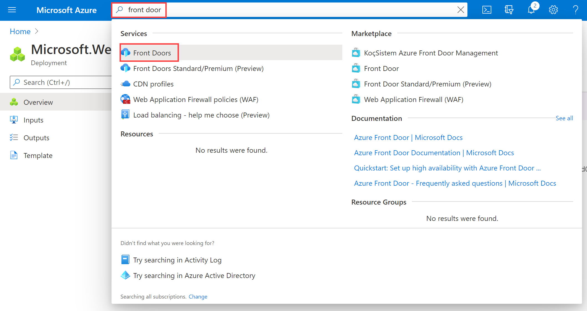

---
Exercise:
    title: 'M05-Unit 6 Create a Front Door for a highly available web application using the Azure portal'
    module: 'Module - Load balancing HTTP(S) traffic in Azure'
---


# M05-Unit 6 Create a Front Door for a highly available web application using the Azure portal

 

In this exercise, you will set up an Azure Front Door configuration that pools two instances of a web application that runs in different Azure regions. This configuration directs traffic to the nearest site that runs the application. Azure Front Door continuously monitors the web application. You will demonstrate automatic failover to the next available site when the nearest site is unavailable. The network configuration is shown in the following diagram:


In this exercise, you will:

+ Task 1: Create two instances of a web app
+ Task 2: Create a Front Door for your application
+ Task 3: View Azure Front Door in action
+ Task 4: Clean up resources


## Task 1: Create two instances of a web app

This exercise requires two instances of a web application that run in different Azure regions. Both the web application instances run in Active/Active mode, so either one can take traffic. This configuration differs from an Active/Stand-By configuration, where one acts as a failover.

1. Sign in to the Azure portal at [https://portal.azure.com](https://portal.azure.com/).

2. On the Azure home page, using the global search type **WebApp** and select **App Services** under services.

3. Click **+ Create** to create a Web App.

4. On the Create Web App page, on the **Basics** tab, enter or select the following information.

   | **Setting**      | **Value**                                                    |
   | ---------------- | ------------------------------------------------------------ |
   | Subscription     | Select your subscription.                                    |
   | Resource group   | Select the resource group ContosoResourceGroup               |
   | Name             | Enter a unique Name for your web app. This example uses WebAppContoso-1. |
   | Publish          | Select **Code**.                                             |
   | Runtime stack    | Select **.NET Core 3.1 (LTS)**.                              |
   | Operating System | Select **Windows**.                                          |
   | Region           | Select **Central US**.                                       |
   | Windows Plan     | Select **Create new** and enter myAppServicePlanCentralUS in the text box. |
   | SKU and size     | Select **Standard S1 100 total ACU, 1.75 GB memory**.        |

5. Select **Review + create**, review the Summary, and then select **Create**.   
   ‎It might take several minutes for the deployment to complete.

6. Create a second web app. On the Azure Portal home page, search  **WebApp**.

7. Click **+ Create** to create a Web App.

8. On the Create Web App page, on the **Basics** tab, enter or select the following information.

   | **Setting**      | **Value**                                                    |
   | ---------------- | ------------------------------------------------------------ |
   | Subscription     | Select your subscription.                                    |
   | Resource group   | Select the resource group ContosoResourceGroup               |
   | Name             | Enter a unique Name for your web app. This example uses WebAppContoso-2. |
   | Publish          | Select **Code**.                                             |
   | Runtime stack    | Select **.NET Core 3.1 (LTS)**.                              |
   | Operating System | Select **Windows**.                                          |
   | Region           | Select **East US**.                                          |
   | Windows Plan     | Select **Create new** and enter myAppServicePlanEastUS in the text box. |
   | SKU and size     | Select **Standard S1 100 total ACU, 1.75 GB memory**.        |

9. Select **Review + create**, review the Summary, and then select **Create**.   
   ‎It might take several minutes for the deployment to complete.

## Task 2: Create a Front Door for your application

Configure Azure Front Door to direct user traffic based on lowest latency between the two web apps servers. To begin, add a frontend host for Azure Front Door.

1. On any Azure Portal page, in **Search resources, services and docs (G+/)**, enter front door, and then select **Front Doors** from the results.

   

1. On the Front Doors page, select **+ Create**.

1. In Create a Front Door, enter or select the following information.

   | **Setting**             | **Value**                                    |
   | ----------------------- | -------------------------------------------- |
   | Subscription            | Select your subscription.                    |
   | Resource group          | Select ContosoResourceGroup                  |
   | Resource group location | Accept default setting                       |
   | Name                    | FrontDoor(yourinitials)   |
   | Tier                    | Standard   |
   | Endpoint Name           | FDendpoint   |
   | Origin Type             | App Service| 
   | Origin host name        | The name of the web app you previously deployed |
   | 

1. Select **Review and Create**, and then select **Create**.

1. Wait for the resource to deploy, and then select **Go to resource**.

1. On the Front Door resource in the Overview blade, locate the endpoint hostname that is created for your endpoint. This should be fdendpoint followed by a hyphen and a random string. For example, **fdendpoint-fxa8c8hddhhgcrb9.z01.azurefd.net**. **Copy** this FQDN.

1. In a new browser tab, navigate to the Front Door endpoint FQDN. The default App Service page will be displayed.
   

   
   ## Task 4: Clean up resources
   
   >**Note**: Remember to remove any newly created Azure resources that you no longer use. Removing unused resources ensures you will not see unexpected charges.

1. In the Azure portal, open the **PowerShell** session within the **Cloud Shell** pane.

1. Delete all resource groups you created throughout the labs of this module by running the following command:

   ```powershell

   Remove-AzResourceGroup -Name 'ContosoResourceGroup' -Force -AsJob

   ```

    >**Note**: The command executes asynchronously (as determined by the -AsJob parameter), so while you will be able to run another PowerShell command immediately afterwards within the same PowerShell session, it will take a few minutes before the resource groups are actually removed.
