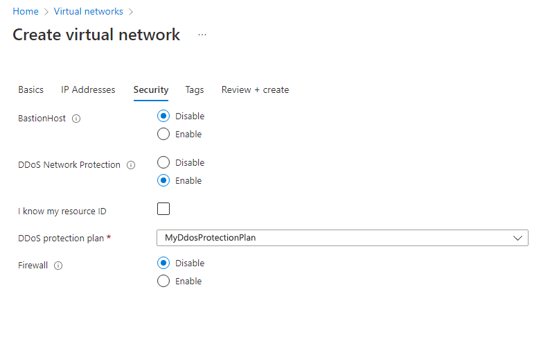
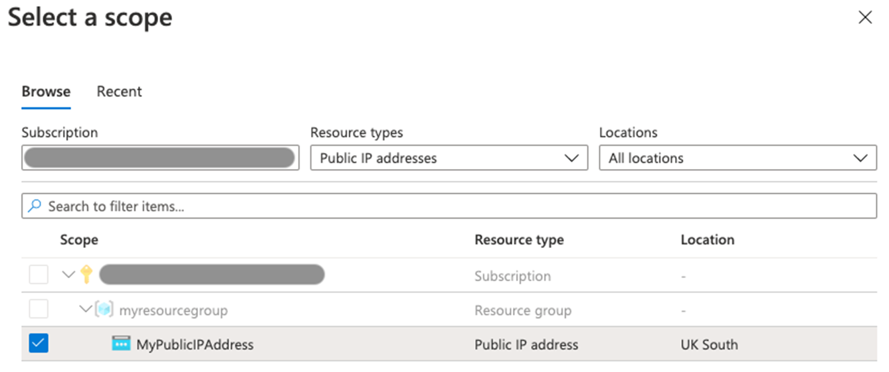
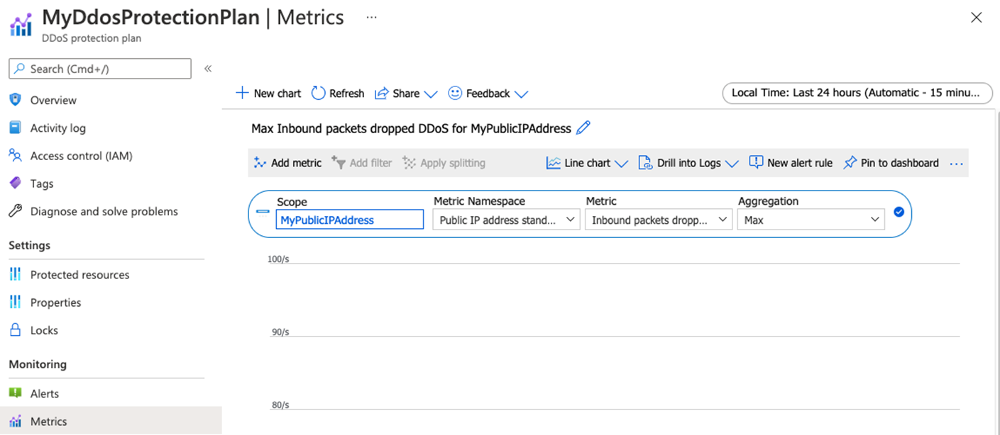
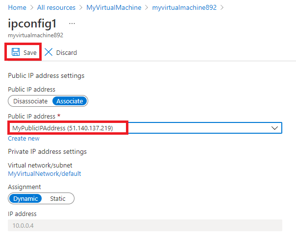
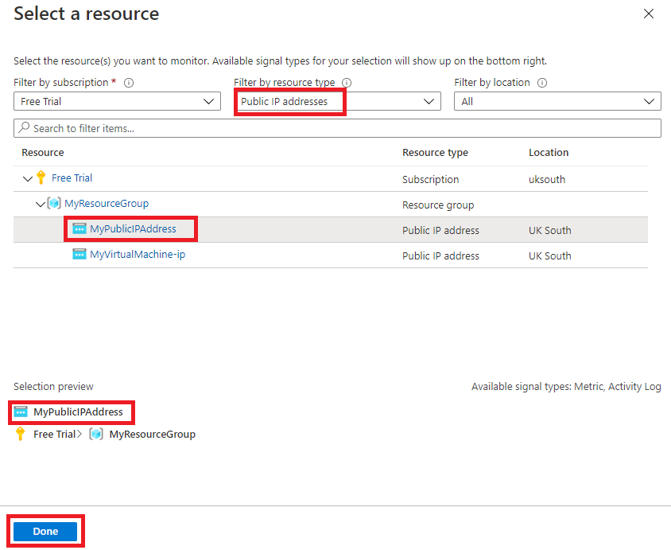
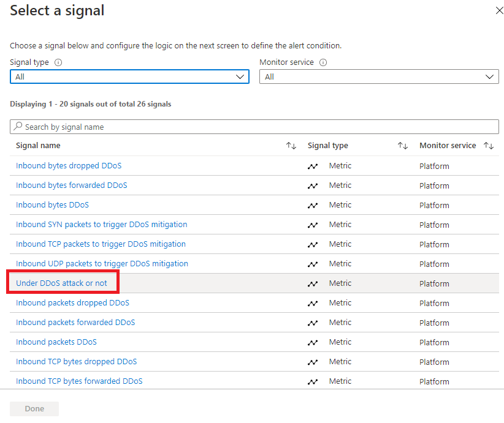

---
Exercise:
    title: 'M06 - Unit 4 Configure DDoS Protection on a virtual network using the Azure portal'
    module: 'Module 06 - Design and implement network security'
---

# M06-Unit 4 Configure DDoS Protection on a virtual network using the Azure portal

Being responsible for Contoso's Network Security team, you are going to run a mock DDoS attack on the virtual network. The following steps walk you through creating a virtual network, configuring DDoS Protection, and creating an attack which you can observe and monitor with the help of telemetry and metrics.

In this exercise, you will:

+ Task 1: Create a resource group
+ Task 2: Create a DDoS Protection plan
+ Task 3: Enable DDoS Protection on a new virtual network
+ Task 4: Configure DDoS telemetry
+ Task 5: Configure DDoS diagnostic logs
+ Task 6: Configure DDoS alerts
+ Task 7: Test with simulation partners
+ Task 8: Clean up resources

**Note:** An **[interactive lab simulation](https://mslabs.cloudguides.com/guides/AZ-700%20Lab%20Simulation%20-%20Configure%20Azure%20DDoS%20Protection%20on%20a%20virtual%20network)** is available that allows you to click through this lab at your own pace. You may find slight differences between the interactive simulation and the hosted lab, but the core concepts and ideas being demonstrated are the same.


#### Estimated time: 40 minutes

## Task 1: Create a resource group

1. Log in to your Azure account.

1. On the Azure portal home page, select **Resource groups**.

1. Select **Create**. 

1. On the **Basics** tab, in **Resource group**, enter **MyResourceGroup**.

1. On **Region**, select East US.

1. Select **Review + create**.

1. Select **Create**.


## Task 2: Create a DDoS Protection plan

1. On the Azure portal home page, in the search box enter **DDoS** and select **DDoS protection plan** when it appears.

1. Select **+ Create**.

1. On the **Basics** tab, in the **Resource group** list, select the resource group you just created.

1. On the **Instance name** box, enter **MyDdoSProtectionPlan**, then select **Review + create**.

1. Select **Create**.

 

## Task 3: Enable DDoS Protection on a new virtual network

Here you will enable DDoS on a new virtual network rather than on an existing one, so first you need to create the new virtual network, then enable DDoS protection on it using the plan you created previously.

1. On the Azure portal home page, select **Create a resource**, then in the search box, enter **Virtual Network**, then select **Virtual Network** when it appears.

1. On the **Virtual Network** page, select **Create**.

1. On the **Basics** tab, select the resource group you created previously.

1. On the **Name** box, enter **MyVirtualNetwork**, then select the **Security** tab. 

1. On the **Security** tab, next to **DDoS Network Protection**, select **Enable**.

1. On the **DDoS protection plan** drop-down list, select **MyDdosProtectionPlan**.

   

1. Select **Review + create**.

1. Select **Create**.

 

## Task 4: Configure DDoS telemetry

You create a Public IP address, and then set up telemetry in the next steps.

1. On the Azure portal home page, select **Create a resource**, then in the search box, enter **public ip**, then select **Public IP address** when it appears.

1. On the **Public IP address** page, select **Create**.

1. On the **Create public IP address** page, under **SKU**, select **Standard**.

1. On the **Name** box, enter **MyPublicIPAddress**.

1. Under **IP address assignment**, select **Static**.

1. On **DNS name label**, enter **mypublicdnsxx** (where xx is your initials to make this unique).

1. Select your resource group from the list.

   

1. Select **Create**.


1. On the Azure home page, select **All resources**.

1. On the list of your resources, select **MyDdosProtectionPlan**.

1. Under **Monitoring**, select **Metrics**.

1. Select the **Scope** box, then select the checkbox next to **MyPublicIPAddress**.

    

1. Select **Apply**.

1. On the **Metrics** box, select **Inbound packets dropped DDoS**.

1. On the **Aggregation** box, select **Max**.

    

 

## Task 5: Configure DDoS diagnostic logs

1. On the Azure home page, select **All resources**.

1. On the list of your resources, select **MyPublicIPAddress**.

1. Under **Monitoring**, select **Diagnostic settings**.

1. Select **Add diagnostic setting**. 

1. On the **Diagnostic setting** page, in the **Diagnostic setting name** box, enter **MyDiagnosticSetting**. 

1. Under **Category details**, select all 3 **log** checkboxes and the **AllMetrics** checkbox.

1. Under **Destination details**, select the **Send to Log Analytics workspace** checkbox. Here, you could select a pre-existing Log Analytics workspace, but as you haven't set up a destination for the diagnostic logs yet, you will just enter the settings, but then discard them in the next step in this exercise.

   

1. Normally you would now select **Save** to save your diagnostic settings. Note that this option is still grayed out as we cannot complete the setting configuration yet.

1. Select **Discard**, then select **Yes**.

 

## Task 6: Configure DDoS alerts

In this step you will create a virtual machine, assign a public IP address to it, and then configure DDoS alerts.

### Create the VM

1. On the Azure portal home page, select **Create a resource**, then in the search box, enter **virtual machine**, then select **Virtual machine** when it appears.

1. On the **Virtual machine** page, select **Create**.

1. On the **Basics** tab, create a new VM using the information in the table below.

   | **Setting**           | **Value**                                                    |
   | --------------------- | ------------------------------------------------------------ |
   | Subscription          | Select your subscription                                     |
   | Resource group        | **MyResourceGroup**                                          |
   | Virtual machine name  | **MyVirtualMachine**                                         |
   | Region                | Your region                                                  |
   | Availability options  | **No infrastructure  redundancy required**                   |
   | Image                 | **Ubuntu Server 18.04 LTS -  Gen 1** (Select Configure VM Generation link if needed) |                     
   | Size                  | Select **See  all sizes**, then choose **B1ls** in the  list and choose **Select**  **(Standard_B1ls - 1 vcpu,  0.5 GiB memory** |
   | Authentication type   | **SSH public key**                                           |
   | Username              | **azureuser**                                                |
   | SSH public key source | **Generate new key pair**                                    |
   | Key pair name         | **myvirtualmachine-ssh-key**                                 |
   | Public inbound ports  | Select None                                                  |


1. Select **Review + create**.

1. Select **Create**.

1. On the **Generate new key pair** dialog box, select **Download private key and create resource**.

1. Save the private key.

1. When deployment is complete, select **Go to resource**.

### Assign the Public IP address

1. On the **Overview** page of the new virtual machine, under **Settings**, select **Networking**.

1. Next to **Network Interface**, select **myvirtualmachine-nic**. The name of the nic may differ.

1. Under **Settings**, select **IP configurations**.

1. Select **ipconfig1**.

1. On the **Public IP address** list, select **MyPublicIPAddress**.

1. Select **Save**.

   

### Configure DDoS alerts

1. On the Azure home page, select **All resources**.

1. On the list of your resources, select **MyDdosProtectionPlan**.

1. Under **Monitoring**, select **Alerts**.

1. Select **New alert rule**.

1. On the **Create alert rule** page, under **Scope**, select **Edit resource**.

1. On the **Select a resource** pane, in the **Filter by resource type** box, scroll down the list and select **Public IP addresses**.

   

1. On the **Resource** list, select **MyPublicIPAddress**, then select **Done**.

1. On the **Create alert rule** page, under **Condition**, select **Add condition**.

1. Select **Under DDoS attack or not**.

   

1. On the **Operator** box select **Greater than or equal to**.

1. On **Threshold value**, enter **1** (means under attack).

1. Select **Done**.

    

1. Back on the **Create alert rule** page, under the **Alert rule details** section and in **Alert rule name**, enter **MyDdosAlert**.

    

1. Select **Create alert rule**.

 

## Task 7: Test with simulation partners


1. Review [Azure DDoS simulation testing policy](https://learn.microsoft.com/azure/ddos-protection/test-through-simulations#azure-ddos-simulation-testing-policy)

1. Configure a DDoS test attack using an approved testing partner. If using BreakingPoint Cloud to test use the settings in the screenshot below (you may need to select the 100k pps test size with the trial account), but specifying the IP address of your own **MyPublicIPAddress** resource in the **Target IP Address** box (e.g., **51.140.137.219**)
   

1. On the Azure portal home page, select **All resources**.

1. In the resources list, select your **MyPublicIPAddress** resource, then under **Monitoring**, select **Metrics**. 

1. In the **Metric** box, select **Under DDoS attack or not** from the list.

1. Now you can see the DDoS attack as it happened. Note it may take the full 10 minutes before you see the results.

   

 
## Task 8: Clean up resources

>**Note**: Remember to remove any newly created Azure resources that you no longer use. Removing unused resources ensures you will not see unexpected charges.

1. On the Azure portal, open the **PowerShell** session within the **Cloud Shell** pane.

1. Delete all resource groups you created throughout the labs of this module by running the following command:

   ```powershell
   Remove-AzResourceGroup -Name 'MyResourceGroup' -Force -AsJob
   ```

    >**Note**: The command executes asynchronously (as determined by the -AsJob parameter), so while you will be able to run another PowerShell command immediately afterwards within the same PowerShell session, it will take a few minutes before the resource groups are actually removed.
