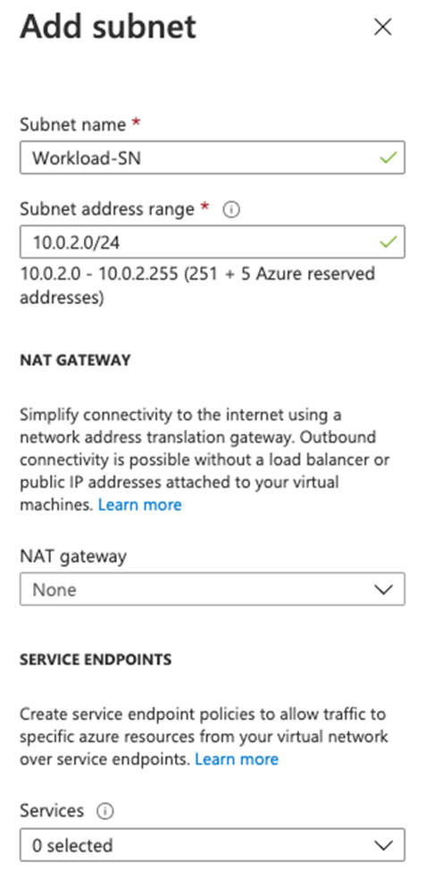
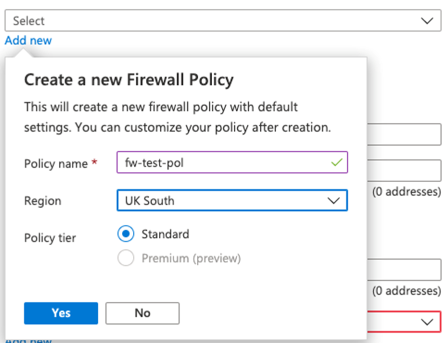
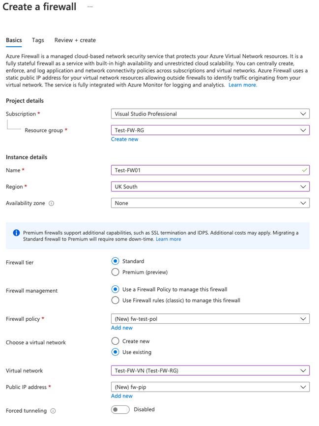
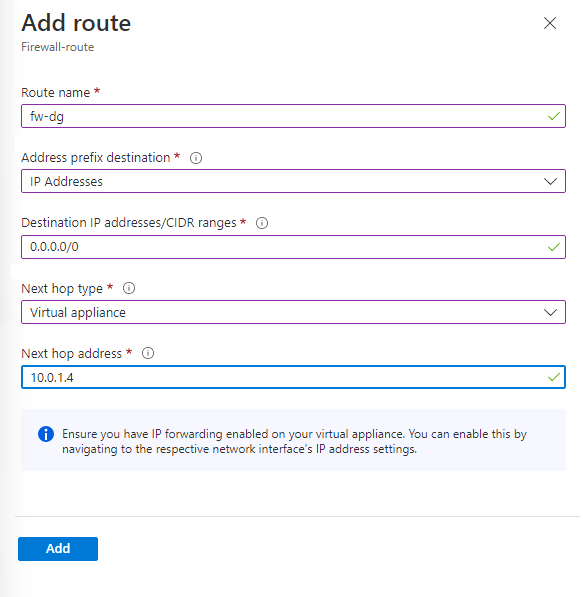
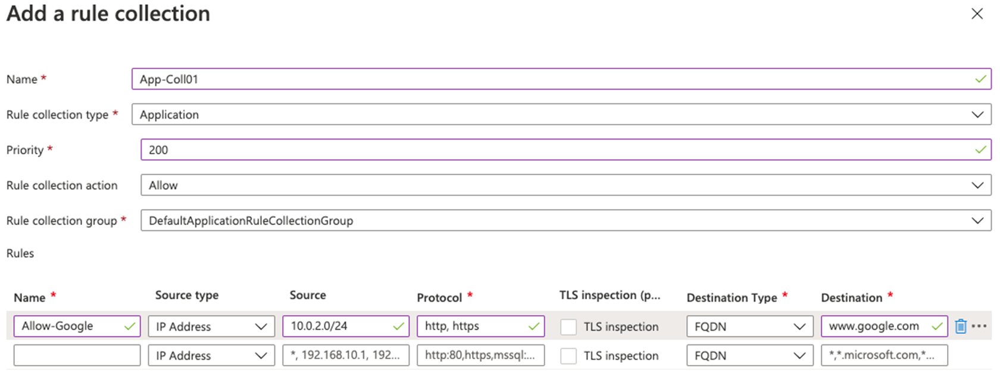
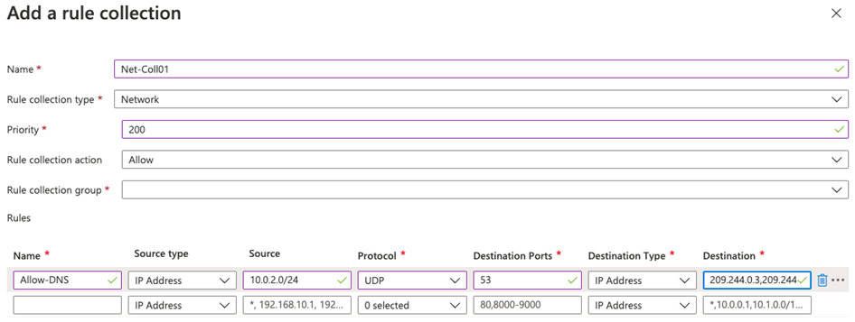
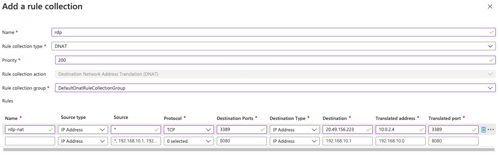
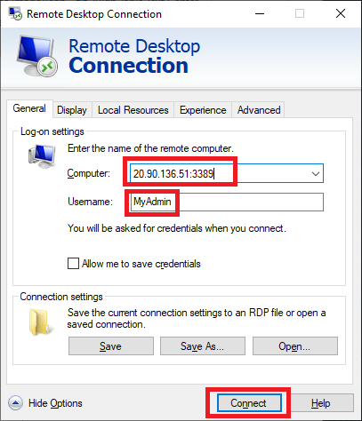
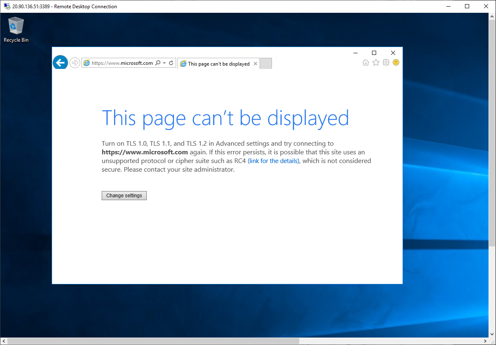

---
Exercise:
    title: 'M06-Unit 7 Deploy and configure Azure Firewall using the Azure portal'
    module: 'Module - Design and implement network security '
---

# M06-Unit 7 Deploy and configure Azure Firewall using the Azure portal

Being part of the Network Security team at Contoso, your next task is to create firewall rules to allow/deny access to certain websites. The following steps walk you through creating a resource group, a virtual network and subnets, and a virtual machine as environment preparation tasks, and then deploying a firewall and firewall policy, configuring default routes and application, network and DNAT rules, and finally testing the firewall.

In this exercise, you will:

+ Task 1: Create a resource group
+ Task 2: Create a virtual network and subnets
+ Task 3: Create a virtual machine
+ Task 4: Deploy the firewall and firewall policy
+ Task 5: Create a default route
+ Task 6: Configure an application rule
+ Task 7: Configure a network rule
+ Task 8: Configure a Destination NAT (DNAT) rule
+ Task 9: Change the primary and secondary DNS address for the server's network interface
+ Task 10: Test the firewall

## Task 1: Create a resource group

In this task, you will create a new resource group.

1. Log in to your Azure account.

2. On the Azure portal home page, select **Resource groups**.

3. Click **Create**. 

4. On the **Basics** tab, in **Resource group**, enter **Test-FW-RG**.

5. In **Region**, select your region from the list.

   

6. Click **Review + create**.

7. Click **Create**.

 

## Task 2: Create a virtual network and subnets

In this task, you will create a single virtual network with two subnets.

1. On the Azure portal home page, select **Create a resource**, then in the search box, type **virtual network** and select **Virtual Network** when it appears.

2. Click **Create**.

3. Select the **Test-FW-RG** resource group you created previously.

4. In the **Name** box, enter **Test-FW-VN**.

   

5. Click **Next: IP Addresses**.

6. Under **Subnet name**, click the word **default**.

7. In the **Edit subnet** dialog box, change the name to **AzureFirewallSubnet**.

8. Change the **Subnet address range** to **10.0.1.0/26**.

9. Click **Save**.

   

10. Click **Add subnet**, to create another subnet, which will host the workload server that you will create shortly.

11. In the **Edit subnet** dialog box, change the name to **Workload-SN**.

12. Change the **Subnet address range** to **10.0.2.0/24**.

13. Click **Add**.

    

14. Click **Review + create**.

15. Click **Create**.

 

## Task 3: Create a virtual machine

In this task, you will create the workload virtual machine and place it in the Workload-SN subnet created previously.

1. On the Azure portal home page, select **Create a resource**, then in the search box, type **virtual machine** and select **Virtual machine** when it appears.

2. On the **Virtual machine** page, click **Create**.

3. On the **Basics** tab, create a new VM using the information in the table below.

   | **Setting**          | **Value**                                                    |
   | -------------------- | ------------------------------------------------------------ |
   | Subscription         | Select your subscription                                     |
   | Resource group       | **Test-FW-RG**                                               |
   | Virtual machine name | **Srv-Work**                                                 |
   | Region               | Your region                                                  |
   | Availability options | **No infrastructure redundancy required**                    |
   | Image                | **Windows Server 2016 Datacenter - Gen 1**                   |
   | Size                 | Select **See all sizes**, then choose **B1s** in the list and choose **Select**   **(Standard_B1s - 1 vcpu, 1 GiB memory (£8.60/month)** |
   | Username             | **MyAdmin**                                                  |
   | Password             | **TestPa$$w0rd!**                                            |
   | Confirm password     | **TestPa$$w0rd!**                                            |
   | Public inbound ports | Select **None**                                              |

   

4. Click **Next : Disks**.

5. Click **Next : Networking**.

6. Ensure that **Test-FW-VN** is selected for the virtual network and the subnet is **Workload-SN**.

7. For **Public IP**, select **None**.

8. Click **Next : Management**.

9. Under **Monitoring**, set **Boot diagnostics** to **Disable**.

10. Click **Review + create**.

11. Click **Create**.

12. When deployment of the VM completes, click **Go to resource**.

13. On the **Overview** page of **Srv-Work**, on the right of the page under **Networking**, take a note of the **Private IP address** for this VM (e.g., **10.0.2.4**).

 

## Task 4: Deploy the firewall and firewall policy

In this task, you will deploy the firewall into the virtual network with a firewall policy configured.

1. On the Azure portal home page, select **Create a resource**, then in the search box, type **firewall** and select **Firewall** when it appears.

2. On the **Firewall** page, click **Create**.

3. On the **Basics** tab, create a firewall using the information in the table below.

   | **Setting**          | **Value**                                                    |
   | -------------------- | ------------------------------------------------------------ |
   | Subscription         | Select your subscription                                     |
   | Resource group       | **Test-FW-RG**                                               |
   | Virtual machine name | **Test-FW01**                                                |
   | Region               | Your region                                                  |
   | Firewall tier        | **Standard**                                                 |
   | Firewall management  | **Use a Firewall Policy to manage this firewall**            |
   | Firewall policy      | Select **Add new** Name: **fw-test-pol** Region: **your region** |

   

   | Choose a virtual network | **Use existing**                         |
   | ------------------------ | ---------------------------------------- |
   | Virtual network          | **Test-FW-VN**                           |
   | Public IP address        | Select **Add new** Name: **fw-pip** |

   

4. Review all the settings to ensure they match the screenshot below.

   

5. Click **Review + create**.

6. Click **Create** and wait for the firewall deployment to complete.

7. When deployment of the firewall is completed, click **Go to resource**.

8. On the **Overview** page of **Test-FW01**, on the right of the page, take a note of the **Firewall private IP** for this firewall (e.g., **10.0.1.4**).

9. In the menu on the left, under **Settings**, click **Public IP configuration**.

10. Take a note of the address under **IP Address** for the **fw-pip** public IP configuration (e.g., **20.90.136.51**).

 

## Task 5: Create a default route

In this task, on the Workload-SN subnet, you will configure the outbound default route to go through the firewall.

1. On the Azure portal home page, select **Create a resource**, then in the search box, type **route** and select **Route table** when it appears.

2. On the **Route table** page, click **Create**.

3. On the **Basics** tab, create a new route table using the information in the table below.

   | **Setting**              | **Value**                |
   | ------------------------ | ------------------------ |
   | Subscription             | Select your subscription |
   | Resource group           | **Test-FW-RG**           |
   | Region                   | Your region              |
   | Name                     | **Firewall-route**       |
   | Propagate gateway routes | **Yes**                  |

4. Click **Review + create**.

5. Click **Create**.

   

6. After deployment completes, select **Go to resource**.

7. On the **Firewall-route** page, under **Settings**, click **Subnets** and then click **Associate**.

8. In **Virtual network**, select **Test-FW-VN**.

9. In **Subnet**, select **Workload-SN**. Make sure that you select only the Workload-SN subnet for this route, otherwise your firewall won't work correctly.

10. Click **OK**.

11. Under **Settings**, select **Routes** and then click **Add**.

12. In **Route name**, enter **fw-dg**.

13. In **Address prefix**, enter **0.0.0.0/0**.

14. In **Next hop type**, select **Virtual appliance**.

15. In **Next hop address**, type the private IP address for the firewall that you noted previously (e.g., **10.0.1.4**)

16. Click **OK**.

    

 

## Task 6: Configure an application rule

In this task, you will add an application rule that allows outbound access to www.google.com.

1. On the Azure portal home page, select **All resources**.

2. In the list of resources, click your firewall policy, **fw-test-pol**.

3. Under **Settings**, click **Application Rules**.

4. Click **Add a rule collection**.

5. On the **Add a rule collection** page, create a new application rule using the information in the table below.

   | **Setting**            | **Value**                                 |
   | ---------------------- | ----------------------------------------- |
   | Name                   | **App-Coll01**                            |
   | Rule collection type   | **Application**                           |
   | Priority               | **200**                                   |
   | Rule collection action | **Allow**                                 |
   | Rule collection group  | **DefaultApplicationRuleCollectionGroup** |
   | **Rules Section**      |                                           |
   | Name                   | **Allow-Google**                          |
   | Source type            | **IP Address**                            |
   | Source                 | **10.0.2.0/24**                           |
   | Protocol               | **http,https**                            |
   | Destination type       | **FQDN**                                  |
   | Destination            | **www.google.com**                        |

   

6. Click **Add**.

 

## Task 7: Configure a network rule

In this task, you will add a network rule that allows outbound access to two IP addresses at port 53 (DNS).

1. On the **fw-test-pol** page, under **Settings**, click **Network Rules**.

2. Click **Add a rule collection**.

3. On the **Add a rule collection** page, create a new network rule using the information in the table below.

   | **Setting**            | **Value**                                                    |
   | ---------------------- | ------------------------------------------------------------ |
   | Name                   | **Net-Coll01**                                               |
   | Rule collection type   | **Network**                                                  |
   | Priority               | **200**                                                      |
   | Rule collection action | **Allow**                                                    |
   | Rule collection group  | **DefaultNetworkRuleCollectionGroup**                        |
   | **Rules Section**      |                                                              |
   | Name                   | **Allow-DNS**                                                |
   | Source type            | **IP Address**                                               |
   | Source                 | **10.0.2.0/24**                                              |
   | Protocol               | **UDP**                                                      |
   | Destination Ports      | **53**                                                       |
   | Destination Type       | **IP Address**                                               |
   | Destination            | **209.244.0.3, 209.244.0.4** These are public DNS servers operated by Century Link |

   ​	

4. Click **Add**.

 

## Task 8: Configure a Destination NAT (DNAT) rule

In this task, you will add a DNAT rule that allows you to connect a remote desktop to the Srv-Work virtual machine through the firewall.

1. On the **fw-test-pol** page, under **Settings**, click **DNAT Rules**.

2. Click **Add a rule collection**.

3. On the **Add a rule collection** page, create a new DNAT rule using the information in the table below.

   | **Setting**           | **Value**                                                    |
   | --------------------- | ------------------------------------------------------------ |
   | Name                  | **rdp**                                                      |
   | Rule collection type  | **DNAT**                                                     |
   | Priority              | **200**                                                      |
   | Rule collection group | **DefaultDnatRuleCollectionGroup**                           |
   | **Rules Section**     |                                                              |
   | Name                  | **rdp-nat**                                                  |
   | Source type           | **IP Address**                                               |
   | Source                | *                                                            |
   | Protocol              | **TCP**                                                      |
   | Destination Ports     | **3389**                                                     |
   | Destination Type      | **IP Address**                                               |
   | Destination           | Enter the firewall public IP address from **fw-pip** that you noted earlier. **e.g. - 20.90.136.51** |
   | Translated address    | Enter the private IP address from **Srv-Work** that you noted earlier. **e.g. - 10.0.2.4** |
   | Translated port       | **3389**                                                     |

​		

4. Click **Add**.

 

## Task 9: Change the primary and secondary DNS address for the server's network interface

For testing purposes in this exercise, in this task, you will configure the Srv-Work server's primary and secondary DNS addresses. However, this is not a general Azure Firewall requirement.

1. On the Azure portal home page, select **Resource groups**.

2. In the list of resource groups, click your resource group, **Test-FW-RG**.

3. In the list of resources in this resource group, select the network interface for the **Srv-Work** virtual machine (e.g., **srv-work350**).

   

4. Under **Settings**, select **DNS servers**.

5. Under **DNS servers**, select **Custom**.

6. Type **209.244.0.3** in the **Add DNS server** text box, and **209.244.0.4** in the next text box.

7. Select **Save**.

   

8. Restart the **Srv-Work** virtual machine.

 

## Task 10: Test the firewall

In this final task, you will test the firewall to verify that the rules are configured correctly and working as expected. This configuration will enable you to connect a remote desktop connection to the Srv-Work virtual machine through the firewall, via the firewall's public IP address.

1. Open **Remote Desktop Connection** on your PC.

2. In the **Computer** box, enter the firewall's public IP address (e.g., **20.90.136.51**) followed by **:3389** (e.g., **20.90.136.51:3389**).

3. In the **Username** box, enter **MyAdmin**.

4. Click **Connect**.

   

5. In the **Enter your credentials** dialog box, log into the **Srv-Work** server virtual machine, by using the password, **TestPa$$w0rd!**.

6. Click **OK**.

7. Click **Yes** on the certificate message.

8. Open Internet Explorer and browse to **https://www.google.com**.

9. In the **Security Alert** dialog box, click **OK**.

10. Click **Close** on the Internet Explorer security alerts that may pop-up.

11. You should see the Google home page.

    

12. Browse to **https://www.microsoft.com**.

13. You should be blocked by the firewall.

    

 
