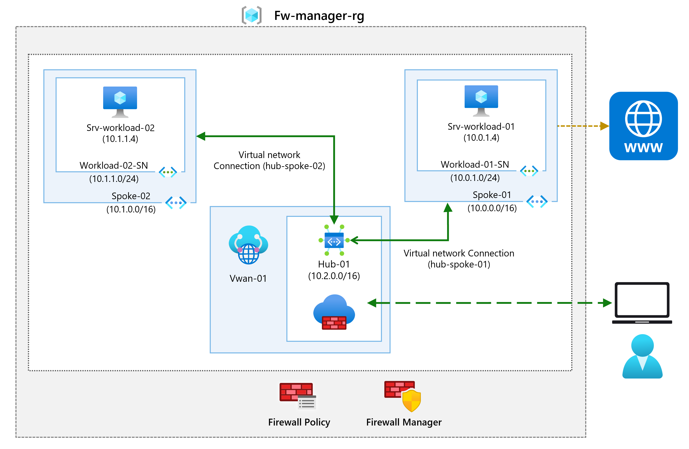
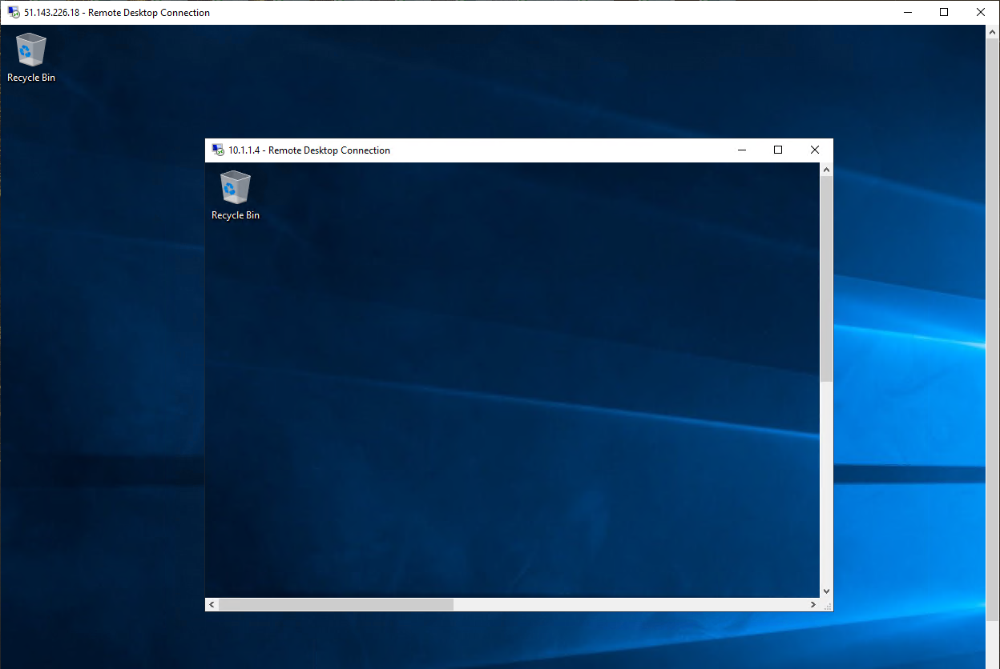

---
Exercise:
    title: 'M06 - Unit 9 Secure your virtual hub using Azure Firewall Manager'
    module: 'Module 06 - Design and implement network security'
---


# M06-Unit 9 Secure your virtual hub using Azure Firewall Manager

## Exercise scenario

In this exercise, you will create the spoke virtual network and create a secured virtual hub, then you will connect the hub and spoke virtual networks and route traffic to your hub. Next you will deploy the workload servers, then create a firewall policy and secure your hub, and finally you will test the firewall.



### Interactive lab simulations

**Note**: The lab simulations that were previously provided have been retired.


## Create a hub and spoke architecture

In this part of the exercise, you will create the spoke virtual networks and subnets where you will place the workload servers. Then you will create the secured virtual hub and connect the hub and spoke virtual networks.

### Job skills

In this exercise, you will:

+ Task 1: Create two spoke virtual networks and subnets
+ Task 2: Create the secured virtual hub
+ Task 3: Connect the hub and spoke virtual networks
+ Task 4: Deploy the servers
+ Task 5: Create a firewall policy and secure your hub
+ Task 6: Associate the firewall policy
+ Task 7: Route traffic to your hub
+ Task 8: Test the application rule
+ Task 9: Test the network rule
+ Task 10: Clean up resources

### Estimated time: 35 minutes

## Task 1: Create two spoke virtual networks and subnets

In this task, you will create the two spoke virtual networks each containing a subnet that will host your workload servers.

1. In the Azure portal, search for and select `Virtual Networks`.

1. Select **Create**.

1. In **Resource group**, select **Create new**, and enter `fw-manager-rg` as the name and select **OK**.

1. In **Virtual network name**, enter `Spoke-01`.

1. In **Region**, select your region.

1. Select **Next**. Review but don't make any changes on the **Security** tab. 

1. Select **Next** and move to the **IP Addresses** tab.

1. Select **Delete address space** then **Add IPv4 address space**. 

1. Verify the IP address space is **10.0.0.0/16**.

1. Select **Add a subnet**. 

1. Change the subnet **Name** to `Workload-01-SN`.

1. Change the **Starting address** to `10.0.1.0`.

1. Select **Add**.

1. Select **Review + create**.

1. Select **Create**.

Repeat steps 1 to 14 above to create another similar virtual network and subnet using the following information. You don't need to wait for the first virtual network to finish deploying. 

+ Resource Group: **fw-manager-rg** (select existing)
+ Virtual network name: `Spoke-02`
+ Address space: **10.1.0.0/16** - (delete any other listed address spaces)
+ Subnet name: `Workload-02-SN`
+ Subnet starting address: `10.1.1.0`

## Task 2: Create the secured virtual hub

In this task you will create your secured virtual hub using Firewall Manager.

1. In the portal search for `firewall manager` and then select **Network Security keyword firewall manager**.
   
1. In the **Secure your resources** blade, select **Virtual Hubs**.

1. Select **Create new secured virtual hub**.

1. For **Resource group**, select **fw-manager-rg**.

1. For **Region**, select your region.

1. For the **Secured virtual hub name**, enter `Hub-01`.

1. For **Hub address space**, enter `10.2.0.0/16`.

1. Ensure **New vWAN** is selected

1. In **Virtual WAN Name**, enter `Vwan-01`.

1. Select **Next: Azure Firewall**. Review but don't make any changes. 

1. Select **Next: Security Partner Provider**. Review but don't make any changes. 

1. Select **Next: Review + create.**

1. Select **Create**.

    > Note: This can take up to 30 minutes to deploy.

1. Wait for the deployment to complete. 

1. In the portal search for `firewall manager` and then select **Network Security keyword firewall manager**.

1. On the **Firewall Manager** page, select **Virtual hubs**.

1. Select **Hub-01**.

1. Select **Azure Firewall** and then **Public IP configuration**.

1. Note the public IP address (e.g., **172.191.79.203**), which you will use later.

## Task 3: Connect the hub and spoke virtual networks

In this task you will connect the hub and spoke virtual networks. This is commonly known as peering.

1. In the portal, search for and select the `Vwan-01` virtual WAN.

1. Under **Connectivity**, select **Virtual network connections**.

1. Select **Add connection**.

1. For **Connection name**, enter `hub-spoke-01`.

1. For **Hubs**, select **Hub-01**.

1. For **Resource group**, select **fw-manager-rg**.

1. For **Virtual network**, select **Spoke-01**.

1. Select **Create**.

1. Repeat steps 4 to 9 above to create another similar connection but using the connection name of `hub-spoke-02` to connect the **Spoke-02** virtual network.

1. **Refresh** the virtual network connections page and verify you have two virtual networks, Spoke-01 and Spoke-02.
   
## Task 4: Deploy the servers

1. In the Azure portal, select the Cloud Shell icon (top right). If necessary, configure the shell.  
    + Select **PowerShell**.
    + Select **No Storage Account required** and your **Subscription**, then select **Apply**.
    + Wait for the terminal to create and a prompt to be displayed. 

1. In the toolbar of the Cloud Shell pane, select the **Manage files** icon, in the drop-down menu, select **Upload** and upload the following files **FirewallManager.json** and **FirewallManager.parameters.json** into the Cloud Shell home directory.

    > **Note:** If you are working in your own subscription the [template files](https://github.com/MicrosoftLearning/AZ-700-Designing-and-Implementing-Microsoft-Azure-Networking-Solutions/tree/master/Allfiles/Exercises) are available in the GitHub lab repository.

1. Deploy the following ARM templates to create the VM needed for this exercise:

   >**Note**: You will be prompted to provide an Admin password. **You will need this password in a later step.**

   ```powershell
   $RGName = "fw-manager-rg"
   
   New-AzResourceGroupDeployment -ResourceGroupName $RGName -TemplateFile FirewallManager.json -TemplateParameterFile FirewallManager.parameters.json
   ```
  
1. When the deployment is complete, go to the Azure portal home page, and then select **Virtual Machines**.

1. On the **Overview** page of **Srv-workload-01**, in the right-hand pane, under the **Networking** section, note down the **Private IP address** (e.g., **10.0.1.4**).

1. On the **Overview** page of **Srv-workload-02**, in the right-hand pane, under the **Networking** section, note down the **Private IP address** (e.g., **10.1.1.4**).

## Task 5: Create a firewall policy and secure your hub

In this task you will first create your firewall policy, then secure your hub. The firewall policy will define collections of rules to direct traffic on one or more Secured virtual hubs.

1. In the portal search for `firewall manager` and then select **Network Security keyword firewall manager**.

1. In the **Firewall Manager** blade, select **Azure Firewall Policies**.

1. Select **Create**.

1. On **Resource group**, select **fw-manager-rg**.

5. Under **Policy details**, for the **Name**, enter `Policy-01`.

1. On **Region** select your region.

1. On **Policy tier**, select **Standard**.

1. Select **Next : DNS Settings**. Review but don't make any changes. 

1. Select **Next : TLS Inspection**. Review but don't make any changes. 

1. Select **Next : Rules**.

1. On the **Rules** tab, select **Add a rule collection**.

1. On the **Add a rule collection** page, in **Name**, enter `App-RC-01`.

1. For **Rule collection type**, select **Application**.

1. For **Priority**, enter **100**.

1. Ensure **Rule collection action** is **Allow**.

1. Under **Rules**, in **Name** enter `Allow-msft`.

1. For the **Source type**, select **IP Address**.

1. For **Source**, enter *.

1. For **Protocol**, enter `http,https`.

1. Ensure **Destination type** is **FQDN**.

1. For **Destination**, enter `*.microsoft.com`.

1. Select **Add**.

1. To add a DNAT rule so you can connect a remote desktop to the Srv-workload-01 VM, select **Add a rule collection**.

1. For **Name**, enter `dnat-rdp`.

1. For **Rule collection type**, select **DNAT**.

1. For **Priority**, enter **100**.

1. Under **Rules**, in **Name** enter `Allow-rdp`.

1. For the **Source type**, select **IP Address**.

1. For **Source**, enter *.

1. For **Protocol**, select **TCP**.

1. For **Destination Ports**, enter `3389`.

1. For **Destination IP address**, enter the firewall virtual hub public IP address that you noted down earlier (e.g., **51.143.226.18**).

1. For **Translated type**, select **IP address**.

1. For **Translated address**, enter the private IP address for **Srv-workload-01** that you noted down earlier (e.g., **10.0.1.4**).

1. For **Translated port**, enter **3389**.

1. Select **Add**.

1. To add a Network rule so you can connect a remote desktop from Srv-workload-01 to Srv-workload-02 VM, select **Add a rule collection**.

1. For **Name**, enter `vnet-rdp`.

1. For **Rule collection type**, select **Network**.

1. For **Priority**, enter **100**.

1. For **Rule collection action**, select **Allow**.

1. Under **Rules**, in **Name** enter `Allow-vnet`.

1. For the **Source type**, select **IP Address**.

1. For **Source**, enter *.

1. For **Protocol**, select **TCP**.

1. For **Destination Ports**, enter **3389**.

1. For **Destination Type**, select **IP Address**.

1. For **Destination**, enter the private IP address for **Srv-workload-02** that you noted down earlier (e.g., **10.1.0.4**).

1. Select **Add**.

1. You should now have 3 rule collections listed.

1. Select **Review + create**.

1. Select **Create**.

## Task 6: Associate the firewall policy

In this task you will associate the firewall policy with the virtual hub.

1. In the portal search for and select `Hub-01`.

1. In the **Settings** blade, select **Security providers**

1. Select the checkbox for **Add Policy**.

1. Select **Policy-01** and then **Save**.

1. Select the checkbox for **Hub-01**.

1. Select **Add**.

1. When the policy has been association, select **Refresh**. The association should be displayed.

## Task 7: Route traffic to your hub

In this task you will ensure that network traffic gets routed through your firewall.

1. In the portal, search for and select **Vwan-01**.

1. In the **Connectivity** blade, select **Hubs**, and then **Hub-01**.
   
1. In the **Security** blade, select **Azure Firewall and Firewall Manager**, select **Hub-01**, and then **Security configuration**.

1. On **Internet traffic**, select **Azure Firewall**.

1. On **Private traffic**, select **Send via Azure Firewall**.

1. Select **Save** and click **OK** to confirm your choice.

1. This will take a few minutes to complete.

1. Once configuration has completed, ensure that under **INTERNET TRAFFIC** and **PRIVATE TRAFFIC**, it says **Secured by Azure Firewall** for both hub-spoke connections.

## Task 8: Test the application rule

In this part of the exercise, you will connect a remote desktop to the firewall public IP address, which is NATed to Srv-Workload-01. You will then use a web browser to test the application rule and connect a remote desktop to Srv-Workload-02 to test the network rule.

In this task you will test the application rule to confirm that it works as expected.

1. Open **Remote Desktop Connection** on your PC.

1. On the **Computer** box, enter the **firewall's public IP address** (e.g., **51.143.226.18**).

1. Select **Show Options**.

1. On the **Username** box, enter **TestUser**.

1. Select **Connect**.

   

1. On the **Enter your credentials** dialog box, log into the **Srv-workload-01** server virtual machine, by using the password you provided during deployment.

1. Select **OK**.

1. Select **Yes** on the certificate message.

1. Open Internet Explorer and select **OK** in the **Set up Internet Explorer 11** dialog box.

1. Browse to `https://www.microsoft.com`

1. On the **Security Alert** dialog box, select **OK**.

1. Select **Close** on the Internet Explorer security alerts that may pop-up.

1. You should see the Microsoft home page.

    

1. Browse to **https://** **<www.google.com>**.

1. You should be blocked by the firewall.

    

1. So, you have verified that you can connect to the one allowed FQDN but are blocked from all others.

## Task 9: Test the network rule

In this task you will test the network rule to confirm that it works as expected.

1. While still logged in to the **Srv-workload-01** RDP session, from this remote computer, open **Remote Desktop Connection**.

1. On the **Computer** box, enter the **private IP address** of **Srv-workload-02** (e.g., **10.1.1.4**).

1. On the **Enter your credentials** dialog box, log in to the **Srv-workload-02** server by using the username **TestUser**, and the password you provided during deployment.

1. Select **OK**.

1. Select **Yes** on the certificate message.

   

1. So, now you have verified that the firewall network rule is working, as you have connected a remote desktop from one server to another server located in another virtual network.

1. Close both RDP sessions to disconnect them.

## Task 10: Clean up resources

>**Note**: Remember to remove any newly created Azure resources that you no longer use. Removing unused resources ensures you will not see unexpected charges.

1. On the Azure portal, open the **PowerShell** session within the **Cloud Shell** pane.

1. Delete all resource groups you created throughout the labs of this module by running the following command:

   ```powershell
   Remove-AzResourceGroup -Name 'fw-manager-rg' -Force -AsJob
   ```

   >**Note**: The command executes asynchronously (as determined by the -AsJob parameter), so while you will be able to run another PowerShell command immediately afterwards within the same PowerShell session, it will take a few minutes before the resource groups are actually removed.
