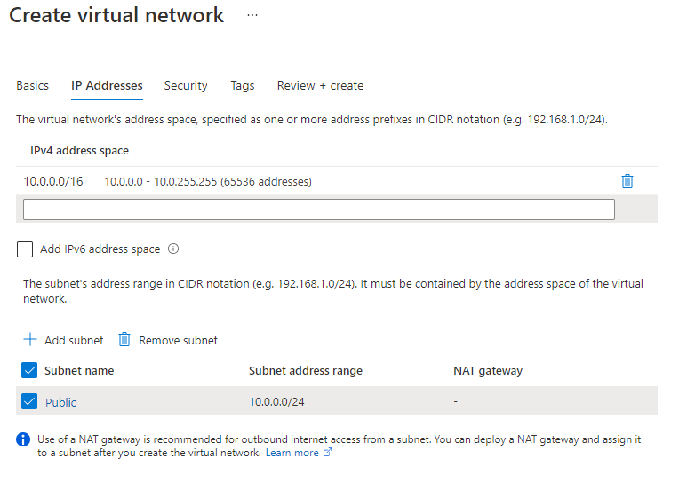
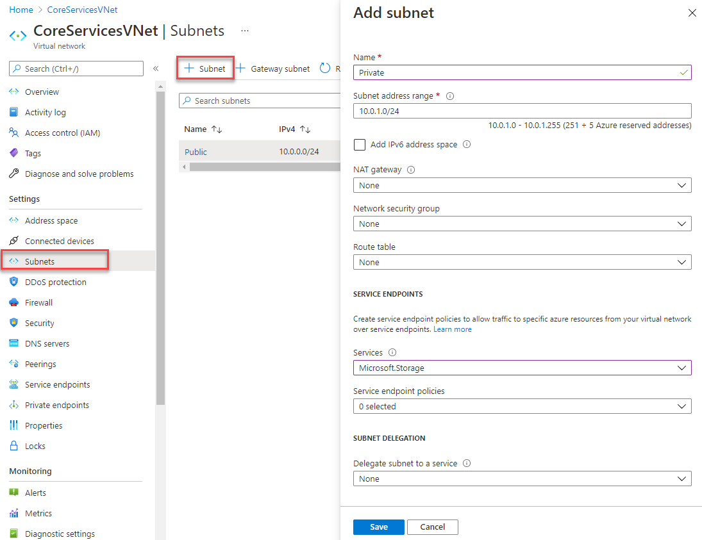
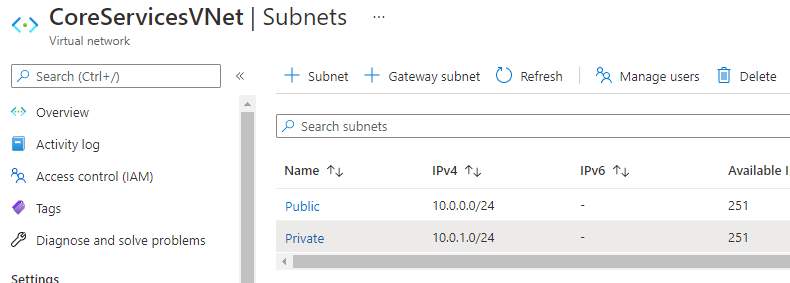
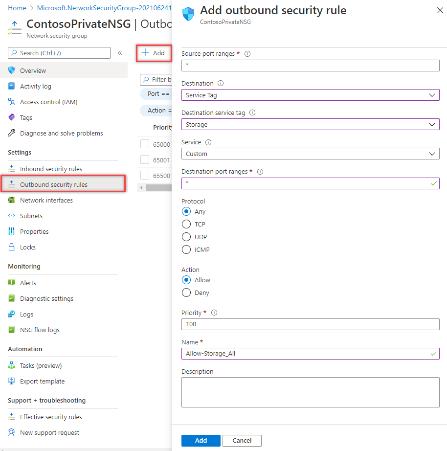
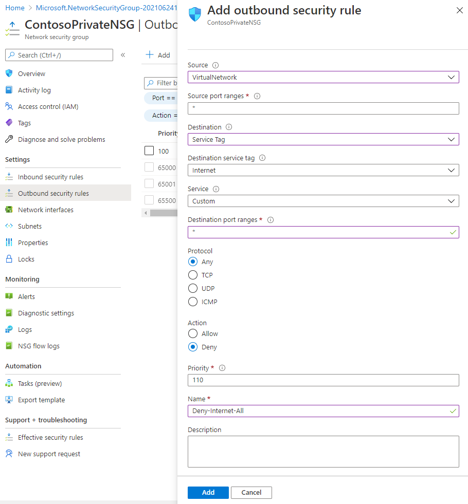
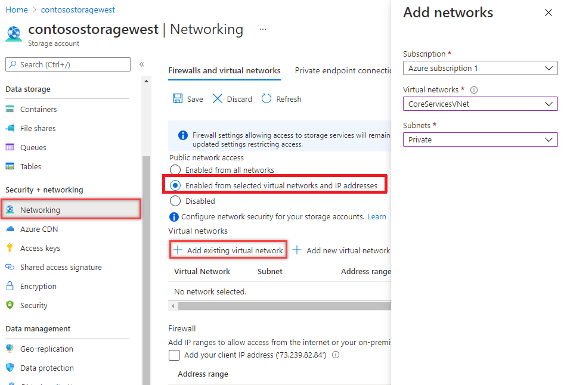
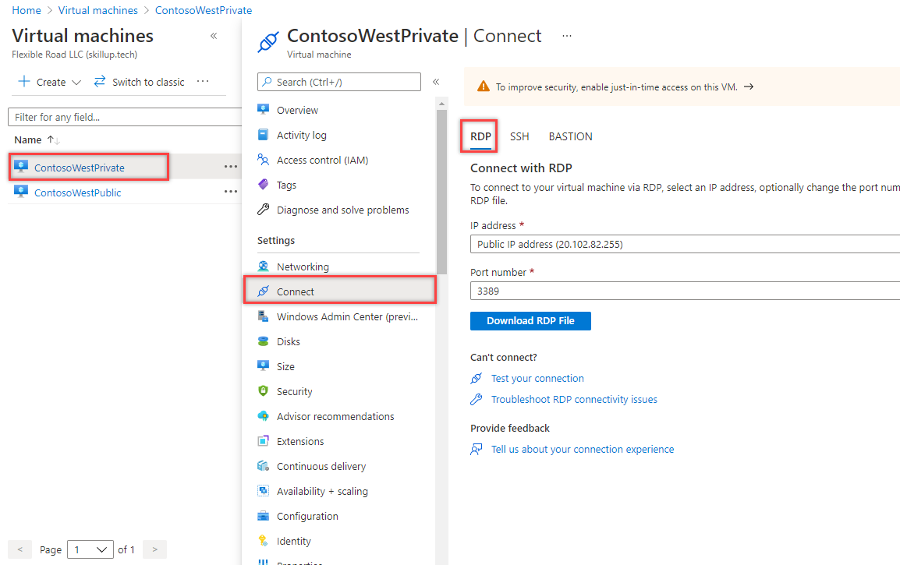

---
Exercise:
    title: 'M07 - Unit 5 Restrict network access to PaaS resources with virtual network service endpoints'
    module: 'Module 07 - Design and implement private access to Azure Services'
---

# M07-Unit 5 Restrict network access to PaaS resources with virtual network service endpoints


Virtual network service endpoints enable you to limit network access to some Azure service resources to a virtual network subnet. You can also remove internet access to the resources. Service endpoints provide direct connection from your virtual network to supported Azure services, allowing you to use your virtual network's private address space to access the Azure services. Traffic destined to Azure resources through service endpoints always stays on the Microsoft Azure backbone network.

In this exercise, you will:

+ Task 1: Create a virtual network
+ Task 2: Enable a service endpoint
+ Task 3: Restrict network access for a subnet
+ Task 4: Add additional outbound rules 
+ Task 5: Allow access for RDP connections
+ Task 6: Restrict network access to a resource
+ Task 7: Create a file share in the storage account
+ Task 8: Restrict network access to a subnet
+ Task 9: Create virtual machines
+ Task 10: Confirm access to storage account
+ Task 11: Clean up resources

**Note:** An **[interactive lab simulation](https://mslabs.cloudguides.com/guides/AZ-700%20Lab%20Simulation%20-%20Restrict%20network%20access%20to%20PaaS%20resources%20with%20virtual%20network%20service%20endpoints)** is available that allows you to click through this lab at your own pace. You may find slight differences between the interactive simulation and the hosted lab, but the core concepts and ideas being demonstrated are the same.

#### Estimated time: 35 minutes

## Task 1: Create a virtual network

1. Login to the Azure Portal.

1. On the Azure Portal home page, search for virtual network and then select **Virtual network** from the results.

1. Select **+** **Create**.

1. Enter, or select, the following information:
   

   | **Setting**    | **Value**                                     |
   | -------------- | --------------------------------------------- |
   | Subscription   | Select your subscription                      |
   | Resource group | (New) myResourceGroup                         |
   | Name           | CoreServicesVNet                              |
   | Location       | Select **East US**                            |

1. Select the **IP Addresses** tab and enter the following values (select **default** to change the subnet name):
   

   | **Setting**          | **Value**   |
   | -------------------- | ----------- |
   | Address space        | 10.0.0.0/16 |
   | Subnet Name          | Public      |
   | Subnet Address range | 10.0.0.0/24 |

1. Select the **Security** tab and enter the following values:
   

   | **Setting**             | **Value** |
   | ----------------------- | --------- |
   | BastionHost             | Disabled  |
   | DDoS Network Protection | Disabled  |
   | Firewall                | Disabled  |

1. Select **Review + Create**. Once the resource is validated select **Create**. 

## Task 2: Enable a service endpoint

Service endpoints are enabled per service, per subnet. Create a subnet and enable a service endpoint for the subnet.

1. In the **Search resources, services, and docs** box at the top of the portal, enter CoreServicesVNet. When CoreServicesVNet appears in the search results, select it.

1. Add a subnet to the virtual network. Under **Settings**, select **Subnets**, and then select **+ Subnet**, as shown in the following picture: 
   

1. Under **Add subnet**, select or enter the following information:

   | **Setting**                 | **Value**                    |
   | --------------------------- | ---------------------------- |
   | Name                        | Private                      |
   | Address range               | 10.0.1.0/24                  |
   | Service endpoints: Services | Select **Microsoft.Storage** |

1. Select **Save**.

You should now have two subnets configured:



 

## Task 3: Restrict network access for a subnet

By default, all VMs in a subnet can communicate with all resources. You can limit communication to and from all resources in a subnet by creating a network security group and associating it to the subnet.

1. In the **Search resources, services, and docs** box at the top of the portal, enter **security group**. When **Network Security groups** appears in the search results, select it.

1. In Network security groups, select **+ Create**. 

1. Enter or select, the following information: 


   | **Setting**    | **Value**                                                    |
   | -------------- | ------------------------------------------------------------ |
   | Subscription   | Select your subscription                                     |
   | Resource group | myResourceGroup                                              |
   | Name           | ContosoPrivateNSG                                            |
   | Location       | Select **East US**                                           |

1. select **Review + create**, then select **Create**:

1. After the ContosoPrivateNSG network security group is created, select **Go to resource**.

1. Under **Settings**, select **Outbound security rules**.

1. Select **+ Add**.

1. Create a rule that allows outbound communication to the Azure Storage service. Enter, or select, the following information:
   

   | **Setting**             | **Value**                 |
   | ----------------------- | ------------------------- |
   | Source                  | Select **Service Tag**    |
   | Source service tag      | Select **VirtualNetwork** |
   | Source port ranges      | *                         |
   | Destination             | Select **Service Tag**    |
   | Destination service tag | Select **Storage**        |
   | Service                 | Custom                    |
   | Destination port ranges | *                         |
   | Protocol                | Any                       |
   | Action                  | Allow                     |
   | Priority                | 100                       |
   | Name                    | Allow-Storage-All         |

1. Select **Add**:


## Task 4: Add additional outbound rules 

Create another outbound security rule that denies communication to the internet. This rule overrides a default rule in all network security groups that allows outbound internet communication. 

1. Select **+Add** under **Outbound security rules**.

1. Enter, or select, the following information:
   

   | **Setting**             | **Value**                 |
   | ----------------------- | ------------------------- |
   | Source                  | Select **Service Tag**    |
   | Source service tag      | Select **VirtualNetwork** |
   | Source port ranges      | *                         |
   | Destination             | Select **Service Tag**    |
   | Destination service tag | Select **Internet**       |
   | Service                 | Custom                    |
   | Destination port ranges | *                         |
   | Protocol                | Any                       |
   | Action                  | Deny                      |
   | Priority                | 110                       |
   | Name                    | Deny-Internet-All         |

1. Select **Add**.

## Task 5: Allow access for RDP connections

Create an inbound security rule that allows Remote Desktop Protocol (RDP) traffic to the subnet from anywhere. The rule overrides a default security rule that denies all inbound traffic from the internet. Remote desktop connections are allowed to the subnet so that connectivity can be tested in a later step.

1. On ContosoPrivateNSG | Outbound security rules, under **Settings**, select **Inbound security rules**.

1. Select **+ Add**.

1. In Add inbound security rule, enter the following values::
   

   | **Setting**             | **Value**                 |
   | ----------------------- | ------------------------- |
   | Source                  | Any                       |
   | Source port ranges      | *                         |
   | Destination             | Select **VirtualNetwork** |
   | Service                 | Custom                    |
   | Destination port ranges | 3389                      |
   | Protocol                | Any                       |
   | Action                  | Allow                     |
   | Priority                | 120                       |
   | Name                    | Allow-RDP-All             |

1. And then select **Add**.

> **Warning**: RDP port 3389 is exposed to the Internet. This is only recommended for testing. For production environments, we recommend using a VPN or private connection.

1. Under **Settings**, select **Subnets**.

1. Select **+ Associate.**

1. Under **Associate subnet**, select **Virtual network** and then select **CoreServicesVNet** under **Choose a virtual network**.

1. Under **Choose subnet**, select **Private**, and then select **OK**.

## Task 6: Restrict network access to a resource

The steps necessary to restrict network access to resources created through Azure services enabled for service endpoints varies across services. See the documentation for individual services for specific steps for each service. The remainder of this exercise includes steps to restrict network access for an Azure Storage account, as an example.

1. On the Azure portal, select Storage accounts.

1. Select +Create.

1. Enter, or select, the following information and accept the remaining defaults:


   | **Setting**    | **Value**                                                    |
   | -------------- | ------------------------------------------------------------ |
   | Subscription   | Select your subscription                                     |
   | Resource group | myResourceGroup                                              |
   | Name           | Enter contosostoragexx (where xx are your initials to make it unique) |
   | Performance    | Standard StorageV2 (general purpose v2)                      |
   | Location       | Select East US                                               |
   | Replication    | Locally-redundant storage (LRS)                              |

1. select **Review**, then select **Create**.

## Task 7: Create a file share in the storage account

1. After the storage account is created, enter the name of the storage account in the **Search resources, services, and docs** box, at the top of the portal. When the name of your storage account appears in the search results, select it.
1. Select **File shares**, as shown in the following picture: 
   
1. Select **+ File share**.
1. Enter marketing under **Name**, and then select **Create**.

## Task 8: Restrict network access to a subnet

By default, storage accounts accept network connections from clients in any network, including the internet. Deny network access from the internet, and all other subnets in all virtual networks, except for the Private subnet in the CoreServicesVNet virtual network.

1. Under **Security + networking** for the storage account, select **Networking**.

1. Select **Enabled from selected virtual networks and IP addresses**.

1. Select **+Add existing virtual network**.

1. Under **Add networks**, select the following values:
   

   | **Setting**      | **Value**                    |
   | ---------------- | ---------------------------- |
   | Subscription     | Select your subscription.    |
   | Virtual networks | Select CoreServicesVNet**.** |
   | Subnets          | Select **Private**.          |

1. Select **Add**.

1. Select **Save**.

1. Under **Security and Networking** for the storage account, select **Access keys**.

1. Select **Show Keys**. Note the **Key** value, as you'll have to manually enter it in a later step when mapping the file share to a drive letter in a VM.

## Task 9: Create virtual machines

To test network access to a storage account, deploy a VM to each subnet.

1. On the Azure portal, open the **PowerShell** session within the **Cloud Shell** pane.

1. In the toolbar of the Cloud Shell pane, select the **Upload/Download files** icon, in the drop-down menu, select **Upload** and upload the following files **VMs.json** and **VMs.parameters.json** into the Cloud Shell home directory one by one from the source folder **F:\Allfiles\Exercises\M07**.

1. Deploy the following ARM templates to create the VMs needed for this exercise:

   >**Note**: You will be prompted to provide an Admin password.

   ```powershell
   $RGName = "myResourceGroup"
   
   New-AzResourceGroupDeployment -ResourceGroupName $RGName -TemplateFile VMs.json -TemplateParameterFile VMs.parameters.json
   ```
  
1. When the deployment is complete, go to the Azure portal home page, and then select **Virtual Machines**.


## Task 10: Confirm access to storage account

1. Once the ContosoPrivate VM finishes creating, open the blade for the VM by selecting Go to resource. Select the Connect button, then select RDP.
   
1. After selecting the Connect button and RDP, select the Download RDP File button. A Remote Desktop Protocol (.rdp) file is created and downloaded to your computer.
1. Open the downloaded rdp file. If prompted, select Connect. Enter the user name and password you specified when creating the VM. You may need to select More choices, then Use a different account, to specify the credentials you entered when you created the VM.
1. Select **OK**.
1. You may receive a certificate warning during the sign-in process. If you receive the warning, select Yes or Continue to proceed with the connection.
1. On the ContosoPrivate VM, map the Azure file share to drive Z using PowerShell. Before running the commands that follow, replace <storage-account-key> , <storage-account-name> (i.e. contosostoragexx) and my-file-share (i.e marketing) with values you supplied and retrieved in the Create a storage account task.


```azurecli
$acctKey = ConvertTo-SecureString -String "<storage-account-key>" -AsPlainText -Force

$credential = New-Object System.Management.Automation.PSCredential -ArgumentList "Azure\<storage-account-name>", $acctKey

New-PSDrive -Name Z -PSProvider FileSystem -Root "\\<storage-account-name>.file.core.windows.net\marketing" -Credential $credential

```

The Azure file share successfully mapped to the Z drive.

1. Confirm that the VM has no outbound connectivity to the internet from a command prompt:

 ping bing.com


You receive no replies because the network security group associated to the Private subnet does not allow outbound access to the internet.

1. Close the remote desktop session to the ContosoPrivate VM.

### Confirm access is denied to storage account

1. Enter ContosoPublic In the **Search resources, services, and docs** box at the top of the portal.

1. When **ContosoPublic** appears in the search results, select it.

1. Complete steps 1-6 in the Confirm access to storage account task for the ContosoPublic VM.  
     
   ‎After a short wait, you receive a New-PSDrive : Access is denied error. Access is denied because the ContosoPublic VM is deployed in the Public subnet. The Public subnet does not have a service endpoint enabled for Azure Storage. The storage account only allows network access from the Private subnet, not the Public subnet.

1. Confirm that the public VM does have outbound connectivity to the internet from a command prompt:

 ping bing.com    

1. Close the remote desktop session to the ContosoPublic VM.

1. From your computer, browse to the Azure portal.

1. Enter the name of the storage account you created in the **Search resources, services, and docs** box. When the name of your storage account appears in the search results, select it.

1. Select **File shares** then select the **marketing** file share.

1. You receive the error shown in the following screenshot:

    

 Access is denied, because your computer is not in the Private subnet of the CoreServicesVNet virtual network.

> **Warning**: Prior to continuing you should remove all resources used for this lab. To do this On the Azure portal select Resource groups. Select any resources groups you have created. On the resource group blade select Delete Resource group, enter the Resource Group Name and select Delete. Repeat the process for any additional Resource Groups you may have created. Failure to do this may cause issues with other labs.

Results: You have now completed this lab.

## Task 11: Clean up resources

   >**Note**: Remember to remove any newly created Azure resources that you no longer use. Removing unused resources ensures you will not see unexpected charges.

1. On the Azure portal, open the **PowerShell** session within the **Cloud Shell** pane.

1. Delete all resource groups you created throughout the labs of this module by running the following command:

   ```powershell
   Remove-AzResourceGroup -Name 'myResourceGroup' -Force -AsJob
   ```

    >**Note**: The command executes asynchronously (as determined by the -AsJob parameter), so while you will be able to run another PowerShell command immediately afterwards within the same PowerShell session, it will take a few minutes before the resource groups are actually removed.
