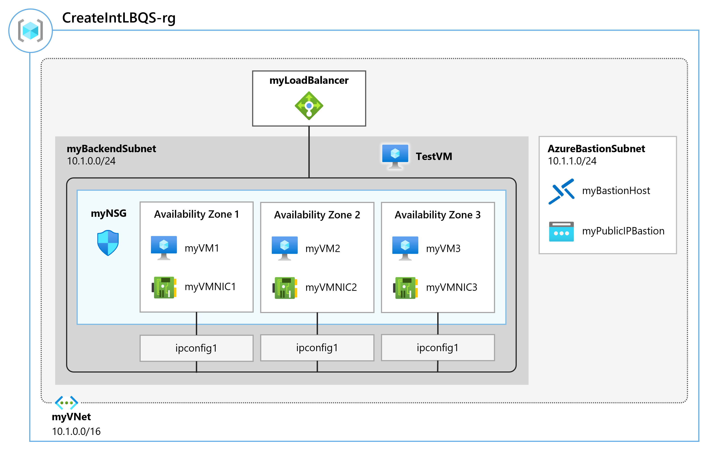
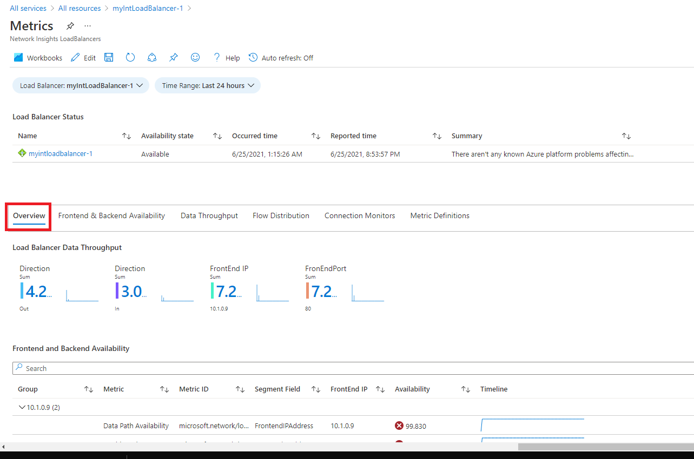
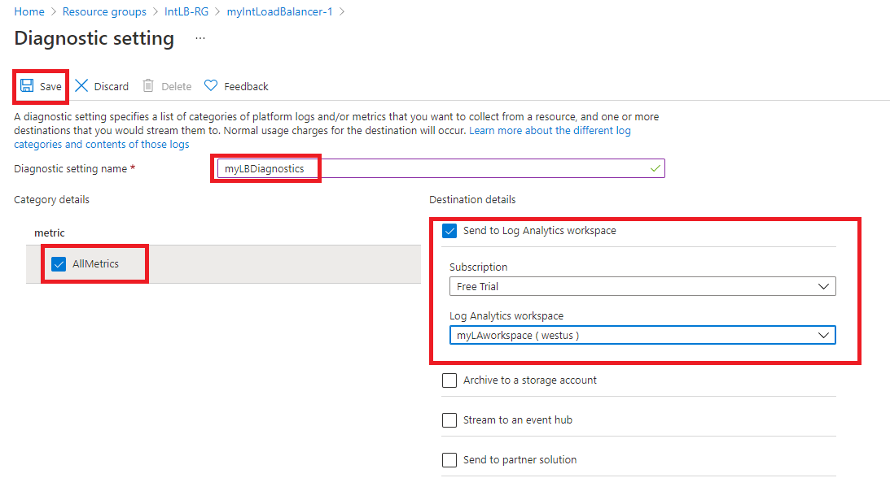

---
Exercise:
    title: 'M08 - Unit 3 Monitor a load balancer resource using Azure Monitor'
    module: 'Module 08 - Design and implement network monitoring'
---

# M08-Unit 3 Monitor a load balancer resource using Azure Monitor

## Exercise scenario

In this exercise, you will create an internal load balancer for the fictional Contoso Ltd organization. Then you will create a Log Analytics workspace, and use Azure Monitor Insights to view information about your internal load balancer. You will view the Functional Dependency View, then view detailed metrics for the load balancer resource, and view resource health information for the load balancer. Finally, you will configure the load balancer's diagnostic settings to send metrics to the Log Analytics workspace you created.

The diagram below illustrates the environment you will be deploying in this exercise.



## Job skills

 In this exercise, you will:

+ Task 1: Create the virtual network
+ Task 2: Create the load balancer
+ Task 3: Create a backend pool
+ Task 4: Create a health probe
+ Task 5: Create a load balancer rule
+ Task 6: Create backend servers
+ Task 7: Add VMs to the backend pool
+ Task 8: Test the load balancer
+ Task 9: Create a Log Analytics Workspace
+ Task 10: Use Functional Dependency View
+ Task 11: View detailed metrics
+ Task 12: View resource health
+ Task 13: Configure diagnostic settings

## Estimated time: 55 minutes

## Task 1: Create the virtual network

In this section, you will create the virtual network and subnets. 

1. Log in to the Azure portal.

1. In the Azure portal, search for and select **Virtual Networks**.

1. Select **+ Create**.

   

1. On the **Basics** tab, use the information in the table below to create the virtual network.

   | **Setting**    | **Value**                                           |
   | -------------- | --------------------------------------------------- |
   | Subscription   | Select your subscription                            |
   | Resource group | Select **Create new**<br /><br />Name: **IntLB-RG** |
   | Name           | **IntLB-VNet**                                      |
   | Region         | **(US) West US**                                    |

1. Select **Next : Security**.

1. Under **BastionHost** select **Enable**, then enter the information from the table below.

    | **Setting**                       | **Value**                                              |
    | --------------------------------- | ------------------------------------------------------ |
    | Bastion name                      | **myBastionHost**                                      |
    | Public IP address                 | Select **Create new** and change the Name to **myBastionIP** |

1. Select **Next : IP Addresses**.

1. Verify the virtual network IP address is **10.1.0.0/16**.

1. Verify the default subnet IP address range is **10.1.0.0 - 10.1.0.255** with **/24**. Change the name to `myBackendSubnet`. 

1. Verify the AzureBastionSubnet is **10.1.1.0 - 10.1.1.63** with **/26**. 

1. You should now have a virtual network with two subnets. Compare to the architecture diagram. 

1. Select **Review + create**.

1. Select **Create**.

## Task 2: Create the load balancer

In this section, you will create an internal Standard SKU load balancer. The reason we are creating a Standard SKU load balancer here in the exercise, instead of a Basic SKU load balance, is for later exercises that require a Standard SKU version of the load balancer.

1. In the Azure portal, search for and select **Load Balancers**

1. Select **Create**, and then **Standard Load Balancer**.

1. On the **Basics** tab, use the information in the table below to create the load balancer.

   | **Setting**           | **Value**                |
   | --------------------- | ------------------------ |
   | Basics tab            |                          |
   | Subscription          | Select your subscription |
   | Resource group        | **IntLB-RG**             |
   | Name                  | **myIntLoadBalancer**    |
   | Region                | **(US) West US**         |
   | SKU                   | **Standard**             |
   | Type                  | **Internal**             |

1. Move to the **Frontend IP configuration tab** and select **+ Add a frontend IP configuration**.

   | **Setting**            | **Value**            |
   | Name                  | `LoadBalancerFrontEnd` |
   | Virtual network       | **IntLB-VNet**           |
   | Subnet                | **myBackendSubnet**      |
   | IP address assignment | **Dynamic**              |

1. **Save** your changes, then select **Review + create**.

1. After a successful validation, select **Create**.

## Task 3: Create a backend pool

The backend address pool contains the IP addresses of the virtual NICs connected to the load balancer.

1. In the Azure portal, search for and select the **myIntLoadBalancer** resource.

1. Under **Settings**, select **Backend pools**, and then select **Add**.

1. On the **Add backend pool** page, enter the information from the table below.

   | **Setting**     | **Value**            |
   | --------------- | -------------------- |
   | Name            | **myBackendPool**    |
   | Virtual network | IntLB-VNet    |
   | Backend Pool Configuration   | **NIC** |

1. Select **Save**.

   

## Task 4: Create a health probe

The load balancer monitors the status of your app with a health probe. The health probe adds or removes VMs from the load balancer based on their response to health checks. Here you will create a health probe to monitor the health of the VMs.

1. For the load balancer resource, select **Settings**, select **Health probes**, then select **Add**.

1. On the **Add health probe** page, enter the information from the table below.

   | **Setting**         | **Value**         |
   | ------------------- | ----------------- |
   | Name                | `myHealthProbe` |
   | Protocol            | **HTTP**          |
   | Port                | **80**            |
   | Path                | **/**             |
   | Interval            | **15**            |

1. Select **Save**.

   

## Task 5: Create a load balancer rule

A load balancer rule is used to define how traffic is distributed to the VMs. You define the frontend IP configuration for the incoming traffic and the backend IP pool to receive the traffic. The source and destination port are defined in the rule. Here you will create a load balancer rule.

1. For the load balancer resource, select **Settings**, select **Load balancing rules**, then select **Add**.

   | **Setting**            | **Value**                |
   | ---------------------- | ------------------------ |
   | Name                   | **myHTTPRule**           |
   | IP Version             | **IPv4**                 |
   | Frontend IP address    | **LoadBalancerFrontEnd** |
   | Backend pool           | **myBackendPool**        |
   | Protocol               | **TCP**                  |
   | Port                   | **80**                   |
   | Backend port           | **80**                   |
   | Health probe           | **myHealthProbe**        |
   | Session persistence    | **None**                 |
   | Idle timeout (minutes) | **15**                   |
   | Floating IP            | **Disabled**             |

   

## Task 6: Create backend servers

In this section, you will create three VMs for the backend pool of the load balancer, add the VMs to the backend pool, and then install IIS on the three VMs to test the load balancer.

1. In the Azure portal, select the Cloud Shell icon (top right). If necessary, configure the shell.  
    + Select **PowerShell**.
    + Select **No Storage Account required** and your **Subscription**, then select **Apply**.
    + Wait for the terminal to create and a prompt to be displayed. 

1. On the toolbar of the Cloud Shell pane, select the **Manage files** icon, in the drop-down menu, select **Upload** and upload the following files **azuredeploy.json** and **azuredeploy.parameters.json** into the Cloud Shell home directory.

    > **Note:** If you are working in your own subscription the [template files](https://github.com/MicrosoftLearning/AZ-700-Designing-and-Implementing-Microsoft-Azure-Networking-Solutions/tree/master/Allfiles/Exercises) are available in the GitHub lab repository.

1. Deploy the following ARM templates to create the virtual network, subnets, and VMs needed for this exercise. T**Note**: You will be prompted to provide an Admin password.

   ```powershell
   $RGName = "IntLB-RG"
   New-AzResourceGroupDeployment -ResourceGroupName $RGName -TemplateFile azuredeploy.json -TemplateParameterFile azuredeploy.parameters.json
   ```
1. Deployment may take several minutes. You can check the progress in the portal by refreshing the virtual machine resource page.   

## Task 7: Add VMs to the backend pool

1. In the Azure portal, search for and select the **myIntLoadBalancer** resource.

1. Under **Settings**, select **Backend pools**., and then select **myBackendPool**.

1. In the **IP configurations** section, select **Add**.

1. Select all the virtual machines that are shown, then select **Add**.

1. Select the checkboxes for **myVM1** and **myVM2** then select **Add**.

1. On the **myBackendPool** page, select **Save**.

## Task 8: Test the load balancer

In this section, you will create a test VM, and then test the load balancer.

### Connect to the test VM (VM3) to test the load balancer

1. In the Azure portal, search for and select the **myIntLoadBalancer** resource.

1. On the **Overview** page, make a note of the **Private IP address**, or copy it to the clipboard. Note: you may have to select **See more** to see the **Private IP address**.

1. Search for and select **myVM3**. 

1. Select **Connect**, and then **Connect via Bastion**.

1. In the **Username** box, enter **TestUser** and in the **Password** box, enter the password you provided during deployment, then select **Connect**.

1. The **myTestVM** window will open in another browser tab.

1. If a **Networks** pane appears, select **Yes**.

1. Select the **Internet Explorer** icon in the task bar to open the web browser.

1. Select **OK** on the **Set up Internet Explorer 11** dialog box.

1. Enter (or paste) the load balancer IP address (e.g. 10.1.0.4).

1. One of the two backend servers virtual machines (myVM1 or myVM2) will respond. Continue refreshing the page, and notice the response comes randomly from the backend servers. 

## Task 9:: Create a Log Analytics Workspace

1. In the Azure portal, search for and select the **Log Analytics workspaces** resource.
   
1. Select **Create**.

1. On the **Create Log Analytics workspace** page, on the **Basics** tab, use the information in the table below to create the workspace.

   | **Setting**    | **Value**                |
   | -------------- | ------------------------ |
   | Subscription   | Select your subscription |
   | Resource group | **IntLB-RG**             |
   | Name           | **myLAworkspace**        |
   | Region         | **West US**              |

1. Select **Review + Create**, then select **Create**.

## Task 10: Use Functional Dependency View

1. In the Azure portal, search for and select the **myIntLoadBalancer** resource. 

   

1. Under **Monitoring**, select **Insights**.

1. The Metrics pane provides a quick view of some key metrics for this load balancer resource, in the form of bar and line charts.

    

## Task 11: View detailed metrics

1. To view more comprehensive metrics for this network resource, select **View detailed metrics**.
   

1. This opens a large full **Metrics** page in the Azure Network Insights platform. The first tab you land on is the **Overview** tab, which shows the availability status of the load balancer and overall Data Throughput and Frontend and Backend Availability for each of the Frontend IPs attached to your Load Balancer. These metrics indicate whether the Frontend IP is responsive and the compute instances in your Backend Pool are individually responsive to inbound connections.
   

1. Select the **Frontend &amp; Backend Availability** tab and scroll down the page to see the Health Probe Status charts. If you see **values that are lower than 100** for these items, it indicates an outage of some kind on those resources.
   

1. Select the **Data Throughput** tab and scroll down the page to see the other data throughput charts.

1. Hover over some of the data points in the charts, and you will see that the values change to show the exact value at that point in time.
   

1. Select the **Flow Distribution** tab and scroll down the page to see the charts under the **VM Flow Creation and Network Traffic** section.

   

## Task 12: View resource health

1. To view the health of your Load Balancer resources, on the Azure portal home page, select **All services**, then select **Monitor**.

1. On the **Monitor&gt;Overview** page, in the left-hand menu select **Service Health**.

1. On the **Service Health&gt;Service issues** page, in the left-hand menu select **Resource Health**.

1. On the **Service Health&gt;Resource health** page, in the **Resource type** drop-down list, scroll down the list and select **Load balancer**.

   

1. Then select the name of your load balancer from the list.

1. The **Resource health** page will identify any major availability issues with your load balancer resource. If there are any events under the **Health History** section, you can expand the health event to see more detail about the event. You can even save the detail about the event as a PDF file for later review and for reporting.

   

## Task 13: Configure diagnostic settings

1. On the Azure portal home page, select **Resource groups**, then select the **IntLB-RG** resource group from the list.

1. On the **IntLB-RG** page, select the name of the **myIntLoadBalancer** load balancer resource in the list of resources.

1. Under **Monitoring**, select **Diagnostic settings**, then select **Add diagnostic setting**.

   

1. On the **Diagnostic setting** page, in the name box, enter **myLBDiagnostics**.

1. Select the **AllMetrics** checkbox, then select the **Send to Log Analytics workspace** checkbox.

1. Select your subscription from the list, then select **myLAworkspace (westus)** from the workspace drop-down list.

1. Select **Save**.

   

## Clean up resources

>**Note**: Remember to remove any newly created Azure resources that you no longer use. Removing unused resources ensures you will not see unexpected charges.

1. On the Azure portal, open the **PowerShell** session within the **Cloud Shell** pane.

1. Delete all resource groups you created throughout the labs of this module by running the following command:

   ```powershell
   Remove-AzResourceGroup -Name 'IntLB-RG' -Force -AsJob
   ```

>**Note**: The command executes asynchronously (as determined by the -AsJob parameter), so while you will be able to run another PowerShell command immediately afterwards within the same PowerShell session, it will take a few minutes before the resource groups are actually removed.
    
## Extend your learning with Copilot

Copilot can assist you in learning how to use the Azure scripting tools. Copilot can also assist in areas not covered in the lab or where you need more information. Open an Edge browser and choose Copilot (top right) or navigate to *copilot.microsoft.com*. Take a few minutes to try these prompts.
+ Summarize the Azure tools that are available for monitoring virtual networks.
+ What Azure Network Watcher monitoring tools are available?

## Learn more with self-paced training

+ [Introduction to Azure Monitor](https://learn.microsoft.com/training/modules/intro-to-azure-monitor/). In this module, you learn how to use Azure Monitor to provide insights into your Azure resource performance and operations.
+ [Monitor and troubleshoot your end-to-end Azure network infrastructure by using network monitoring tools](https://learn.microsoft.com/training/modules/troubleshoot-azure-network-infrastructure/). In this module, you learn to use Azure Network Watcher tools, diagnostics, and logs to help find and fix networking issues in your Azure infrastructure.

## Key takeaways

Congratulations on completing the lab. Here are the main takeaways for this lab. 

+ Azure Monitor provides features and tools for collecting, managing, and analyzing IT data from all of your Azure, other cloud, and on-premises resources.
+ Metrics are quantitative measurements that show snapshots of application or resource performance. Metrics are typically numeric values that you can measure over time.
+ Logs are textual records of events, actions, and messages that occur in a resource or application. 
+ Azure Monitor Insights, visualizations, and dashboards can consume and transmit monitoring information about your applications.
+ Alerts notify you of critical conditions and can take corrective action. Alert rules can be based on metric or log data.+ 
    
