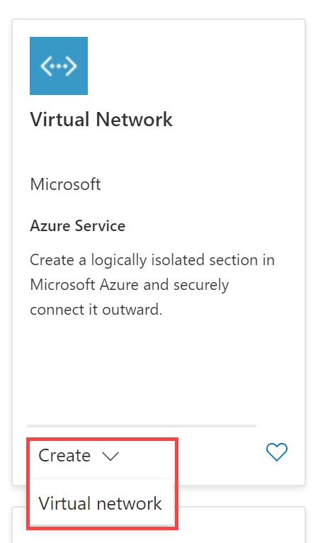

 

Now you're ready to create and deploy some virtual networks with the IP addresses that you planned.

Consider the fictional organization Contoso Ltd, which is in the process of migrating infrastructure and applications to Azure. In your role as network engineer, you must plan and implement three virtual networks and subnets to support resources in those virtual networks.

The **CoreServicesVnet** virtual network is deployed in the **US West** region. This virtual network will have the largest number of resources. It will have connectivity to on-premises networks through a VPN connection. This network will have web services, databases, and other systems that are key to the operations of the business. Shared services, such as domain controllers and DNS also will be located here. A large amount of growth is anticipated, so a large address space is necessary for this virtual network.

The **ManufacturingVnet** virtual network is deployed in the **North Europe** region, near the location of your organization's manufacturing facilities. This virtual network will contain systems for the operations of the manufacturing facilities. The organization is anticipating a large number of internal connected devices for their systems to retrieve data from, such as temperature, and will need an IP address space that it can expand into.

The **ResearchVnet** virtual network is deployed in the **West India** region, near the location of the organization's research and development team. The research and development team uses this virtual network. The team has a small, stable set of resources that is not expected to grow. The team needs a small number of IP addresses for a few virtual machines for their work.

You will create the following resources:

 

| **Virtual Network** | **Region**   | **Virtual network address space** | **Subnet**                | **Subnet**    |
| ------------------- | ------------ | --------------------------------- | ------------------------- | ------------- |
| CoreServicesVnet    | West US      | 10.20.0.0/16                      |                           |               |
|                     |              |                                   | GatewaySubnet             | 10.20.0.0/27  |
|                     |              |                                   | SharedServicesSubnet      | 10.20.10.0/24 |
|                     |              |                                   | DatabaseSubnet            | 10.20.20.0/24 |
|                     |              |                                   | PublicWebServiceSubnet    | 10.20.30.0/24 |
| ManufacturingVnet   | North Europe | 10.30.0.0/16                      |                           |               |
|                     |              |                                   | ManufacturingSystemSubnet | 10.30.10.0/24 |
|                     |              |                                   | SensorSubnet1             | 10.30.20.0/24 |
|                     |              |                                   | SensorSubnet2             | 10.30.21.0/24 |
|                     |              |                                   | SensorSubnet3             | 10.30.22.0/24 |
| ResearchVnet        | West India   | 10.40.40.0/24                     |                           |               |
|                     |              |                                   | ResearchSystemSubnet      | 10.40.40.0/24 |

These virtual networks and subnets are structured in a way that accommodates existing resources yet allows for projected growth. Let's create these virtual networks and subnets to lay the foundation for our networking infrastructure.

## Create the Contoso resource group

1. Go to [Azure Portal](https://portal.azure.com/).

2. On the home page, under **Azure services**, select **Resource groups**.  
   ‎

3. In Resource groups, select **+ Create**.

4. Use the information in the following table to create the resource group.

| **Tab**         | **Option**                                 | **Value**            |
| --------------- | ------------------------------------------ | -------------------- |
| Basics          | Resource group                             | ContosoResourceGroup |
|                 | Region                                     | (US) West US         |
| Tags            | No changes required                        |                      |
| Review + create | Review your settings and select **Create** |                      |

5. In Resource groups, verify that **ContosoResourceGroup** appears in the list.

 

## Create the CoreServicesVnet virtual network and subnets

1. On the Azure Portal home page, select **Create a resource**.
2. In **Search services and marketplace**, enter virtual network.  
   ‎
3. In Marketplace, in Virtual Network, select **Create &gt; Virtual network**.  
   ‎
4. Use the information in the following table to create the CoreServicesVnet virtual network.  
   ‎Remove or overwrite the default IP Address space

 

| **Tab**      | **Option**         | **Value**            |
| ------------ | ------------------ | -------------------- |
| Basics       | Resource Group     | ContosoResourceGroup |
|              | Name               | CoreServicesVnet     |
|              | Region             | (US) West US         |
| IP Addresses | IPv4 address space | 10.20.0.0/16         |

 5.Use the information in the following table to create the CoreServicesVnet subnets.

 6.To begin creating each subnet, select **+ Add subnet**. To finish creating each subnet, select **Add**.

| **Subnet**             | **Option**           | **Value**              |
| ---------------------- | -------------------- | ---------------------- |
| GatewaySubnet          | Subnet name          | GatewaySubnet          |
|                        | Subnet address range | 10.20.0.0/27           |
| SharedServicesSubnet   | Subnet name          | SharedServicesSubnet   |
|                        | Subnet address range | 10.20.10.0/24          |
| DatabaseSubnet         | Subnet name          | DatabaseSubnet         |
|                        | Subnet address range | 10.20.20.0/24          |
| PublicWebServiceSubnet | Subnet name          | PublicWebServiceSubnet |
|                        | Subnet address range | 10.20.30.0/24          |

 7.To finish creating the CoreServicesVnet and its associated subnets, select **Review + create**.

 8.Verify your configuration passed validation, and then select **Create**.

 

## Create the ManufacturingVnet virtual network and subnets

1. On the Azure Portal home page, select **Create a resource**.

2. In **Search services and marketplace**, enter virtual network.  
   ‎

3. In Marketplace, in Virtual Network, select **Create &gt; Virtual network**.  
   ‎

4. Use the information in the following table to create the ManufacturingVnet virtual network.

| **Tab**      | **Option**         | **Value**             |
| ------------ | ------------------ | --------------------- |
| Basics       | Resource Group     | ContosoResourceGroup  |
|              | Name               | ManufacturingVnet     |
|              | Region             | (Europe) North Europe |
| IP Addresses | IPv4 address space | 10.30.0.0/16          |

5. Use the information in the following table to create the ManufacturingVnet subnets.

6. To begin creating each subnet, select **+ Add subnet**. To finish creating each subnet, select **Add**.

| **Subnet**                | **Option**           | **Value**                 |
| ------------------------- | -------------------- | ------------------------- |
| ManufacturingSystemSubnet | Subnet name          | ManufacturingSystemSubnet |
|                           | Subnet address range | 10.30.10.0/24             |
| SensorSubnet1             | Subnet name          | SensorSubnet1             |
|                           | Subnet address range | 10.30.20.0/24             |
| SensorSubnet2             | Subnet name          | SensorSubnet2             |
|                           | Subnet address range | 10.30.21.0/24             |
| SensorSubnet3             | Subnet name          | SensorSubnet3             |
|                           | Subnet address range | 10.30.22.0/24             |

7. To finish creating the ManufacturingVnet and its associated subnets, select **Review + create**.

8. Verify your configuration passed validation, and then select **Create**.

 

## Create the ResearchVnet virtual network and subnets

1. On the Azure Portal home page, select **Create a resource**.

2. In **Search services and marketplace**, enter virtual network.  
   ‎

3. In Marketplace, in Virtual Network, select **Create &gt; Virtual network**.  
   ‎

4. Use the information in the following table to create the ResearchVnet virtual network.

5. Use the information in the following table to create the ResearchVnet subnet.

6. To begin creating the subnet, select **+ Add subnet**. To finish creating the subnet, select **Add**.

| **Subnet**           | **Option**           | **Value**            |
| -------------------- | -------------------- | -------------------- |
| ResearchSystemSubnet | Subnet name          | ResearchSystemSubnet |
|                      | Subnet address range | 10.40.40.0/24        |

7. To finish creating the ResearchVnet and its associated subnet, select **Review + create**.

8. Verify your configuration passed validation, and then select **Create**.

 

## Verify the creation of VNets and Subnets

1. On the Azure Portal home page, select **All resources**.

   

2. Verify that the CoreServicesVnet, ManufacturingVnet, and ResearchVnet are listed. Your list should look like this:

   

3. Note that Azure creates NetworkWatchers for each region that you use.

4. Select **CoreServicesVnet**. 

5. In CoreServicesVnet, under **Settings**, select **Subnets**.

6. In CoreServicesVnet | Subnets, verify that the subnets you created are listed, and that the IP address ranges are correct.

   

7. Repeat steps 4 -6 for each subnet.

Congratulations! You have successfully created a resource group, three VNets, and their associated subnets. 